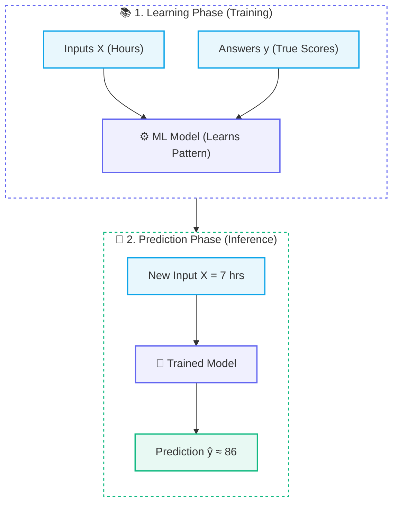
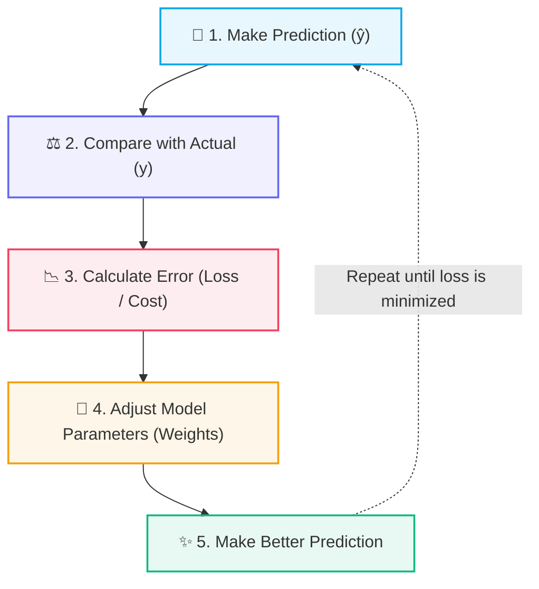
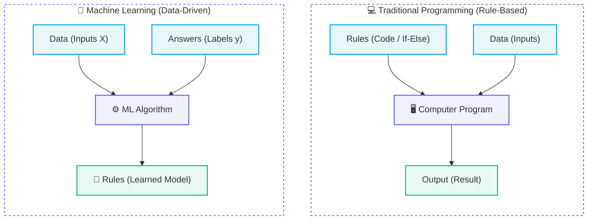

# 🧠 Introduction to Machine Learning

## 💡 The Core Intuition of Machine Learning

> [!abstract] Mental Model
> **Traditional Programming:** You write the rules $\rightarrow$ Computer gives the output.  
> **Machine Learning:** You provide examples ($X + y$) $\rightarrow$ Computer discovers the rules (Model) $\rightarrow$ Predicts on new data ($\hat{y}$).

Imagine you are given the following student observation data:

| ⏱️ Hours Studied ($X$) | 🎯 Exam Score ($y$) |
| :---: | :---: |
| 1 | 35 |
| 2 | 42 |
| 3 | 50 |
| 4 | 61 |
| 5 | 67 |
| 6 | 75 |

Now ask: **"If someone studies 7 hours, what score might they get?"**

As humans, we intuitively spot the pattern: *More hours studied $\rightarrow$ higher exam score*.

Instead of manually calculating or guessing the outcome, we want a computer to **learn this mathematical relationship from the examples**. That is the essence of **Machine Learning**.

> [!important] In Extremely Simple Terms
> **Give the computer examples $\longrightarrow$ It discovers the underlying pattern $\longrightarrow$ Use that pattern to make predictions on new data.**

---

## 🧩 The 3 Foundational Pillars of ML

Almost every concept in machine learning revolves around these three components:

> [!note] The ML Triad
> 1. **$X$ $\rightarrow$ Input (Features):** The information/data given to the model (e.g., $X = \text{Hours studied}$).
> 2. **$y$ $\rightarrow$ Target (Ground-Truth Answer):** The actual outcome we are trying to predict (e.g., $y = \text{Exam score}$).
> 3. **$\text{Model}$ $\rightarrow$ Pattern (Learned Function):** The mathematical mapping that converts inputs into predictions ($f(X) \approx y$).



---

## 🤖 What Does "Learning" Actually Mean?

How does a machine actually "learn" without explicit step-by-step instructions?

> [!example] The Naive Guess Analogy
> Suppose our model starts with a naive initial guess:
> *"Every extra hour studied increases the score by 2 points (starting at 30)."*
> 
> It predicts:
> - $1 \text{ hour} \rightarrow 30$ *(Actual: 35 — Error: -5)*
> - $2 \text{ hours} \rightarrow 32$ *(Actual: 42 — Error: -10)*
> - $3 \text{ hours} \rightarrow 34$ *(Actual: 50 — Error: -16)*
> 
> These predictions have high error. Rather than giving up, the algorithm **adjusts its internal parameters (weights and biases)** to pull its predictions closer to the true answers.

### 🔄 The Heartbeat of Machine Learning: The Optimization Loop



> [!tip] The Optimization Connection
> This iterative cycle is at the core of all machine learning algorithms:
> - **Loss Functions (e.g., Mean Squared Error - MSE)** measure the error.
> - **Optimization Algorithms (e.g., Gradient Descent)** adjust parameters systematically to minimize the error.

---

## 🔄 Traditional Programming vs. Machine Learning



### 1. Traditional Programming (Rule-Based)
Human engineers explicitly write hardcoded logic:

```python
# Traditional logic: Developer manually creates the threshold
if hours_studied > 5:
    predicted_score = 70
```

### 2. Machine Learning (Data-Driven Learning)
We feed **Data ($X$)** and **Correct Answers ($y$)** into an algorithm. The algorithm infers the mathematical relationship automatically:

$$\text{Learned Function: } \hat{y} \approx 8.5 \times X + 26.5$$

When given a new, unseen input ($X = 7$ hours):

$$\hat{y} \approx 8.5 \times 7 + 26.5 \approx 86 \text{ marks}$$

---

## 🔑 Core Takeaways

> [!success] Summary Essentials
> 1. **Machine Learning** extracts rules from historical data rather than requiring humans to hand-code every condition.
> 2. The core triad is **$X$ (Inputs)**, **$y$ (Answers)**, and **$\text{Model}$ (Learned Mapping)**.
> 3. **Learning** is an iterative feedback loop: $\text{predict} \rightarrow \text{measure error} \rightarrow \text{adjust parameters} \rightarrow \text{repeat}$.
> 4. A model's real benchmark is its ability to **generalize** to new, unseen examples.

---

## 🔗 Prerequisites & Next Steps

### Next Step
- [[02. Supervised vs Unsupervised Learning]] — Exploring the two major branches: Supervised ($X + y$) vs Unsupervised ($X$ only).

## 🔗 Related Notes
- [[01. Classical ML/README|📁 Classical ML Foundations MOC]]
- [[02. Supervised vs Unsupervised Learning]]
- [[03. Features, Targets, and Datasets]]
- [[04. Train-Test Split and Generalization]]
- [[05. End-to-End ML Pipeline]]
