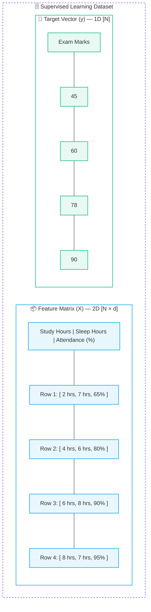
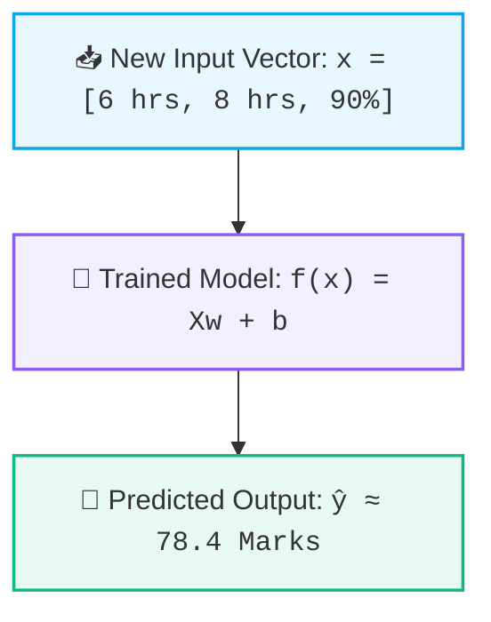

# 📊 Features, Targets, and Datasets
 
> [!abstract] Executive Summary
> In machine learning, datasets are represented as tabular structures partitioned into an input **Feature Matrix ($X$)** and an output **Target Vector ($y$)**. Supervised learning trains mathematical models to find the mapping function $\boxed{f(X) \approx y}$.

---

## 📖 1. The Core Machine Learning Vocabulary

To read ML literature, configure Scikit-Learn estimators, and build pipelines, you must understand the standard terminology used to describe datasets:

| Component | Mathematical Symbol | Scikit-Learn Type | Real-World Meaning | Example in Student Data |
| :--- | :---: | :---: | :--- | :--- |
| **Features** | **$X$** *(Matrix)* | 2D Array / DataFrame | Input measurements & attributes | `Study Hours`, `Sleep Hours`, `Attendance` |
| **Target / Label** | **$y$** *(Vector)* | 1D Series / Array | Ground-truth outcome to predict | `Exam Marks (e.g. 78)` |
| **Sample / Instance** | $\mathbf{x}^{(i)}$ | 1D Row Vector | A single observation / student | Row 3: `[6 hrs, 8 hrs, 90%]` |
| **Feature Dimension** | $d$ or $m$ | Integer scalar | Total number of input columns | $d = 3\text{ features}$ |
| **Dataset Size** | $N$ or $n$ | Integer scalar | Total number of samples (rows) | $N = 4\text{ rows}$ |

---

## 🗂️ 2. Visual Structure of a Dataset



---

## 📐 3. The Governing Machine Learning Equation

Every supervised learning model learns an approximate mathematical function $f$ that transforms input feature vectors into predictions:

$$
\boxed{X \xrightarrow{\quad \text{Model } f(\cdot) \quad} \hat{y} \quad \text{such that} \quad \hat{y} \approx y}
$$

Where:
- $X \in \mathbb{R}^{N \times d}$ = Input Feature Matrix
- $y \in \mathbb{R}^N$ = Ground-truth Target Vector
- $\hat{y}$ (*pronounced "y-hat"*) = Model's generated predictions
- $\mathcal{L}(y, \hat{y})$ = Loss/Error between ground-truth and prediction



---

## 💻 Python Representation (Pandas & Scikit-Learn)

```python
import pandas as pd

# Load dataset
df = pd.DataFrame({
    'study_hours': [2, 4, 6, 8],
    'sleep_hours': [7, 6, 8, 7],
    'attendance': [65, 80, 90, 95],
    'exam_score': [45, 60, 78, 90]
})

# Separate Feature Matrix (X) and Target Vector (y)
X = df[['study_hours', 'sleep_hours', 'attendance']]  # 2D DataFrame (Uppercase X)
y = df['exam_score']                                  # 1D Series (Lowercase y)
```

---

## 🔗 Prerequisites & Next Steps

### Prerequisites
- [[01. Introduction to Machine Learning]]
- [[02. Supervised vs Unsupervised Learning]]

### Next Step
- [[04. Train-Test Split and Generalization]] — Why we must never train and evaluate a model on the exact same data.

## 🔗 Related Notes
- [[01. Classical ML/README|📁 Classical ML Foundations MOC]]
- [[01. Introduction to Machine Learning]]
- [[02. Supervised vs Unsupervised Learning]]
- [[04. Train-Test Split and Generalization]]
- [[05. End-to-End ML Pipeline]]
