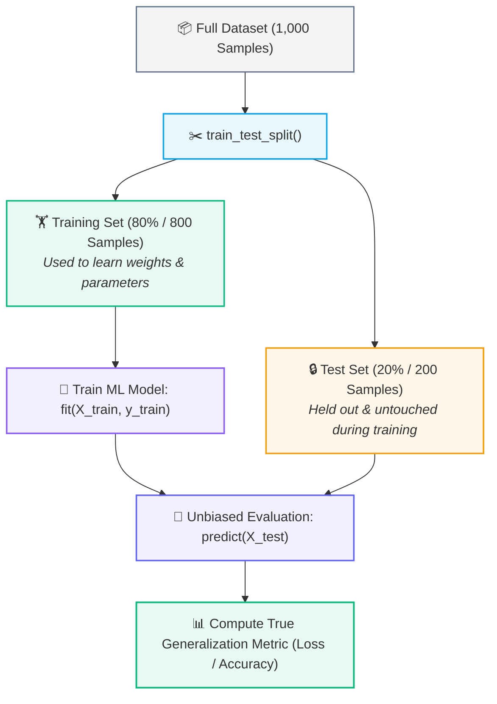
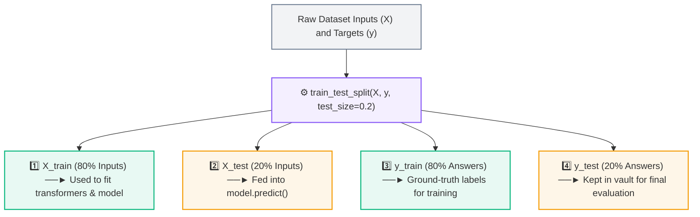
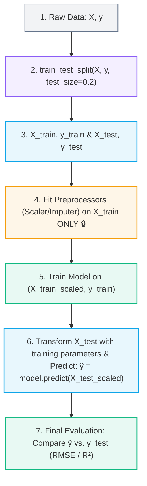

# ✂️ Train-Test Split and Generalization

> [!abstract] Executive Summary
> **Train-Test Split** is the foundational protocol in machine learning that partitions raw data into two mutually exclusive sets: a **Training Set** (used to fit model weights) and a **Testing Set** (held out strictly to evaluate real-world generalization). It is our primary defense against **overfitting** and **data memorization**.

---

## 🚫 1. Why We Cannot Train on 100% of Data

Suppose you have a dataset with 1,000 historical examples. A catastrophic beginner mistake is to feed all 1,000 examples into the model during training, and then evaluate the model's accuracy on those exact same 1,000 examples.

> [!example] 📝 The Leaked Classroom Exam Analogy
> Imagine a teacher gives students the **exact 100 exam questions and answers** to study the night before, and then gives them the **exact same 100 questions** on the final exam.  
> 
> If the students score 100%, does that mean they understand the underlying subject?  
> **No.** They simply memorized the answers. To measure true problem-solving ability, the teacher must evaluate them on **unseen questions**.

---

## ✂️ 2. The Train-Test Split Workflow

To reliably measure whether an ML model has learned generalizable patterns or simply memorized training samples, we partition the dataset into two disjoint sets:



### Standard Split Proportions:
- 🟢 **Training Set ($70\% - 80\%$):** Used by the optimization algorithm to adjust weights and learn internal parameters.
- 🟡 **Testing Set ($20\% - 30\%$):** Held out strictly as an unbiased proxy for future unseen real-world data.

---

## 🎯 3. Generalization: The Core Goal of Machine Learning

> [!important] The Generalization Principle
> The ultimate objective of Machine Learning is **Generalization** — the ability of a trained model to make accurate predictions on new, previously unseen data distributions.
> 
> $$\boxed{\text{High Training Accuracy} \;+\; \text{High Test Accuracy} \implies \text{Successful Generalization}}$$

---

## 🚨 4. What is Overfitting?

**Overfitting** occurs when a model learns the training data *too well* — memorizing random noise, outliers, and idiosyncratic sample details rather than the true underlying functional mapping.

```mermaid
flowchart TD
    subgraph Under ["1️⃣ Underfitting (High Bias)"]
        direction TB
        U1["Model is too simple (e.g. flat line)"]
        U2["Train Acc: 58% | Test Acc: 55% 🥱"]
    end

    subgraph Optimal ["2️⃣ Optimal Generalization"]
        direction TB
        O1["Model captures true pattern"]
        O2["Train Acc: 91% | Test Acc: 89% 🎯"]
    end

    subgraph Over ["3️⃣ Overfitting (High Variance)"]
        direction TB
        V1["Model memorizes training noise"]
        V2["Train Acc: 99.8% | Test Acc: 52% 💀"]
    end

    classDef under fill:#64748b15,stroke:#64748b,stroke-width:1.5px;
    classDef opt fill:#10b98118,stroke:#10b981,stroke-width:1.8px;
    classDef over fill:#f43f5e18,stroke:#f43f5e,stroke-width:1.8px;

    class Under,U1,U2 under;
    class Optimal,O1,O2 opt;
    class Over,V1,V2 over;
```



> [!warning] The Classic Overfitting Red Flag
> If **Training Score $\approx 99\%$** but **Test Score $\approx 55\%$**, the model has overfitted. It has memorized specific training instances rather than discovering reusable mathematical principles.

---

## 💻 5. Python Syntax & Anatomy of `train_test_split()`

In Python's `scikit-learn` library, data splitting is performed via `train_test_split()`:

```python
from sklearn.model_selection import train_test_split

# Unpacks exactly 4 output variables
X_train, X_test, y_train, y_test = train_test_split(
    X, y, 
    test_size=0.20, 
    random_state=42, 
    shuffle=True
)
```



### 🧩 What Are `X_train`, `X_test`, `y_train`, `y_test`?

> [!important] Variable Names vs. Language Keywords
> `X_train`, `X_test`, `y_train`, and `y_test` are **ordinary Python variable names**, NOT reserved Python keywords or built-in functions. They are community standard conventions chosen for clarity:

| Variable | Mathematical Role | Dimensions (e.g. 100 samples, 3 features) | What It Is Used For |
| :--- | :--- | :--- | :--- |
| **`X_train`** | Input Feature Matrix (Train) | 2D Array: $[80 \times 3]$ | Scaler fitting, imputer fitting, and model feature learning. |
| **`X_test`** | Input Feature Matrix (Test) | 2D Array: $[20 \times 3]$ | Scaler transforming, imputer transforming, and `model.predict()`. |
| **`y_train`** | Target Vector (Train) | 1D Series: $[80]$ | Correct answers given to `model.fit()` to learn weights ($w, b$). |
| **`y_test`** | Target Vector (Test) | 1D Series: $[20]$ | Kept hidden until after prediction; compared against $\hat{y}$ for final score. |

---

### ❓ How Python Knows Which Variable Receives Which Partition

> [!tip] 1. Positional Tuple Unpacking
> Python has no inherent semantic concept of "training" or "testing". `train_test_split()` returns a fixed 4-element tuple in a strict mathematical sequence:
> 
> $$\text{Output Tuple} = (\mathbf{X}_{\text{train}}, \; \mathbf{X}_{\text{test}}, \; \mathbf{y}_{\text{train}}, \; \mathbf{y}_{\text{test}})$$
> 
> Python unpacks them purely by **index position** ($1^{\text{st}} \to \text{Var}_1, \; 2^{\text{nd}} \to \text{Var}_2, \; 3^{\text{rd}} \to \text{Var}_3, \; 4^{\text{th}} \to \text{Var}_4$). If you accidentally write `X_train, y_train, X_test, y_test = ...`, Python will blindly assign `X_test` into `y_train`!

> [!important] 2. Synchronized Row Alignment (Co-Splitting)
> `train_test_split()` splits $X$ and $y$ simultaneously using a **shared index shuffle permutation**. If Student B's feature row (`Hours = 4`) is routed into `X_train`, Student B's ground-truth exam score (`Score = 65`) is mathematically guaranteed to be routed into `y_train` at the exact same index.

---

## 🔄 6. The Complete Leakage-Free Workflow



---

## 🔗 Prerequisites & Next Steps

### Prerequisites
- [[01. Introduction to Machine Learning]]
- [[03. Features, Targets, and Datasets]]

### Next Step
- [[05. End-to-End ML Pipeline]] — Follow the complete lifecycle from raw data to evaluation.

## 🔗 Related Notes
- [[01. Classical ML/README|📁 Classical ML Foundations MOC]]
- [[01. Introduction to Machine Learning]]
- [[02. Supervised vs Unsupervised Learning]]
- [[03. Features, Targets, and Datasets]]
- [[05. End-to-End ML Pipeline]]
