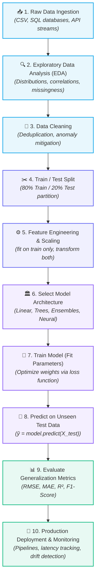

# 🔁 End-to-End ML Pipeline
 
> [!abstract] Executive Summary
> An **End-to-End Machine Learning Pipeline** standardizes the entire model lifecycle from raw data ingestion to production deployment into a sequence of reproducible, leakage-free stages: **Ingest $\to$ Inspect $\to$ Clean $\to$ Split $\to$ Preprocess $\to$ Train $\to$ Evaluate $\to$ Iterate**.

---

## 🗺️ 1. The 10-Stage Machine Learning Lifecycle



---

## 🏡 2. Concrete Pipeline Walkthrough: House Price Prediction

To see how these 10 steps connect in a real-world system, let's trace an end-to-end **House Price Prediction** project:

| Stage | Action Taken | Real-World Example |
| :---: | :--- | :--- |
| **1. Raw Data** | Load raw housing records | Ingest 10,000 house listings with square footage, bedrooms, locality, and price. |
| **2. Understand Data** | Exploratory Data Analysis | Inspect feature histograms, calculate skewness, identify outlier luxury mansions. |
| **3. Clean Data** | Handle defects | Impute missing bedroom counts using median; remove corrupt negative price entries. |
| **4. Train/Test Split** | Isolate evaluation set | Partition 8,000 houses to `X_train` and 2,000 houses to `X_test`. |
| **5. Preprocess** | [[Feature Scaling\|Feature transformation]] | Scale square footage via [[Feature Scaling\|StandardScaler]]; One-Hot Encode locality. |
| **6. Choose Model** | Select algorithm | Select **Linear Regression** as the initial baseline estimator. |
| **7. Train** | Model optimization | Fit regression weights ($\mathbf{w}, b$) to minimize Mean Squared Error on `X_train`. |
| **8. Predict** | Generate predictions | Feed `X_test` into the model: $\hat{y} = \text{model.predict}(X_{\text{test}})$. |
| **9. Evaluate** | Calculate error metrics | Compare $\hat{y}$ with actual sale prices (e.g., $\text{MAE} = \text{₹}25,000, \; R^2 = 0.88$). |
| **10. Improve** | Enhance performance | Add polynomial interaction features, tune regularization ($\alpha$), or deploy Random Forest. |

---

## 🛡️ 3. Encapsulation with Scikit-Learn `Pipeline`

> [!tip] Best Practice: The `Pipeline` Object
> In production code, bundling transformers and estimators inside a Scikit-Learn `Pipeline` guarantees that data leakage is impossible during cross-validation and deployment:

```python
from sklearn.pipeline import Pipeline
from sklearn.preprocessing import StandardScaler
from sklearn.linear_model import LinearRegression

# Construct atomic pipeline
ml_pipe = Pipeline([
    ('scaler', StandardScaler()),
    ('regressor', LinearRegression())
])

# Fits scaler on X_train ONLY, transforms X_train, fits model
ml_pipe.fit(X_train, y_train)

# Transforms X_test using training parameters, makes predictions
predictions = ml_pipe.predict(X_test)
```

---

## 🔗 Prerequisites & Next Steps

### Prerequisites
- [[01. Introduction to Machine Learning]]
- [[02. Supervised vs Unsupervised Learning]]
- [[03. Features, Targets, and Datasets]]
- [[04. Train-Test Split and Generalization]]

### Next Step
- [[04. Feature Scaling]] — How scaling transforms features and optimizes loss surface geometry.

## 🔗 Related Notes
- [[01. Classical ML/README|📁 Classical ML Foundations MOC]]
- [[02. Data Preprocessing/README|🧹 Data Preprocessing MOC]]
- [[04. Feature Scaling]]
- [[01. Introduction to Machine Learning]]
- [[02. Supervised vs Unsupervised Learning]]
- [[03. Features, Targets, and Datasets]]
- [[04. Train-Test Split and Generalization]]
- [[AI & ML/README|🤖 AI & ML Master MOC]]
