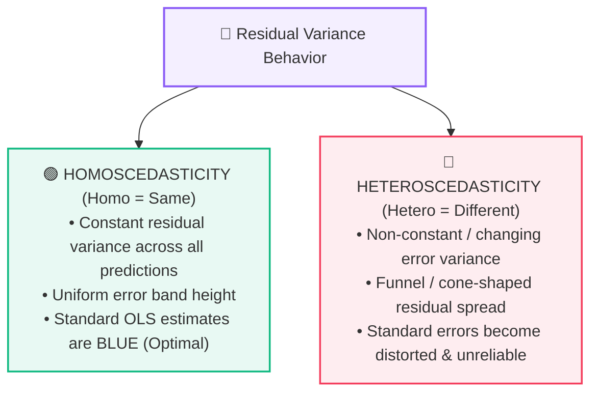
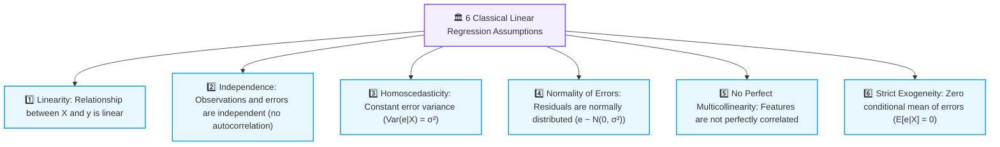

# 📐 Linear Regression Assumptions & Residual Analysis

> [!abstract] Executive Summary
> **Linear Regression** relies on foundational mathematical conditions regarding the data distribution and error behavior to produce reliable, unbiased predictions. **Residual Analysis** (inspecting prediction errors $e = y - \hat{y}$) serves as the primary diagnostic tool to verify these conditions—detecting non-linearity, **heteroscedasticity** (changing error variance), autocorrelation, and omitted variables.

---

## 🧩 1. What is an Assumption & Why Do Residuals Matter?

An **assumption** is a structural condition that the data and error terms must satisfy for an Ordinary Least Squares (OLS) regression model to be mathematically optimal, unbiased, and statistically valid.

When evaluating a fitted linear regression model, the most critical diagnostics examine its **residuals**:

$$
\boxed{e_i = y_i - \hat{y}_i = \text{Actual Target} - \text{Predicted Value}}
$$

> [!example] 🎯 Concrete Residual Example
> If a student's actual exam score is $y = 80$ and the model predicts $\hat{y} = 75$:
> $$e = 80 - 75 = \mathbf{+5} \quad (\text{Model under-predicted by 5 points})$$

If the model has captured all systematic relationships in the data, the remaining residuals should represent **pure, unstructured random noise**.

---

## 📊 2. Residual Analysis & Residual Plots

Rather than examining isolated errors, we evaluate all residuals collectively using a **Residual Plot**:
- **X-axis:** Predicted Values ($\hat{y}$) or Feature Values ($X$)
- **Y-axis:** Residuals ($e = y - \hat{y}$)
- **Reference Baseline:** A horizontal line at $e = 0$

```mermaid
flowchart TD
    subgraph Ideal ["✅ 1. Ideal / Random Scatter (Valid Assumptions)"]
        direction TB
        I1["Residuals scatter uniformly around 0"]
        I2["Constant band height across all predictions"]
        I3["Model captures true linear relationship 🎯"]
    end

    subgraph NonLinear ["❌ 2. Curved / U-Shape (Non-Linearity)"]
        direction TB
        N1["Residuals systematically curve above/below 0"]
        N2["Indicates underlying quadratic / polynomial trend"]
        N3["Remedy: Add polynomial features (X², √X) 🔄"]
    end

    subgraph Hetero ["❌ 3. Funnel / Cone (Heteroscedasticity)"]
        direction TB
        H1["Error spread widens or narrows with predictions"]
        H2["Variance is non-constant across scale"]
        H3["Remedy: Log Transformation (ln y) or WLS 📢"]
    end

    classDef ideal fill:#10b98118,stroke:#10b981,stroke-width:1.8px;
    classDef warn fill:#f59e0b18,stroke:#f59e0b,stroke-width:1.8px;
    classDef danger fill:#f43f5e18,stroke:#f43f5e,stroke-width:1.8px;

    class Ideal,I1,I2,I3 ideal;
    class NonLinear,N1,N2,N3 warn;
    class Hetero,H1,H2,H3 danger;
```



---

## 🔍 Comprehensive Diagnostic Pattern Cheat Sheet

| Residual Pattern | Visual Signature | Underlying Diagnosis | Real-World Meaning | Corrective Remedy |
| :--- | :---: | :--- | :--- | :--- |
| 🎲 **Random Scatter** | Uniform band around $e=0$ | ✅ **Homoscedastic & Linear** | Errors are pure random white noise. | Model assumptions are validated. |
| 🔄 **U-Shape / Curve** | Parabolic arc | ❌ **Non-Linearity** | The true physical relationship is curved, not a straight line. | Apply polynomial features ($X^2$) or non-linear models. |
| 📢 **Funnel / Cone** | Narrow on left, wide on right | ❌ **Heteroscedasticity** | Uncertainty/error grows as the predicted quantity grows. | Apply **Log Transformation** ($\ln y$) or Weighted Least Squares (WLS). |
| 🫧 **Clusters / Groups** | Isolated clusters of dots | ❌ **Omitted Variable** | The dataset contains unmodeled sub-populations. | Add missing categorical features (e.g., location, department). |
| 📈 **Trend over Time** | Wave or systematic drift | ❌ **Autocorrelation** | Residuals depend on prior time steps ($e_t \sim e_{t-1}$). | Use Time-Series modeling (ARIMA, lag features). |
	
---

### 📊 Visualizing the 5 Residual Signatures

> [!tip]+ 🎲 1. Random Scatter — Ideal & Well-Specified Model
> ```text
> Residual (e)
>    + │    ·    ·   ·    ·   ·    ·
>      │  ·   ·    ·   ·    ·   ·    ·
>    0 ├───·───·───·───·───·───·───·───► Predicted (ŷ)
>      │    ·    ·   ·    ·   ·    ·
>    - │  ·   ·    ·   ·    ·   ·    ·
> ```
> * **Diagnosis:** Residuals form a uniform, constant-width cloud around $e=0$.
> * **Conclusion:** Linear relationship holds; error variance is homoscedastic.

> [!warning]+ 🔄 2. U-Shape / Parabolic Curve — Non-Linearity
> ```text
> Residual (e)
>    + │  ·                            ·
>      │     ·                      ·
>    0 ├────────·────────────────·──────► Predicted (ŷ)
>      │           ·          ·
>    - │              · · ·
> ```
> * **Diagnosis:** Errors systematically dip below and rise above zero in a curve.
> * **Conclusion:** Missed quadratic/polynomial trend $\to$ Add $X^2$, $\sqrt{X}$, or interaction terms.

> [!danger]+ 📢 3. Funnel / Cone Shape — Heteroscedasticity
> ```text
> Residual (e)
>    + │                          ·    ·
>      │                    ·  ·    ·
>    0 ├───·──·──·───·───·───·───·───·──► Predicted (ŷ)
>      │                    ·  ·    ·
>    - │                          ·    ·
> ```
> * **Diagnosis:** Residual dispersion expands (or contracts) as predicted magnitude increases.
> * **Conclusion:** Non-constant error variance $\to$ Apply **Log Transformation** ($\ln y$) or WLS.

> [!note]+ 🫧 4. Clustered Groupings — Omitted Sub-Population
> ```text
> Residual (e)
>    + │     ····                ····
>      │     ····                ····
>    0 ├──────────────·─────────────────► Predicted (ŷ)
>      │                 ····
>    - │                 ····
> ```
> * **Diagnosis:** Isolated clusters of residuals separated by empty space.
> * **Conclusion:** Missing key categorical feature (e.g. `City`, `Gender`, `Department`).

> [!quote]+ 📈 5. Drift / Sine Wave — Autocorrelation (Time-Series)
> ```text
> Residual (e)
>    + │     · ·                · ·
>      │   ·     ·            ·     ·
>    0 ├──·───────·──────────·───────·──► Time Index (t)
>      │             ·     ·
>    - │               · ·
> ```
> * **Diagnosis:** Positive or negative cyclical trend over chronological order ($e_t \approx \rho e_{t-1}$).
> * **Conclusion:** Errors violate independence assumption $\to$ Add lag features or use ARIMA.

---

## ⚖️ 3. Homoscedasticity vs. Heteroscedasticity



### 🟢 Homoscedasticity (*Constant Variance*)
- **Definition:** The mathematical variance of the error term is constant across all levels of the independent variables:
  $$
  \boxed{\text{Var}(e_i \mid X) = \sigma^2 \quad (\text{Constant for all } i)}
  $$
- The uncertainty of predictions is identical whether predicting low or high values.

### 🔴 Heteroscedasticity (*Non-Constant Variance*)
- **Definition:** The spread of residuals systematic changes across the range of predictions:
  $$
  \boxed{\text{Var}(e_i \mid X) = \sigma_i^2 \neq \text{Constant}}
  $$

> [!example] 🏠 Real-World Intuition: House Price Valuation
> - For modest budget houses (₹20 Lakh), prediction errors are typically tight: **$\pm ₹1\text{ to }2\text{ Lakh}$**.
> - For luxury multi-crore mansions (₹15 Crore), prediction errors can swing widely: **$\pm ₹1.5\text{ to }3\text{ Crore}$**.
> 
> The variance of errors scales with the magnitude of the target. That expanding cone is classic **heteroscedasticity**.

---

## 🛠️ 4. Remedies for Heteroscedasticity

When residual diagnostics display a funnel shape, two primary transformations stabilize the variance:

### 1️⃣ Log Transformation (Primary Remedy)
Taking the natural logarithm of the target variable $y$ compresses large-scale values and stabilizes multiplicative variance:

$$
\boxed{y \implies \ln(y) \quad \text{or} \quad \log_{10}(y)}
$$

```python
import numpy as np

# Apply log transform to stabilize variance
y_train_log = np.log1p(y_train)  # log1p handles log(1 + y) safely

# Train model on log scale
model.fit(X_train, y_train_log)

# Revert predictions back to original scale
predictions_original_scale = np.expm1(model.predict(X_test))
```

### 2️⃣ Weighted Least Squares (WLS)
Instead of treating all observations equally, WLS assigns smaller weights ($w_i = \frac{1}{\sigma_i^2}$) to high-variance data points and higher weights to low-variance data points.

---

## 📜 5. The Classical 6 Linear Regression Assumptions (Gauss-Markov Framework)

For complete theoretical grounding, standard OLS regression relies on six formal assumptions:



---

## 💻 Python Diagnostic Implementation

```python
import matplotlib.pyplot as plt
import numpy as np

# 1. Compute predictions and residuals
y_pred = model.predict(X_test)
residuals = y_test - y_pred

# 2. Plot Residual Diagnostic Chart
plt.figure(figsize=(8, 5))
plt.scatter(y_pred, residuals, alpha=0.6, edgecolors='k')
plt.axhline(y=0, color='r', linestyle='--', linewidth=1.5)
plt.title("Residual Diagnostic Plot")
plt.xlabel("Predicted Values (ŷ)")
plt.ylabel("Residuals (e = y - ŷ)")
plt.grid(True, alpha=0.3)
plt.show()
```

---

## 🔑 Key Summary Takeaways

| Concept | Key Rule |
| :--- | :--- |
| **Residual** | $e = y - \hat{y} = \text{Actual} - \text{Predicted}$ |
| **Ideal Residual Plot** | Random, uniform scatter around zero without identifiable patterns |
| **U-Shape Curve** | Indicates **Non-Linearity** $\to$ Add polynomial terms |
| **Funnel / Cone Shape** | Indicates **Heteroscedasticity** $\to$ Apply **Log Transformation** |
| **Homoscedasticity** | Constant error variance ($\text{Var}(e) = \sigma^2$) |
| **Heteroscedasticity** | Changing error variance across prediction magnitudes |

---

## 🔗 Prerequisites & Next Steps

### Prerequisites
- [[03. Features, Targets, and Datasets]]
- [[05. End-to-End ML Pipeline]]
- [[AI & ML/02. Data Preprocessing/04. Feature Scaling|Feature Scaling]]

### Next Steps
- **Gradient Descent & Cost Functions** — How regression parameters are optimized numerically.
- **Regularization (Ridge & Lasso)** — Penalizing regression weights to prevent overfitting.

## 🔗 Related Notes
- [[01. Classical ML/README|📁 Classical ML Foundations MOC]]
- [[03. Features, Targets, and Datasets]]
- [[04. Train-Test Split and Generalization]]
- [[05. End-to-End ML Pipeline]]
- [[AI & ML/README|🤖 AI & ML Master MOC]]
