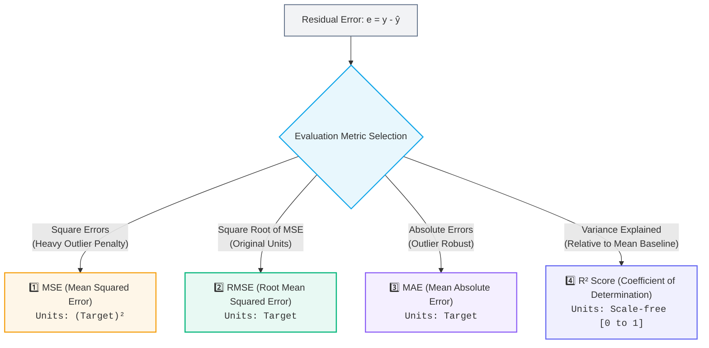

# 📊 Regression Evaluation Metrics (MSE, RMSE, MAE, $R^2$)

> [!abstract] Executive Summary
> Regression evaluation metrics measure the discrepancy between the model's predicted continuous output ($\hat{y}$) and the true ground-truth target ($y$). Choosing the right metric depends on **unit interpretability**, **sensitivity to extreme outliers**, and **mathematical differentiability** during optimization.

---

## 🎯 The Four Essential Regression Metrics



---

## 1️⃣ Mean Squared Error (MSE)

$$\boxed{\text{MSE} = \frac{1}{n} \sum_{i=1}^{n} (y_i - \hat{y}_i)^2}$$

### Core Characteristics:
- **How it works:** Computes the average of squared differences between actual and predicted values.
- **Unit problem:** The units are **squared** relative to the target variable. If predicting house prices in $\text{dollars} \; (\$)$, MSE is in $\text{dollars}^2 \; (\$^2)$, making direct interpretation difficult.
- **Outlier sensitivity:** Because errors are squared, large mistakes are penalized exponentially ($10 \to 100$, $100 \to 10,000$).
- **Optimization:** Smooth and differentiable everywhere $\to$ ideal loss function for Gradient Descent.

```python
from sklearn.metrics import mean_squared_error

mse = mean_squared_error(y_test, y_pred)
```

---

## 2️⃣ Root Mean Squared Error (RMSE)

$$\boxed{\text{RMSE} = \sqrt{\text{MSE}} = \sqrt{\frac{1}{n} \sum_{i=1}^{n} (y_i - \hat{y}_i)^2}}$$

### Core Characteristics:
- **How it works:** Takes the square root of the MSE.
- **Unit restoration:** Converts error back into the **exact same units as the target variable**. If predicting exam scores ($0-100$), an $\text{RMSE} = 4.5$ means predictions are off by roughly $\pm 4.5\text{ marks}$ on average.
- **Outlier sensitivity:** Retains the heavy penalty for large mistakes while remaining intuitively readable for humans.

```python
import numpy as np
from sklearn.metrics import mean_squared_error

# In modern scikit-learn or via numpy
rmse = float(np.sqrt(mean_squared_error(y_test, y_pred)))
```

---

## 3️⃣ Mean Absolute Error (MAE)

$$\boxed{\text{MAE} = \frac{1}{n} \sum_{i=1}^{n} |y_i - \hat{y}_i|}$$

### Core Characteristics:
- **How it works:** Computes the average magnitude of absolute errors.
- **Robust to Outliers:** Does not square errors. An error of $10$ is penalized exactly twice as much as an error of $5$ (linear scaling).
- **Unit:** In the original target units.

```python
from sklearn.metrics import mean_absolute_error

mae = mean_absolute_error(y_test, y_pred)
```

---

## 4️⃣ $R^2$ Score (Coefficient of Determination)

$$\boxed{R^2 = 1 - \frac{\text{SS}_{\text{res}}}{\text{SS}_{\text{tot}}} = 1 - \frac{\sum (y_i - \hat{y}_i)^2}{\sum (y_i - \bar{y})^2}}$$

Where:
- $\text{SS}_{\text{res}}$ = Residual Sum of Squares (Model error)
- $\text{SS}_{\text{tot}}$ = Total Sum of Squares (Error of simply predicting the mean $\bar{y}$)

### Interpretation Scale:
- $R^2 = 1.0$: Perfect predictions ($\text{SS}_{\text{res}} = 0$).
- $R^2 = 0.0$: The model performs no better than always predicting the dataset average ($\bar{y}$).
- $R^2 < 0.0$: The model performs **worse** than simply predicting the mean (indicates a severely misfitted model).

```python
from sklearn.metrics import r2_score

r2 = r2_score(y_test, y_pred)
```

---

## ⚖️ Side-by-Side Comparison Matrix

| Metric | Mathematical Formula | Units | Outlier Penalty | Differentiable? | Primary Use Case |
| :--- | :--- | :--- | :--- | :--- | :--- |
| **MSE** | $\frac{1}{n}\sum(y-\hat{y})^2$ | Squared ($\text{units}^2$) | Quadratic (Very High) | Yes (Smooth) | Mathematical Loss Function optimization |
| **RMSE** | $\sqrt{\frac{1}{n}\sum(y-\hat{y})^2}$ | Natural ($\text{units}$) | Quadratic (High) | Yes | Executive reporting when large errors are costly |
| **MAE** | $\frac{1}{n}\sum\|y-\hat{y}\|$ | Natural ($\text{units}$) | Linear (Robust) | No (at $0$) | Datasets with extreme noise / anomalies |
| **$R^2$** | $1 - \frac{\text{SS}_{\text{res}}}{\text{SS}_{\text{tot}}}$ | Dimensionless ($0 \to 1$) | Proportional | N/A | Comparing model quality across different datasets |

---

## 💻 Complete Production Pattern: `fit_linreg_rmse`

Here is the standard leak-free implementation pattern combining a full Scikit-Learn Pipeline with Root Mean Squared Error evaluation:

```python
import numpy as np
from sklearn.pipeline import Pipeline
from sklearn.preprocessing import StandardScaler
from sklearn.linear_model import LinearRegression
from sklearn.metrics import mean_squared_error

def fit_linreg_rmse(X_train, y_train, X_test, y_test) -> float:
    """
    Trains a leak-free Linear Regression pipeline and evaluates RMSE.
    
    1. StandardScaler learns μ and σ strictly from X_train.
    2. LinearRegression fits parameters (w, b) using X_train_scaled and y_train.
    3. X_test is transformed using training statistics and evaluated.
    4. Computes RMSE in original target units.
    """
    # 1. Instantiate atomic Pipeline
    pipe = Pipeline([
        ("scaler", StandardScaler()),
        ("model", LinearRegression()),
    ])

    # 2. Fit preprocessor and model on training set ONLY
    pipe.fit(X_train, y_train)

    # 3. Predict on unseen test set
    pred = pipe.predict(X_test)

    # 4. Compute RMSE and return as standard Python float
    return float(np.sqrt(mean_squared_error(y_test, pred)))
```

---

## 🔗 Prerequisites & Next Steps

### Prerequisites
- [[04. Train-Test Split and Generalization]]
- [[02. Data Preprocessing/05. Scikit-Learn Pipeline|🚂 Scikit-Learn Pipeline]]

### Next Steps
- [[06. Linear Regression Assumptions|📐 Linear Regression Assumptions & Residual Diagnostics]]
- **Classification Metrics** — Precision, Recall, F1-Score, and ROC-AUC.

## 🔗 Related Notes
- [[01. Classical ML/README|📁 Classical ML Foundations MOC]]
- [[04. Train-Test Split and Generalization]]
- [[05. End-to-End ML Pipeline]]
- [[06. Linear Regression Assumptions]]
- [[02. Data Preprocessing/05. Scikit-Learn Pipeline]]
