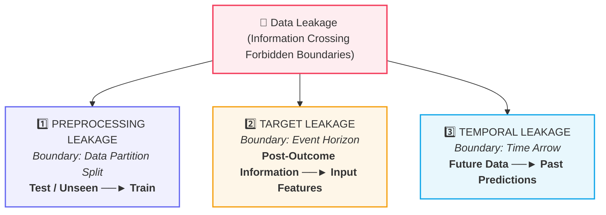
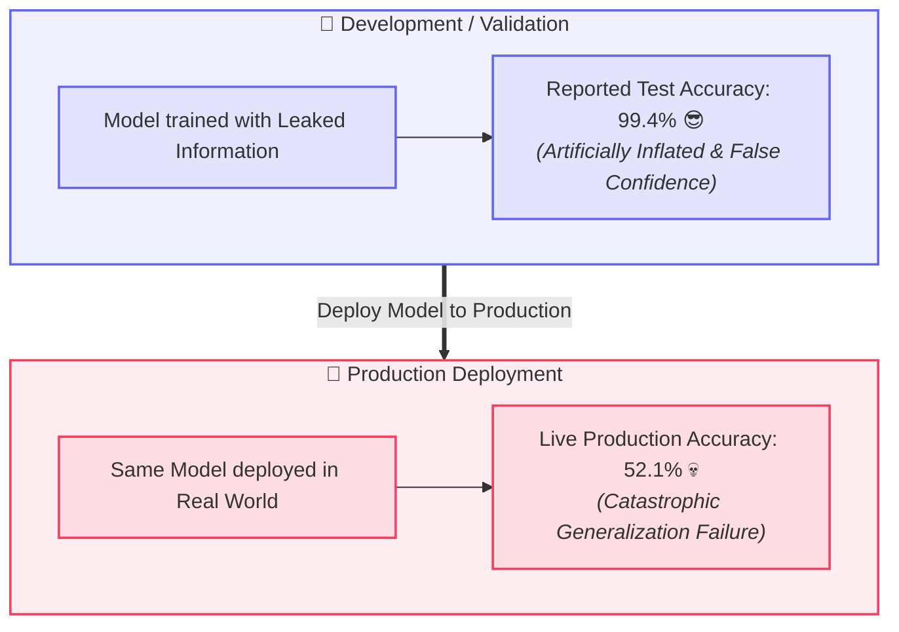
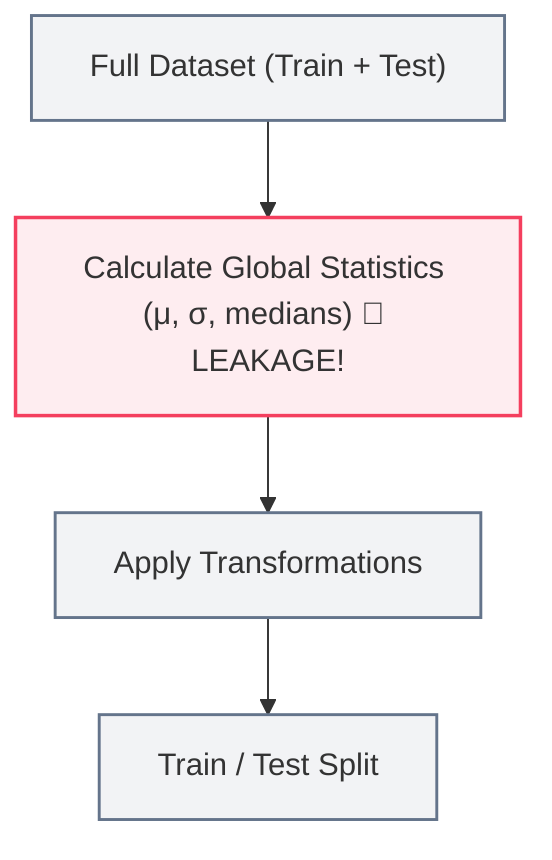
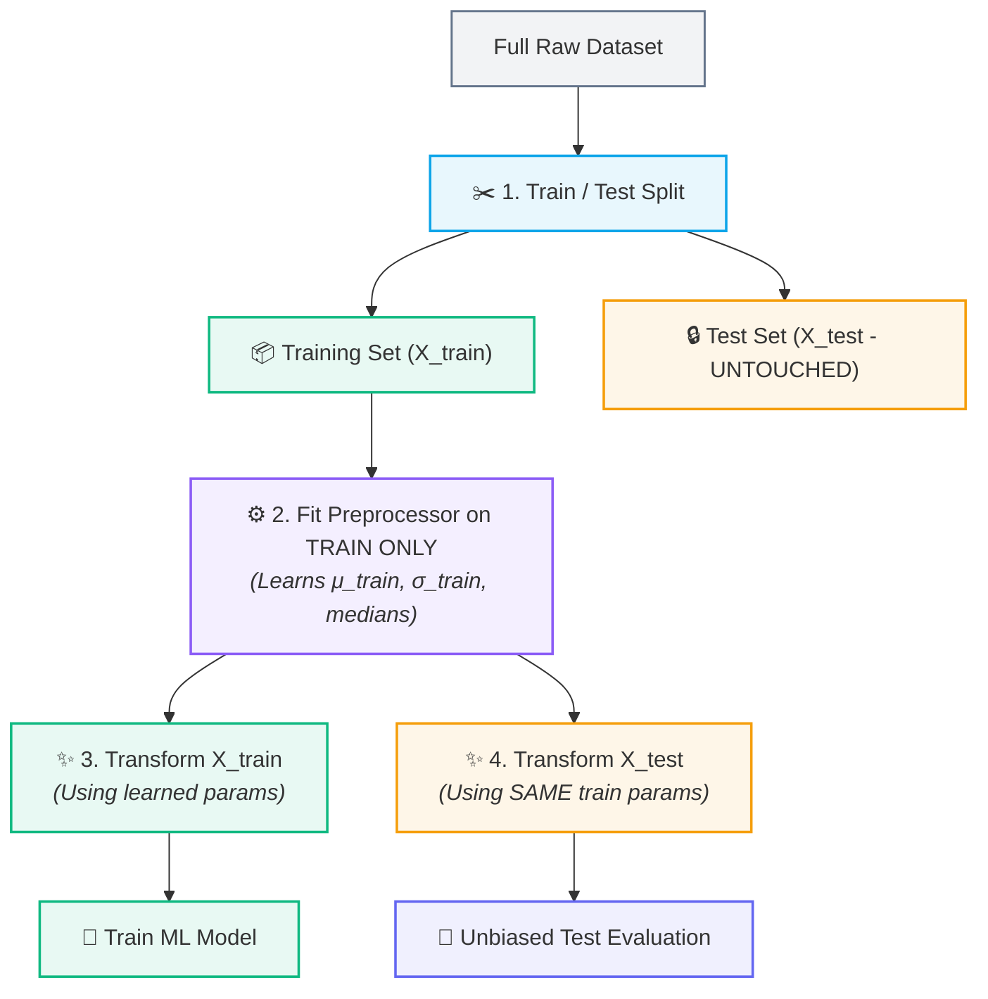
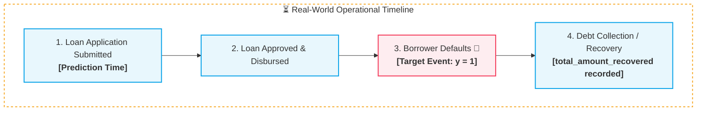
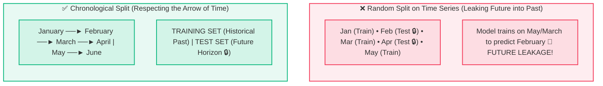

# 🚨 Data Leakage: The 3 Critical Leakage Patterns

> [!abstract] Master Definition
> **Data Leakage** occurs when **information reaches the model during training that would not be available at prediction/inference time**. 
> 
> Across all forms of leakage, the fundamental flaw is identical: **information has crossed a structural boundary it should never have crossed**, causing artificially inflated validation metrics and catastrophic model failure in production.

---

## 🗺️ The 3 Structural Boundaries of Leakage



---

## 🛑 Why is Data Leakage So Dangerous?



> [!warning] The 3 Hidden Risks of Leakage
> 1. **False Confidence:** Gives unrealistically optimistic performance metrics during development.
> 2. **Failure in Production:** Models that memorize leaked artifacts collapse when presented with real-world inputs.
> 3. **Subtle & Silent:** Unlike syntax errors or runtime crashes, data leakage executes without throwing errors—it silently destroys model validity.

---

## 1️⃣ Preprocessing Leakage (Test $\to$ Train)

Preprocessing leakage happens when data transformations (e.g., scaling, imputation, encoding) compute summary statistics across the **entire dataset** before performing the train-test split.

### ❌ The Wrong Order (Causes Leakage)


> [!danger] Why this fails
> The training process indirectly learns the mean, standard deviation, or median of the test set before the model is even trained. The test set is no longer truly "unseen."

---

### ✅ The Correct Order (Leakage-Free Protocol)



> [!tip] 🔑 Memory Rule: **Fit on Train Only!**
> Always fit scalers, encoders, and imputers strictly on `X_train`. Transform both `X_train` and `X_test` using the learned training parameters.

---

## 2️⃣ Target Leakage (Post-Event $\to$ Pre-Event)

**Target Leakage** occurs when an input feature includes data that only becomes available **after the target event has already occurred**.



### 🚨 The Classic Loan Default Trap:
- **Target ($y$):** `will_default` (Yes/No)
- **Leaked Feature ($X$):** `total_amount_recovered`
- **Why it breaks:** You can only record money recovered by debt collectors *after* a borrower has defaulted! 
- At the moment a new customer applies for a loan, `total_amount_recovered` does not exist. Feeding it into the training matrix allows the model to cheat by simply checking: *"If amount recovered > 0 $\implies$ Default = True"*.

### Other Target Leakage Examples:
| Prediction Task ($y$) | Leaked Feature ($X$) | Why It Leaks |
| :--- | :--- | :--- |
| **Will a patient need surgery?** | `post_op_recovery_time` | Only measured after surgery took place. |
| **Will a student pass an exam?** | `final_course_letter_grade` | Grade is determined by the exam itself. |
| **Will a customer churn?** | `cancellation_survey_score` | Survey is sent only after account cancellation. |

> [!tip] 🔑 Memory Rule: **Temporal Availability!**
> Only include features that are strictly known at the exact instant the prediction must be made in the real world.

---

## 3️⃣ Temporal Leakage (Future $\to$ Past)

**Temporal Leakage** occurs when time-dependent (time-series or ordered) data is split using random shuffling, allowing future data points to leak into the training process of past predictions.



### Why Random Split Fails for Time-Ordered Data:
If predicting tomorrow's stock price or next month's sales, real-world inference only has access to the **past**. A random train/test split leaks future market trends, seasonal peaks, and macro-economic shifts into the training set.

### ✅ The Remedy: Chronological / Time-Based Splitting
```python
# For time-series data: NEVER use shuffle=True
from sklearn.model_selection import TimeSeriesSplit

# 1. Sort dataset by timestamp
df = df.sort_values('timestamp')

# 2. Split chronologically (e.g. first 80% time for train, last 20% for test)
split_idx = int(len(df) * 0.8)
train_df = df.iloc[:split_idx]
test_df = df.iloc[split_idx:]
```

---

## 🧠 Master Comparison: The 3 Leakage Types

| Leakage Type | Forbidden Boundary Crossed | What Information Leaks? | Canonical Example | Gold-Standard Remedy |
| :--- | :---: | :--- | :--- | :--- |
| **1. Preprocessing** | $\text{Test} \longrightarrow \text{Train}$ | Test set summary statistics ($\mu, \sigma$, medians) | Fitting `StandardScaler` or `SimpleImputer` on `X` before split | Split first; fit transformers on `X_train` only; use Scikit-Learn `Pipeline`. |
| **2. Target** | $\text{After} \longrightarrow \text{Before}$ | Information determined after the outcome occurs | Using `total_amount_recovered` to predict `loan_default` | Audit operational feature timeline; drop post-event variables. |
| **3. Temporal** | $\text{Future} \longrightarrow \text{Past}$ | Future market trends & seasonal data | Random train/test split on time-series records | Use chronological cutoff (`TimeSeriesSplit`); never shuffle time-ordered data. |

---

## ⚡ The Rapid MCQ Memory Formula

$$
\boxed{\text{PREPROCESSING} \implies \text{Test} \to \text{Train} \; ❌}
$$
$$
\boxed{\text{TARGET} \implies \text{After Outcome} \to \text{Before Outcome} \; ❌}
$$
$$
\boxed{\text{TEMPORAL} \implies \text{Future} \to \text{Past} \; ❌}
$$

---

## 💻 Python / Scikit-Learn Leakage Prevention Pipeline

```python
from sklearn.model_selection import train_test_split
from sklearn.pipeline import Pipeline
from sklearn.preprocessing import StandardScaler
from sklearn.impute import SimpleImputer
from sklearn.linear_model import LogisticRegression

# 1. Split FIRST (Enforces Preprocessing Boundary)
X_train, X_test, y_train, y_test = train_test_split(X, y, test_size=0.2, random_state=42)

# 2. Encapsulate in Pipeline (Guarantees transformers fit on train only)
safe_pipeline = Pipeline([
    ('imputer', SimpleImputer(strategy='median')),
    ('scaler', StandardScaler()),
    ('classifier', LogisticRegression())
])

# 3. Fit pipeline on training data ONLY
safe_pipeline.fit(X_train, y_train)

# 4. Predict on test set safely
test_predictions = safe_pipeline.predict(X_test)
```

---

## 🔗 Prerequisites & Next Steps

### Prerequisites
- [[04. Train-Test Split and Generalization]]
- [[03. Features, Targets, and Datasets]]

### Next Steps
- [[02. Categorical Encoding]] — Encoding nominal and ordinal features without data leakage.
- [[03. Missing Value Imputation]] — Handling missing entries without leaking statistical properties across splits.
- [[04. Feature Scaling]] — Standardizing feature ranges while respecting data split boundaries.

## 🔗 Related Notes
- [[02. Data Preprocessing/README|🧹 Data Preprocessing MOC]]
- [[01. Classical ML/README|📁 Classical ML Foundations MOC]]
- [[02. Categorical Encoding]]
- [[03. Missing Value Imputation]]
- [[04. Feature Scaling]]
- [[04. Train-Test Split and Generalization]]
- [[05. End-to-End ML Pipeline]]
