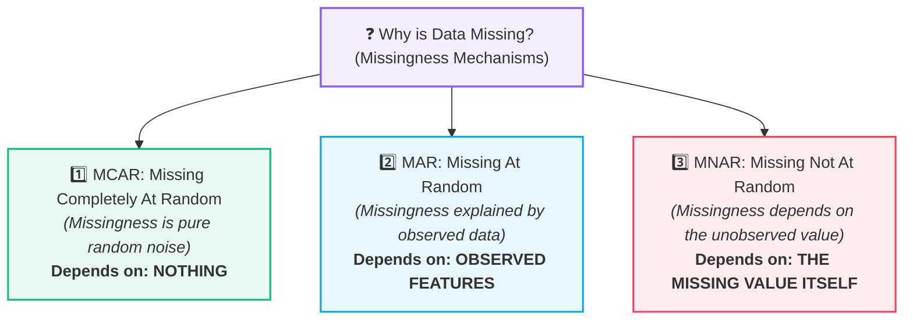
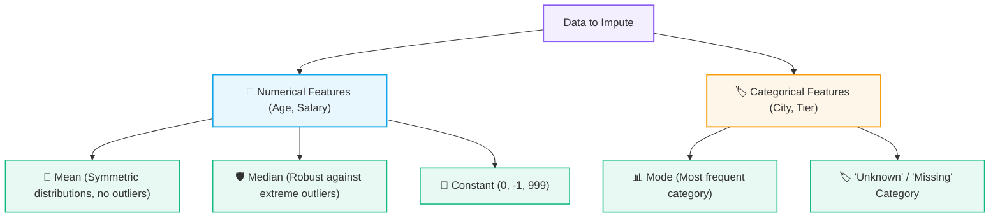
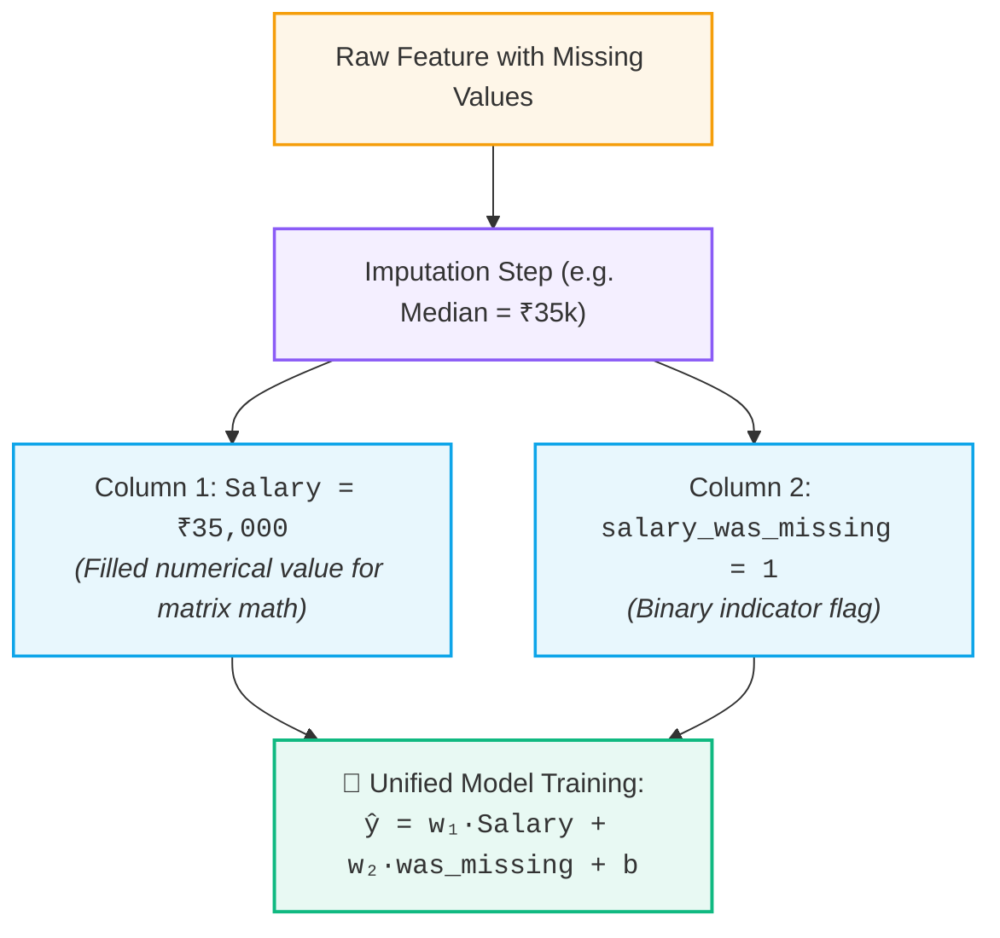
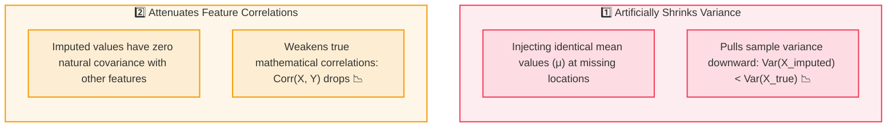

# 🩹 Missing Value Imputation & Missingness Mechanisms (MCAR, MAR, MNAR)

> [!abstract] Executive Summary
> Real-world datasets frequently contain missing values (`NaN`, `null`, `None`). **Imputation** is the process of estimating and replacing missing entries with substituted values to prevent catastrophic row deletion and enable mathematical matrix operations in ML models. 
> 
> Before choosing an imputation strategy, we must understand the underlying **mechanism of missingness**: **MCAR** (Completely Random), **MAR** (Depends on Observed Data), or **MNAR** (Depends on the Hidden Value Itself).

---

## ❓ 1. The Missing Data Problem

Most machine learning estimators (Linear Regression, SVMs, Neural Networks, PCA) rely on complete numerical matrix operations and **will throw fatal errors if fed missing values**.

| 🧑‍🎓 Student | 🎂 Age | ⏱️ Study Hours | 🎯 Exam Score |
| :---: | :---: | :---: | :---: |
| Student A | 18 | 5 | 70 |
| Student B | 19 | 8 | 85 |
| Student C | 18 | 3 | 55 |
| Student D | 20 | <mark><b>? (Missing)</b></mark> | 90 |

> [!warning] Why Not Just Delete Rows? (Complete Case Analysis)
> While dropping rows with missing values (`df.dropna()`) is easy, it discards all other valid feature values in those rows. If 20 features each have 5% missing data randomly scattered across rows, deleting rows can destroy over 60% of your entire dataset!

---

## 🔬 2. The 3 Missingness Mechanisms (MCAR vs. MAR vs. MNAR)

The statistical validity of any imputation method depends directly on **why the data is missing**:



---

### 1️⃣ MCAR — Missing Completely At Random
- **Definition:** The probability of a value being missing is completely independent of both observed features and the missing value itself.
- **Mental Model:** Pure, accidental coin-flip noise.
- **Example:** A respondent's salary is missing because their Wi-Fi momentarily dropped, or a sensor battery died unexpectedly.
- **Implication:** Dropping rows is statistically unbiased (though wasteful). Standard mean/median imputation is safe.

---

### 2️⃣ MAR — Missing At Random
- **Definition:** The probability of a value being missing depends systematically on **other features that we CAN observe in the dataset**, but not on the missing value itself once those features are accounted for.
- **Mental Model:** *"I can explain the missingness using information I already know."*
- **Example:** Younger people (observed `Age < 25`) are statistically more likely to skip reporting `Salary`. Because `Age` is recorded, we can condition on `Age` to estimate `Salary`.
- **Implication:** Imputing conditionally using other observed features (e.g., KNN Imputation, Iterative / Regression Imputation) yields unbiased estimates.

---

### 3️⃣ MNAR — Missing Not At Random (The Danger Zone) 🚨
- **Definition:** The probability of a value being missing depends directly on the **true value of the missing variable itself**.
- **Mental Model:** *"The missingness is driven by the very secret they are hiding."*
- **Example:** High-income earners refuse to disclose their `Salary` because they consider it private. Severely depressed patients fail to return a depression survey.
- **Implication:** Standard mean or median imputation causes **catastrophic systematic bias**. If all missing salaries belong to multi-millionaires, replacing them with the sample mean (₹40,000) severely underestimates their true earnings!

---

### 🧠 Master Mechanism Comparison Matrix

| Mechanism | Missingness Depends On... | Core Diagnostic Question | Canonical Example | Safe Handling |
| :--- | :--- | :--- | :--- | :--- |
| **MCAR** | **Nothing** (Pure randomness) | *"Is it just a random technical glitch?"* | Wi-Fi disconnect dropped the form field. | Deletion is unbiased; Mean/Median imputation. |
| **MAR** | **Observed features** | *"Can I explain it using other recorded data?"* | People in certain cities skip salary; City is recorded. | Model-based imputation (KNN, IterativeImputer). |
| **MNAR** | **The missing value itself** | *"Is the value missing because it is extreme/sensitive?"* | Multi-millionaires refuse to report salary. | Domain modeling; add `was_missing` indicator flag. |

---

## 📊 3. Imputation Strategies: Numerical vs. Categorical



---

### 🧮 Mean vs. Median: The Outlier Rule

Consider a sample of 5 employee salaries with one missing entry and one extreme outlier:
$$\text{Salaries} = [₹30\text{k}, \; ₹32\text{k}, \; ₹35\text{k}, \; \mathbf{?}, \; ₹10\text{ Crore}]$$

1. **Mean Imputation:**
   $$\mu = \frac{30 + 32 + 35 + 10000}{4} = \frac{10097}{4} \approx \mathbf{₹25.2\text{ Lakh}}$$
   - ❌ **Severely Distorted:** The imputed value ($₹25.2\text{ Lakh}$) is wildly unrepresentative for typical employees.

2. **Median Imputation (Outlier-Robust):**
   $$\text{Sorted Observed} = [30\text{k}, \mathbf{32\text{k}}, \mathbf{35\text{k}}, 10\text{Cr}] \implies \text{Median} = \frac{32 + 35}{2} = \mathbf{₹33.5\text{k}}$$
   - ✅ **Representative & Robust:** Outliers have zero leverage on the median.

> [!tip] Golden Rule for Numerical Imputation
> **Always prefer Median over Mean whenever data is skewed or contains outliers.**

---

### 🏷️ Categorical Imputation: Mode vs. `"Unknown"`

Because qualitative categories (e.g. `City = ['Delhi', 'Mumbai', missing, 'Delhi']`) have no mathematical mean or median, two core strategies are employed:

| Strategy | Action Taken | Real-World Meaning | Scikit-Learn Configuration |
| :--- | :--- | :--- | :--- |
| **1. Mode (Most Frequent)** | Fills missing entries with the most common class (`'Delhi'`). | Assumes the missing observation follows the dominant population majority. | `SimpleImputer(strategy='most_frequent')` |
| **2. `"Unknown"` Constant** | Creates an explicit new category (`'Unknown'`). | Preserves missingness as an independent state; downstream [[Categorical Encoding\|One-Hot Encoding]] generates a dedicated `City_Unknown` column. | `SimpleImputer(strategy='constant', fill_value='Unknown')` |

> [!important] When to Use `"Unknown"` Over Mode
> Use `"Unknown"` when the fact that a category was omitted may carry distinct domain meaning (e.g., missing medical department, unverified merchant country, or withheld survey response). Mode imputation should only be used when missingness is pure accidental noise (MCAR) and the dominant class overwhelmingly represents reality.

---

## 🏷️ 4. The Missing Indicator Feature (`was_missing`)

When data is missing (especially under **MAR** or **MNAR**), the fact that a value was missing often carries **strong predictive signal**:

| Customer | Salary (Raw) | Salary (Imputed with Median) | `salary_was_missing` (Indicator) |
| :---: | :---: | :---: | :---: |
| **A** | ₹30,000 | ₹30,000 | `0` *(Originally observed)* |
| **B** | <mark>Missing</mark> | **₹35,000** | **`1`** *(Originally missing!)* |
| **C** | ₹40,000 | ₹40,000 | `0` *(Originally observed)* |



> [!important] How the Model Uses Both Features Simultaneously
> The model does **NOT** train in separate phases (e.g., present first, missing second). It trains in **one unified step**:
> - **In Linear Models ($\hat{y} = w_1 x + w_2 \text{was\_missing} + b$):** The model learns a general slope $w_1$ for observed salary, and a separate intercept shift $w_2$ that adjusts the prediction specifically when the salary was withheld.
> - **In Decision Trees:** The tree can split on `salary_was_missing == 1` to route imputed samples down an entirely dedicated branch.

> [!tip] Scikit-Learn Automatic Indicator
> In Scikit-Learn, setting `SimpleImputer(add_indicator=True)` automatically generates these binary indicator columns:
> ```python
> from sklearn.impute import SimpleImputer
> imputer = SimpleImputer(strategy='median', add_indicator=True)
> X_imputed = imputer.fit_transform(X_train)
> ```

---

## ⚠️ 5. The Hidden Statistical Pitfalls of Mean Imputation

While simple and fast, mean imputation alters the underlying data geometry:



---

## 🛡️ 6. Preventing Imputation Leakage (The Protocol)

> [!danger] Critical Rule: Never Compute Summary Statistics on Full Data!
> Always calculate the mean, median, or mode **strictly from `X_train`**, and use those exact training parameters to impute both `X_train` and `X_test`.

```python
from sklearn.model_selection import train_test_split
from sklearn.impute import SimpleImputer
import numpy as np

# 1. Split FIRST to prevent preprocessing leakage
X_train, X_test, y_train, y_test = train_test_split(X, y, test_size=0.2, random_state=42)

# 2. Instantiate imputer with missing indicator flag
imputer = SimpleImputer(strategy='median', add_indicator=True)

# 3. Fit on TRAINING data ONLY, then transform X_train
X_train_imputed = imputer.fit_transform(X_train)

# 4. Transform TEST data using training set median
X_test_imputed = imputer.transform(X_test)
```

---

## 🔑 Key Summary Takeaways

| Concept | Golden Rule |
| :--- | :--- |
| **MCAR** | Missingness is pure chance $\to$ Deletion is unbiased; standard imputation works. |
| **MAR** | Missingness depends on observed features $\to$ Use model-based / conditional imputation. |
| **MNAR** | Missingness depends on the hidden value itself $\to$ Mean/median causes severe bias; add `was_missing` flag. |
| **Outliers Present** | Use **Median** over Mean. |
| **Categorical Missing** | Use **Mode** or create a new `"Unknown"` category. |
| **`was_missing` Flag** | Preserves informative missingness signals for the downstream classifier. |
| **Leakage Prevention** | Fit imputer on `X_train` only; transform `X_test` with training parameters. |

---

## 🔗 Prerequisites & Next Steps

### Prerequisites
- [[01. Data Leakage|🚨 Data Leakage & The 3 Critical Boundaries]]
- [[03. Features, Targets, and Datasets]]

### Next Steps
- [[02. Categorical Encoding]] — Transforming categorical variables into numerical vectors.
- [[04. Feature Scaling]] — Standardizing the range of imputed numerical features.

## 🔗 Related Notes
- [[02. Data Preprocessing/README|🧹 Data Preprocessing MOC]]
- [[01. Data Leakage]]
- [[04. Feature Scaling]]
- [[02. Categorical Encoding]]
- [[04. Train-Test Split and Generalization]]
- [[05. End-to-End ML Pipeline]]
