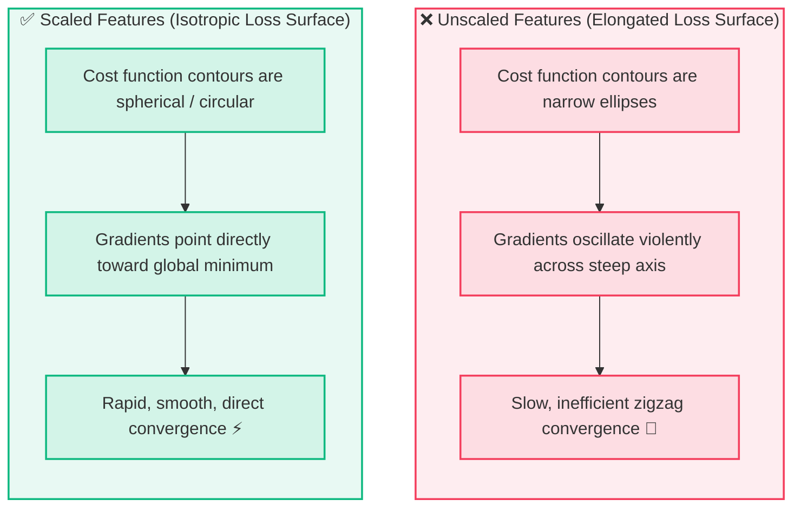
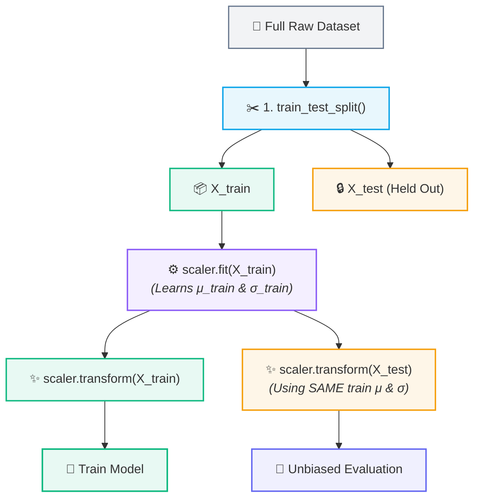

# 📏 Feature Scaling & StandardScaler

## 📐 What is a Scaler?

> [!abstract] Core Concept
> A **scaler** is a data preprocessing tool that transforms the numerical values of features onto a standardized, comparable scale without altering the underlying distribution shape or relative relationships in the data.

### The Scale Disparity Problem

Consider a dataset predicting student performance:

| 🧑‍🎓 Student | ⏱️ Hours Studied ($X_1$) | 💰 Family Income ($X_2$) |
| :---: | :---: | :---: |
| Student A | 5 | ₹50,000 |
| Student B | 8 | ₹80,000 |
| Student C | 10 | ₹1,20,000 |

Notice the scale difference:
- **Hours Studied**: Operates in single digits ($5 \to 10$)
- **Family Income**: Operates in tens of thousands ($50,000 \to 1,20,000$)

```text
WITHOUT Scaling:
Income  ──────────────────────────────────────────► (Range: 50,000 - 120,000)
Hours   ─────►                                      (Range: 5 - 10)

WITH Scaling:
Income  ─────► (Range: -1.2 to +1.2)
Hours   ─────► (Range: -1.2 to +1.2)
```

> [!warning] The Scale Bias
> Without scaling, distance-based and gradient-based algorithms may treat income as thousands of times more important simply because its numbers are larger.

---

## 🎯 Why Does Scale Matter?

### 1. Loss Surface Geometry & Optimization



### 2. Distance-Based Algorithms
Algorithms that compute geometric distances between sample points (e.g., **KNN, K-Means, SVM, PCA**) are heavily distorted if one feature has an overpowering scale.

---

## 📐 StandardScaler (Z-Score Standardization)

**StandardScaler** standardizes features by removing the mean and scaling to unit variance.

### Mathematical Formula

$$
\boxed{z = \frac{x - \mu}{\sigma}}
$$

Where:
- $x$ = Original feature value
- $\mu$ = Mean of the feature values ($\mu = \frac{1}{N}\sum x_i$)
- $\sigma$ = Standard deviation of the feature values ($\sigma = \sqrt{\frac{1}{N}\sum (x_i - \mu)^2}$)
- $z$ = Standardized score ($z$-score)

### Statistical Properties of Scaled Output
- 🟢 **Mean ($\mu_z$) $\approx 0$**
- 🟢 **Standard Deviation ($\sigma_z$) $\approx 1$**

---

### 🔍 Intuitive Example

Suppose we have study hours for 3 students:

$$\text{Hours} = [2, 4, 6]$$

1. **Calculate Mean ($\mu$):**
   $$\mu = \frac{2 + 4 + 6}{3} = 4$$

2. **Standard Deviation ($\sigma$):**
   $$\sigma = \sqrt{\frac{(2-4)^2 + (4-4)^2 + (6-4)^2}{3}} = \sqrt{\frac{4 + 0 + 4}{3}} = \sqrt{2.67} \approx 1.63$$

3. **Center & Standardize Values:**
   - $x = 2 \implies z = \frac{2 - 4}{1.63} \approx -1.22$ *(Negative / Below Average)*
   - $x = 4 \implies z = \frac{4 - 4}{1.63} = 0.0$ *(Zero / Exactly Average)*
   - $x = 6 \implies z = \frac{6 - 4}{1.63} \approx +1.22$ *(Positive / Above Average)*

> [!tip] Information Preservation
> Scaling changes the **units and coordinates** in which the model views the features — it does **not** alter the underlying distribution shape, rank order, or relative information.

---

## ⚙️ The `fit()` vs. `transform()` Paradigm

In machine learning libraries (such as Scikit-Learn), scaling follows a strict two-phase protocol:

| Protocol Step | Code Action | What Happens Under the Hood |
| :--- | :--- | :--- |
| **`fit()`** | `scaler.fit(X_train)` | **LEARNS** scaling parameters ($\mu_{\text{train}}$ and $\sigma_{\text{train}}$) from `X_train`. |
| **`transform()`** | `scaler.transform(X)` | **APPLIES** learned parameters: $z = \frac{x - \mu_{\text{train}}}{\sigma_{\text{train}}}$. |

---

## 🚫 Preventing Data Leakage in Scaling

> [!danger] Critical Rule: Never Fit on Test Data!
> Always fit the scaler **strictly on the training data**, then use those learned parameters to transform both the training and test sets.



### Why?
Fitting on the test set (or fitting before splitting) leaks information about the test distribution (its mean and variance) into the training process. In production, unseen future data must be evaluated using the baseline established during training.

---

## 💻 Python / Scikit-Learn Implementation

```python
from sklearn.model_selection import train_test_split
from sklearn.preprocessing import StandardScaler

# 1. Split data first to avoid data leakage
X_train, X_test, y_train, y_test = train_test_split(X, y, test_size=0.2, random_state=42)

# 2. Initialize scaler
scaler = StandardScaler()

# 3. Fit on training data ONLY, then transform training data
X_train_scaled = scaler.fit_transform(X_train)

# 4. Transform test data using the parameters learned from X_train
X_test_scaled = scaler.transform(X_test)
```

---

## 🔑 Summary Takeaways

| Concept | Key Role |
| :--- | :--- |
| **Scaler** | Standardizes features with different units/ranges onto a comparable scale. |
| **StandardScaler** | Normalizes data to have $\mu \approx 0$ and $\sigma \approx 1$ via $z = \frac{x - \mu}{\sigma}$. |
| **Loss Surface** | Makes optimization surfaces spherical, accelerating Gradient Descent convergence. |
| **`fit()`** | **Learns** parameters ($\mu, \sigma$) from training data. |
| **`transform()`** | **Applies** learned parameters to scale data. |
| **Data Leakage** | Prevented by fitting on `X_train` only, never on `X_test`. |

---

## 🔗 Prerequisites & Next Steps

### Prerequisites
- [[03. Features, Targets, and Datasets]]
- [[04. Train-Test Split and Generalization]]
- [[05. End-to-End ML Pipeline]]

### Next Steps
- **Linear Regression & Gradient Descent** — See how feature scaling optimizes loss function convergence.

## 🔗 Related Notes
- [[01. Classical ML/README|📁 Classical ML Foundations MOC]]
- [[05. End-to-End ML Pipeline]]
- [[04. Train-Test Split and Generalization]]
- [[03. Features, Targets, and Datasets]]
