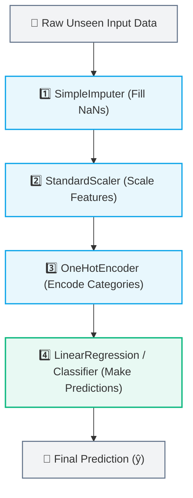
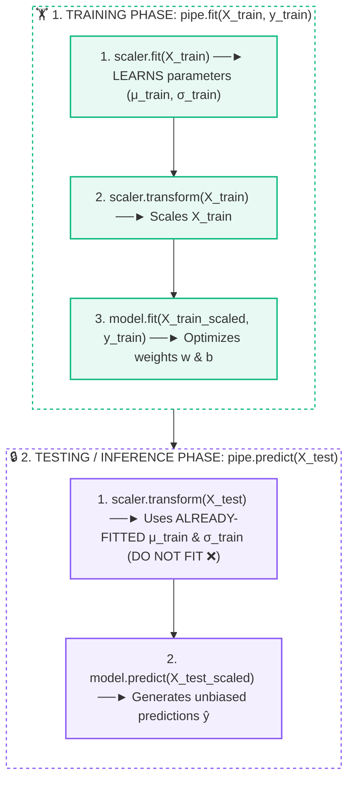
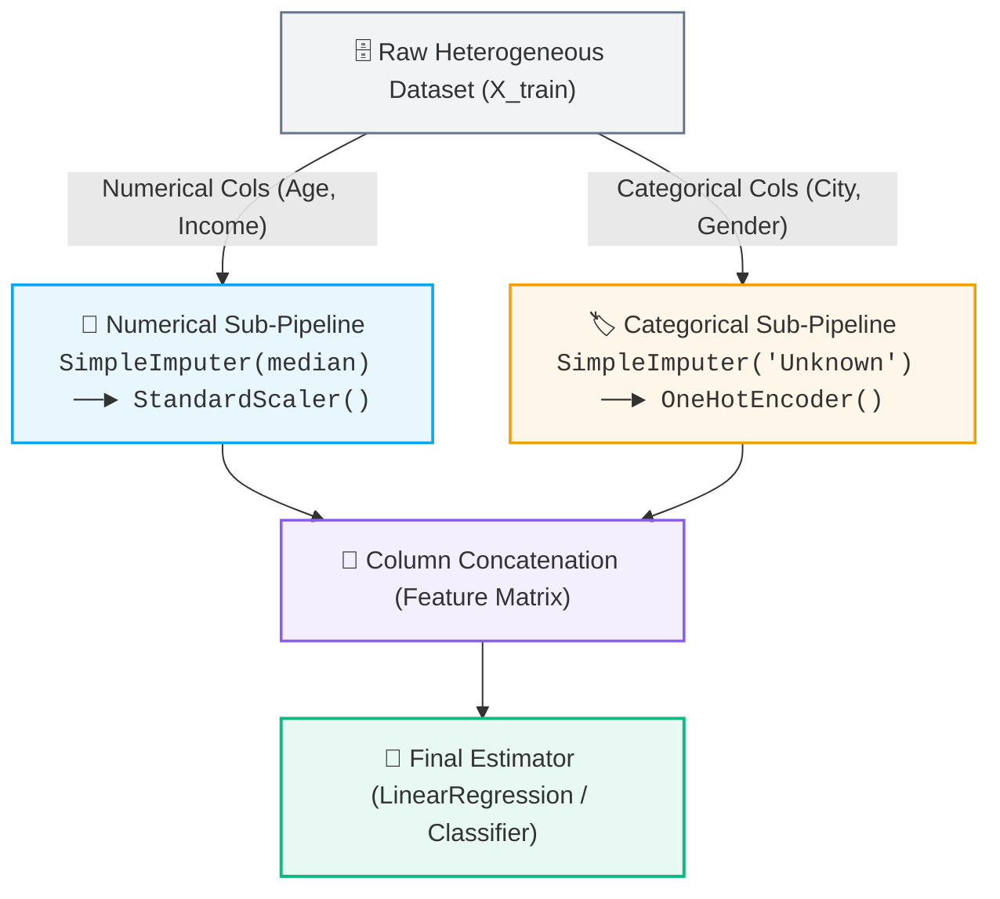

# 🚂 Scikit-Learn Pipeline & ColumnTransformer

> [!abstract] Executive Summary
> A **Scikit-Learn Pipeline** chains multiple data preprocessing transformers and a final estimator into a single, unified mathematical workflow. It serves as the industry standard for **leak-proof machine learning**, guaranteeing that all transformation parameters ($\mu, \sigma$, medians, categories) are strictly learned from training data during `fit()` and seamlessly applied during inference without test contamination.

---

## 🚂 1. What is a Pipeline?

In real-world machine learning, raw data must pass through multiple sequential transformations before reaching the estimator:



### The Manual Anti-Pattern vs. The Unified Pipeline

```python
# ❌ THE ERROR-PRONE MANUAL WAY (High Risk of Data Leakage & Bugs)
imputer.fit(X_train)
X_train_imp = imputer.transform(X_train)
scaler.fit(X_train_imp)
X_train_scaled = scaler.transform(X_train_imp)
model.fit(X_train_scaled, y_train)

# Must remember to manually apply the EXACT same chain to X_test:
X_test_imp = imputer.transform(X_test)
X_test_scaled = scaler.transform(X_test_imp)
y_pred = model.predict(X_test_scaled)
```

```python
# ✅ THE CLEAN, LEAK-PROOF PIPELINE WAY
from sklearn.pipeline import Pipeline
from sklearn.preprocessing import StandardScaler
from sklearn.linear_model import LinearRegression

# Encapsulate entire chain into one object
pipe = Pipeline([
    ('scaler', StandardScaler()),
    ('model', LinearRegression())
])

# Fits transformers on X_train ONLY, fits model
pipe.fit(X_train, y_train)

# Safely transforms X_test using training parameters and predicts
y_pred = pipe.predict(X_test)
```

---

## 🛡️ 2. Why Pipeline is the Ultimate Defense Against Data Leakage

> [!example] 📏 The Ruler Analogy: Make the Ruler Once
> Think of a data preprocessor (like `StandardScaler`) as a **calibrated measuring ruler**:
> 1. **Training Data ($X_{\text{train}}$) $\longrightarrow$ Create and calibrate the ruler:** The scaler measures the mean ($\mu$) and standard deviation ($\sigma$) of the training samples.
> 2. **Testing Data ($X_{\text{test}}$) $\longrightarrow$ Measure using the EXISTING ruler:** You use that exact same ruler to measure the test samples.
> 
> **You NEVER create a new ruler using the test data.** ❌  
> A Pipeline automatically enforces this rule so you cannot accidentally recalibrate your ruler on unseen evaluation data.



### 🔍 Lifecycle Comparison: Training vs. Testing

| Lifecycle Stage | Code Called | What Happens to Preprocessors? | What Happens to the Model? | Leakage Status |
| :--- | :--- | :--- | :--- | :--- |
| **🏋️ Training** | `pipe.fit(X_train, y_train)` | **`fit()`** and **`transform()`** on `X_train` | Learns optimal parameters ($w, b$) using $y_{\text{train}}$ | ✅ Safe |
| **🔒 Testing / Live** | `pipe.predict(X_test)` | **`transform()` ONLY** (uses training $\mu, \sigma$) | Uses trained parameters to output $\hat{y}$ | 🔒 **Zero Leakage** |

---

### ❓ Why Does `fit()` Take Both $(X, y)$ While `predict()` Takes Only $(X)$?

```mermaid
flowchart TD
    subgraph TrainFlow ["🏋️ 1. TRAINING (Model learns relationship X ──► y)"]
        direction LR
        XTr["X_train (Inputs)"] --> Scl["StandardScaler (Transforms X)"] --> EstTr["Estimator (Linear Regression)"]
        YTr["y_train (Answers)"] ───────────────────────────────────────────► EstTr
    end

    subgraph TestFlow ["🔮 2. INFERENCE / PREDICTION (Model estimates ŷ from X)"]
        direction LR
        XTe["X_test (Inputs ONLY)"] --> SclTe["StandardScaler (Using train μ, σ)"] --> EstTe["Trained Estimator"] --> YHat["Predictions (ŷ)"]
    end

    TrainFlow --- TestFlow

    classDef xNode fill:#0ea5e918,stroke:#0ea5e9,stroke-width:1.8px;
    classDef yNode fill:#10b98118,stroke:#10b981,stroke-width:1.8px;
    classDef estNode fill:#6366f118,stroke:#6366f1,stroke-width:1.8px;

    class XTr,XTe xNode;
    class YTr,YHat yNode;
    class Scl,SclTe,EstTr,EstTe estNode;
```

1. **Why `fit(X_train, y_train)` needs both:**
   * Preprocessing transformers (`StandardScaler`, `SimpleImputer`) strictly operate on **input features $X$** to standardize coordinates and fill missing features.
   * The final model estimator needs **both** the preprocessed inputs $X_{\text{train}}$ and the true ground-truth answers $y_{\text{train}}$ to optimize its internal weights and minimize error ($f(X) \approx y$).
2. **Why `predict(X_test)` gets ONLY $X_{\text{test}}$:**
   * In real-world deployment, you only have the input features (e.g., hours studied) and need the model to generate the prediction ($\hat{y}$).
   * The ground-truth test labels $y_{\text{test}}$ remain locked in an evaluation vault. You only compare $\hat{y}$ against $y_{\text{test}}$ **afterwards** to compute performance metrics (such as MSE or $R^2$).

> [!important] The One Core Sentence to Memorize
> **A Pipeline chains preprocessing and the model together, ensuring all transformers are fitted strictly on the training partition and never on the testing partition.**

---

## 🔀 3. Handling Mixed Data Types: `ColumnTransformer`

Real datasets contain a mix of **numerical columns** (requiring median imputation + scaling) and **categorical columns** (requiring mode imputation + one-hot encoding). 

`ColumnTransformer` applies dedicated transformation sub-pipelines to specific subsets of columns:



---

## 💻 4. Production Python Boilerplate: Complete Pipeline

```python
from sklearn.model_selection import train_test_split
from sklearn.compose import ColumnTransformer
from sklearn.pipeline import Pipeline
from sklearn.impute import SimpleImputer
from sklearn.preprocessing import StandardScaler, OneHotEncoder
from sklearn.linear_model import Ridge

# 1. Define column subsets
num_features = ['age', 'study_hours', 'income']
cat_features = ['city', 'education_level']

# 2. Build numerical transformation sub-pipeline
num_pipeline = Pipeline([
    ('imputer', SimpleImputer(strategy='median', add_indicator=True)),
    ('scaler', StandardScaler())
])

# 3. Build categorical transformation sub-pipeline
cat_pipeline = Pipeline([
    ('imputer', SimpleImputer(strategy='constant', fill_value='Unknown')),
    ('encoder', OneHotEncoder(handle_unknown='ignore', drop='first'))
])

# 4. Combine into ColumnTransformer
preprocessor = ColumnTransformer(transformers=[
    ('num', num_pipeline, num_features),
    ('cat', cat_pipeline, cat_features)
])

# 5. Build full Master Pipeline
full_model_pipe = Pipeline([
    ('preprocessor', preprocessor),
    ('regressor', Ridge(alpha=1.0))
])

# 6. Split FIRST
X_train, X_test, y_train, y_test = train_test_split(X, y, test_size=0.2, random_state=42)

# 7. Fit on X_train ONLY & Predict safely on X_test
full_model_pipe.fit(X_train, y_train)
y_predictions = full_model_pipe.predict(X_test)
```

---

## 🔄 5. Safe Cross-Validation Without Leakage

When evaluating models using Cross-Validation ($K$-Fold), fitting preprocessing outside the CV loop leaks validation folds into training folds.

Passing the **Pipeline object directly into `cross_val_score`** guarantees that each fold fits transformers independently:

```python
from sklearn.model_selection import cross_val_score

# Fits scaler and imputer separately inside each of the 5 folds!
cv_scores = cross_val_score(full_model_pipe, X_train, y_train, cv=5, scoring='r2')
print(f"Mean CV R² Score: {cv_scores.mean():.4f}")
```

---

## 🔑 Key Summary Takeaways

| Feature / Question | Answer |
| :--- | :--- |
| **What is a Pipeline?** | A sequential chain of preprocessing transformers ending in an estimator. |
| **How does it prevent leakage?** | Calls `fit_transform()` on `X_train`, but strictly calls `transform()` on `X_test`. |
| **What does `pipe.fit()` do?** | Fits all transformers and the model on training data. |
| **What does `pipe.predict()` do?** | Transforms new inputs using training statistics and outputs predictions $\hat{y}$. |
| **Mixed feature types?** | Handled seamlessly with `ColumnTransformer`. |
| **Cross-Validation safety?** | Preprocessing is automatically re-fitted per fold without data bleed. |

---

## 🔗 Prerequisites & Next Steps

### Prerequisites
- [[01. Data Leakage|🚨 Data Leakage: The 3 Critical Leakage Patterns]]
- [[02. Categorical Encoding]]
- [[03. Missing Value Imputation]]
- [[04. Feature Scaling]]

### Next Steps
- **Model Evaluation & Cross-Validation** — Rigorous metrics ($R^2$, RMSE, MAE, Confusion Matrix).
- **Hyperparameter Tuning (`GridSearchCV`)** — Optimizing model and transformer parameters inside a Pipeline.

## 🔗 Related Notes
- [[02. Data Preprocessing/README|🧹 Data Preprocessing MOC]]
- [[01. Data Leakage]]
- [[04. Feature Scaling]]
- [[03. Missing Value Imputation]]
- [[02. Categorical Encoding]]
- [[01. Classical ML/06. Linear Regression Assumptions|📐 Linear Regression Assumptions]]
- [[01. Classical ML/README|📁 Classical ML Foundations MOC]]
