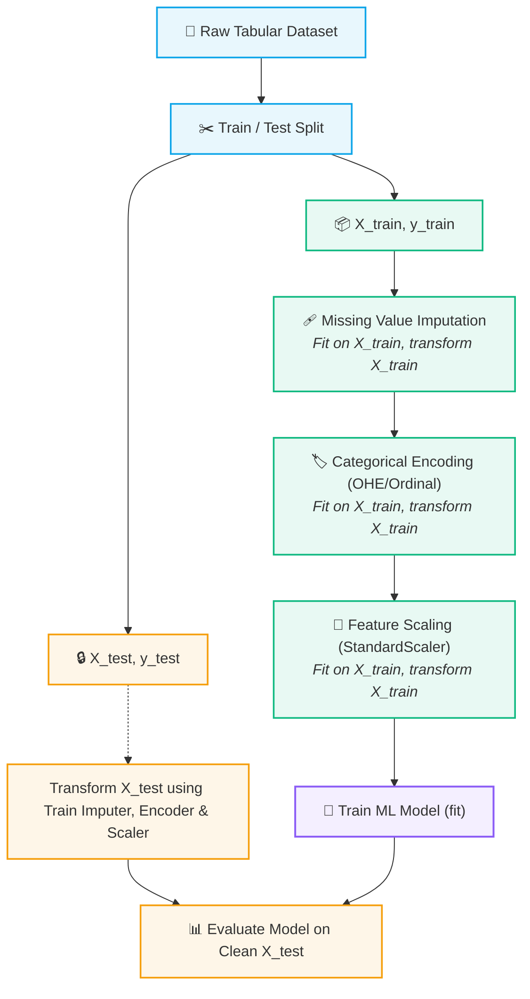

# 🧹 Data Preprocessing & Feature Engineering

> [!abstract] Module Overview
> Raw real-world data is noisy, incomplete, categorical, and measured across disparate scales. This module covers the core transformation techniques used to convert raw features into optimal mathematical representations for machine learning algorithms without data leakage.

---

## 📖 Module Topics

1. **[[01. Data Leakage]]**
   - Master definition: Information reaching the model that wouldn't be available at prediction time
   - **The 3 Leakage Patterns:**
     - 1️⃣ *Preprocessing Leakage*: Computing statistics over full dataset before splitting ($\text{Test} \to \text{Train}$)
     - 2️⃣ *Target Leakage*: Using features only known after the target event ($\text{After} \to \text{Before}$)
     - 3️⃣ *Temporal Leakage*: Future data leaking into past predictions via random splits ($\text{Future} \to \text{Past}$)
   - Safe workflows: `train_test_split`, `TimeSeriesSplit`, and Scikit-Learn `Pipeline`

2. **[[02. Categorical Encoding]]**
   - Nominal vs. Ordinal categorical variables
   - Ordinal Encoding: Preserving natural monotonic rankings ($0 < 1 < 2$)
   - The False Ordering Hazard of integer encoding nominal features
   - One-Hot Encoding (OHE): Orthogonal indicator columns and equidistant vectors

3. **[[03. Missing Value Imputation]]**
   - Handling incomplete data matrices (`NaN` / null values)
   - **The 3 Mechanisms:** **MCAR** (Random), **MAR** (Observed data), and **MNAR** (Hidden value itself)
   - Numerical strategies: Mean vs. Median (outlier-robust) & Categorical strategies (Mode, `"Unknown"`)
   - The Missing Indicator feature (`was_missing` / `add_indicator=True`)
   - Statistical side-effects of Mean Imputation (variance shrinkage & correlation attenuation)
   - Preventing Imputation Leakage across train/test splits

4. **[[04. Feature Scaling|Feature Scaling & StandardScaler]]**
   - The scale disparity problem (e.g., hours vs income)
   - Why scale matters: Loss surface geometry & Gradient Descent optimization
   - **StandardScaler**: Formula ($z = \frac{x - \mu}{\sigma}$), zero-centering, and unit variance
   - The `fit()` vs `transform()` paradigm in scaling

5. **[[05. Scikit-Learn Pipeline|Scikit-Learn Pipeline & ColumnTransformer]]**
   - Chaining transformers and estimators into a single leak-proof object
   - Internal mechanics of `fit()` (training) vs `predict()` (inference)
   - Heterogeneous column pipelines via `ColumnTransformer`
   - Safe Cross-Validation without data leakage

---

## 🔄 Module Workflow Graph

---

## 🔗 Prerequisites & Next Steps

### Prerequisites
- [[AI & ML/01. Classical ML/README|Classical ML Foundations MOC]]
- [[AI & ML/01. Classical ML/01. Introduction to Machine Learning|Introduction to Machine Learning]]
- [[AI & ML/01. Classical ML/02. Supervised vs Unsupervised Learning|Supervised vs Unsupervised Learning]]

### Next Steps
- [[AI & ML/02. Data Preprocessing/01. Data Leakage|Data Leakage]]
- [[AI & ML/02. Data Preprocessing/02. Categorical Encoding|Categorical Encoding]]
- [[AI & ML/02. Data Preprocessing/03. Missing Value Imputation|Missing Value Imputation]]
- [[AI & ML/02. Data Preprocessing/04. Feature Scaling|Feature Scaling]]

---

## 🔗 Related Notes
- [[AI & ML/README|🤖 AI & ML Master MOC]]
- [[AI & ML/01. Classical ML/README|📁 Classical ML Foundations MOC]]
- [[Dashboard|🧭 Main Command Center]]

