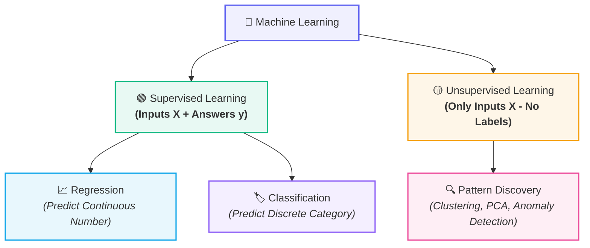
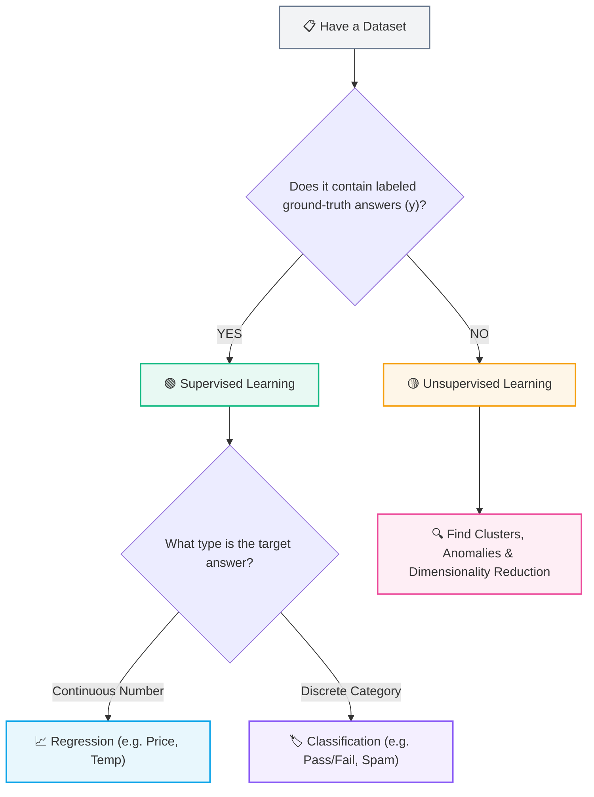

# 🧭 Supervised vs Unsupervised Learning

## 🧠 The Machine Learning Mental Map

Classical Machine Learning is fundamentally split into two main branches based on whether the training data includes **ground-truth answers ($y$)**:



---

## 🟢 1. Supervised Learning ($X + y$)

> [!example] 🐱 The Flashcard Analogy: Teaching a Child
> Imagine teaching a young child to recognize animals using labeled flashcards:
> - Show card: 🐱 $\longrightarrow$ You say: **"CAT"**
> - Show card: 🐶 $\longrightarrow$ You say: **"DOG"**
> - Show card: 🐱 $\longrightarrow$ You say: **"CAT"**
> - Show card: 🐶 $\longrightarrow$ You say: **"DOG"**
> 
> You provide **Examples ($X$) + Correct Answers ($y$)**.
> Later, when shown a brand new card 🐱, the child immediately identifies **"CAT"**.

### How Supervised Learning Works in ML
The model receives pairs of **Input features ($X$)** and **True targets ($y$)** during training. It learns the mathematical relationship mapping $X \rightarrow y$ so it can predict $\hat{y}$ for future, unseen $X$.

```text
Input X + Correct Answer y ──> [ Learn Relationship ] ──> Predict y for new X
```

---

## 📈 Supervised Sub-Type A: Regression (Predicting a Number)

> [!abstract] Definition
> In **Regression**, the target output ($y$) is a **continuous numerical value** (a measurement, price, or score).

```text
Hours Studied ──> Exam Score (e.g., 72.5, 81.0, 93.2)
```

### Real-World Regression Examples:
| Problem | Input Features ($X$) | Target Output ($y$) |
| :--- | :--- | :--- |
| 🏠 **House Price Prediction** | Area, bedrooms, neighborhood | ₹ 75,00,000 |
| ⛅ **Weather Forecasting** | Humidity, pressure, wind speed | 31.5 °C |
| 💼 **Salary Estimation** | Years of experience, tech stack | ₹ 85,000 / month |
| 🎓 **Academic Performance** | Hours studied, attendance rate | 87.4 Marks |

---

## 🏷️ Supervised Sub-Type B: Classification (Predicting a Category)

> [!abstract] Definition
> In **Classification**, the target output ($y$) is a **discrete class, label, or category**.

```text
Hours Studied ──> Pass vs. Fail
```

### Real-World Classification Examples:
| Problem | Input Features ($X$) | Target Output ($y$) |
| :--- | :--- | :--- |
| 📧 **Email Spam Filter** | Sender, keywords, attachments | `Spam` vs. `Not Spam` |
| 🐾 **Image Recognition** | Pixel matrix, color channels | `Cat` vs. `Dog` vs. `Rabbit` |
| 💳 **Fraud Detection** | Transaction amount, location | `Fraud` vs. `Normal` |
| 🩺 **Medical Diagnostics** | Blood markers, symptoms | `Disease` vs. `No Disease` |

---

## 🟡 2. Unsupervised Learning ($X$ Only)

> [!example] 🧩 Unlabeled Discovery Analogy
> Imagine giving a computer a pile of animal photos with **no labels at all**:
> $$\text{🐱  🐱  🐶  🐶  🐰  🐰}$$
> 
> You give no answers. You simply instruct: *"Find patterns and organize these."*
> 
> The computer groups them by geometry and traits:
> - **Group 1:** Pointed ears & whiskers (Cats)
> - **Group 2:** Floppy ears & long snouts (Dogs)
> - **Group 3:** Long upright ears (Rabbits)
> 
> It doesn't know the human words "Cat" or "Dog", but it identifies intrinsic structural clusters.

### How Unsupervised Learning Works in ML
The algorithm receives **only input data ($X$)** with **no target answer ($y$)**. It finds natural groupings, correlations, and representations on its own.

### Common Unsupervised Tasks:
- 👥 **Customer Segmentation:** Grouping e-commerce customers into spending personas (K-Means Clustering).
- 📉 **Dimensionality Reduction:** Compressing high-dimensional features into core components without losing signal (PCA).
- 🚨 **Anomaly Detection:** Flagging abnormal server traffic spikes or unusual system behavior.

---

## 🔥 Remember This Forever

| Paradigm | What You Provide | Core Mechanism | Goal |
| :--- | :--- | :--- | :--- |
| **Supervised** | **$X + y$** *(Inputs + Answers)* | Learns mapping $f(X) \approx y$ | **Predict $y$** for new $X$ |
| **Unsupervised** | **$X$ only** *(No Labels)* | Analyzes structure and distances | **Find patterns & clusters** |

---

## ⚖️ Decision Tree Cheat-Sheet



---

## 🔗 Prerequisites & Next Steps

### Prerequisites
- [[Introduction to Machine Learning]]

### Next Step
- [[Features, Targets, and Datasets]] — How tabular and matrix representations ($X, y$) are formalized in code.

## 🔗 Related Notes
- [[Classical ML/README|📁 Classical ML Foundations MOC]]
- [[Introduction to Machine Learning]]
- [[Features, Targets, and Datasets]]
- [[Train-Test Split and Generalization]]
- [[End-to-End ML Pipeline]]
