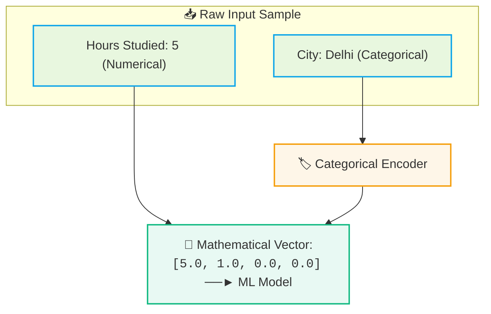
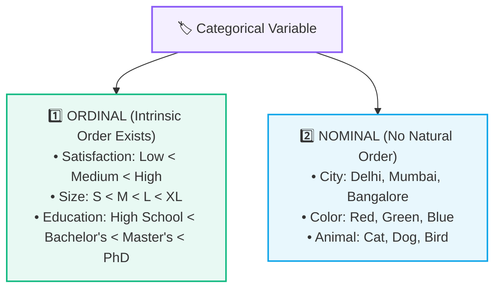
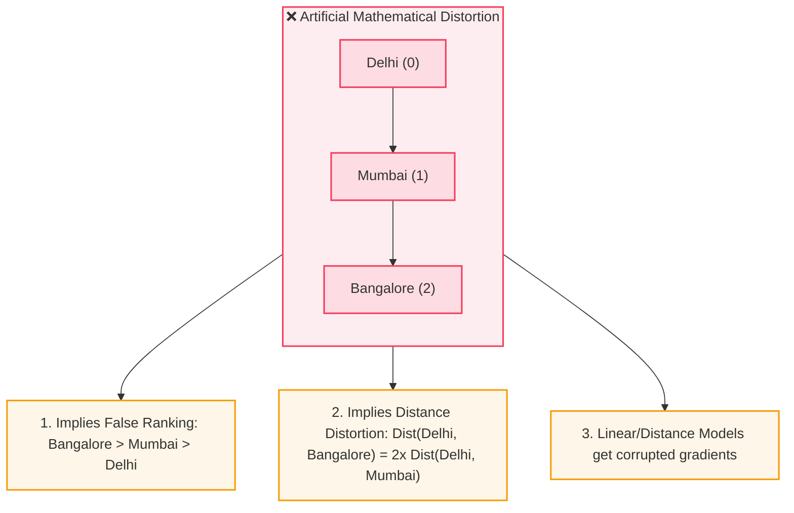
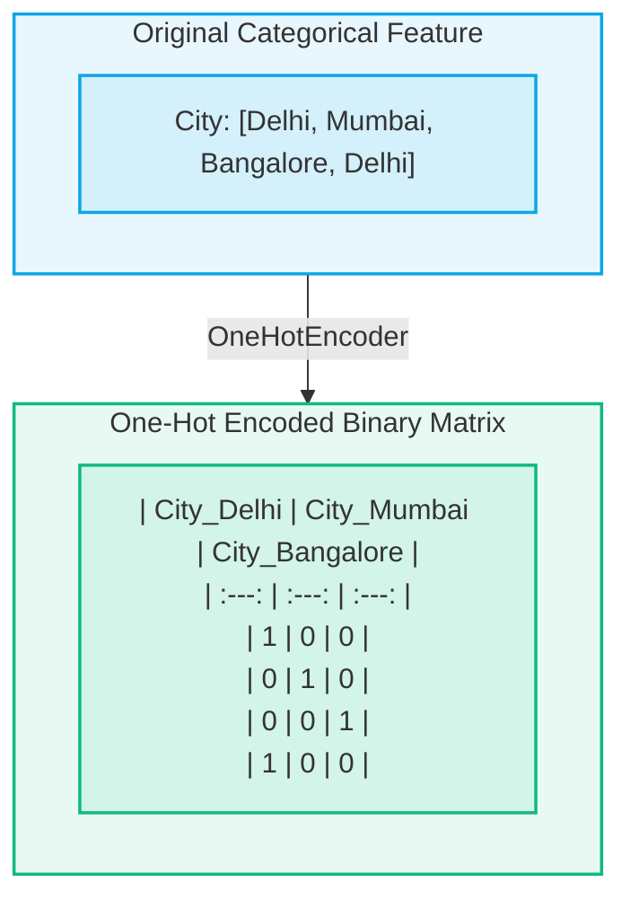

# 🏷️ Categorical Encoding: Nominal vs. Ordinal

> [!abstract] Executive Summary
> Machine learning models are mathematical optimization functions that operate on numerical tensors ($\mathbb{R}^n$). **Categorical Encoding** is the data preprocessing process of transforming non-numerical attributes (categories, labels, strings) into structured numerical vectors without introducing false mathematical assumptions or distorting underlying relationships.

---

## 🧩 1. What is a Categorical Variable?

A **variable (feature)** represents an observed characteristic of a data sample. Features broadly fall into two fundamental classes:

| Feature Type | Definition | Example Values | Representation in Raw Data |
| :--- | :--- | :--- | :--- |
| **Numerical Feature** | Quantitative measurements with intrinsic mathematical scale. | `Hours Studied: 5.5`, `Age: 21`, `Salary: $85,000` | Continuous floats or discrete integers |
| **Categorical Feature** | Qualitative labels representing groups, states, or classes. | `City: Delhi`, `Color: Red`, `Rating: High` | Strings, text labels, or discrete IDs |



---

## ⚖️ 2. The Two Types of Categorical Data: Nominal vs. Ordinal

Before selecting an encoding strategy, the feature's semantic structure must be analyzed:



---

## 📈 3. Ordinal Encoding (Preserving Inherent Rank)

When categorical levels possess a clear, unambiguous ranking, **Ordinal Encoding** maps each category to an integer that preserves this monotonic order:

$$\text{Low} \to 0, \quad \text{Medium} \to 1, \quad \text{High} \to 2$$

Because $0 < 1 < 2$, the mathematical model accurately learns that $\text{Low} < \text{Medium} < \text{High}$.

```python
from sklearn.preprocessing import OrdinalEncoder

# Explicitly declare category order
categories_order = [["Low", "Medium", "High"]]
encoder = OrdinalEncoder(categories=categories_order)

X_train_encoded = encoder.fit_transform(X_train[["satisfaction_level"]])
```

> [!important] Explicit Ordering Rule
> Always specify the explicit category ordering when configuring an ordinal encoder. If left to default alphabetical ordering, `"High"` might be assigned `0`, `"Low"` `1`, and `"Medium"` `2`, destroying the true semantic relationship.

---

## 🚨 4. The Nominal Integer Encoding Trap (False Ordering)

What happens if we arbitrarily assign integers to **Nominal** (unordered) features?

$$\text{Delhi} \to 0, \quad \text{Mumbai} \to 1, \quad \text{Bangalore} \to 2$$



> [!danger] Critical Modeling Hazard
> In linear models ($y = w_1 x_1 + b$) and distance-based algorithms (KNN, K-Means, SVMs), assigning nominal categories arbitrary integers forces the optimizer to treat the category as a linear continuum, corrupting loss gradients and predictive logic.

---

## 🔲 5. One-Hot Encoding (OHE)

To encode **Nominal** features without creating artificial ranking, **One-Hot Encoding** creates a separate binary ($0$ or $1$) indicator column for every unique category:



### Properties of One-Hot Encoding:
- **Equidistant Representation:** In Euclidean space, the distance between any two one-hot vectors is identically $\sqrt{2}$, ensuring no two cities are artificially "closer" than others:
  $$d(\text{Delhi}, \text{Mumbai}) = \sqrt{(1-0)^2 + (0-1)^2 + (0-0)^2} = \sqrt{2}$$
- **Dimensionality Consideration:** If a categorical feature has $K$ distinct categories, One-Hot Encoding adds $K$ new columns. For high-cardinality features (e.g., `Postal Code` with 5,000 values), target encoding or frequency encoding is preferred.

```python
from sklearn.preprocessing import OneHotEncoder

ohe = OneHotEncoder(sparse_output=False, handle_unknown="ignore")
X_train_ohe = ohe.fit_transform(X_train[["City"]])
```

> [!tip] `handle_unknown='ignore'`
> Setting `handle_unknown='ignore'` in Scikit-Learn ensures that if a new, unseen category appears in the test set or production inference, the encoder gracefully assigns all $0$s across the one-hot columns instead of throwing a runtime error.

---

## 🧠 6. Encoding Decision Matrix

| Characteristic | 🟢 Ordinal Encoding | 🔲 One-Hot Encoding |
| :--- | :--- | :--- |
| **Category Structure** | Natural inherent ranking ($\text{Low} < \text{Med} < \text{High}$) | Unordered nominal groups ($\text{Red}, \text{Blue}, \text{Green}$) |
| **New Columns Added** | **0** (Replaces column in-place with integers) | **$K$ columns** (where $K$ = number of unique categories) |
| **Mathematical Assumption** | $0 < 1 < 2 < \dots < K$ | Orthogonal, equidistant unit vectors |
| **Primary Danger** | False ranking if applied to nominal data | High memory / Dimensionality curse if $K$ is very large |

---

## 🔗 Related Notes & Next Concepts

- **Parent MOC:** [[AI & ML/Data Preprocessing/README|🧹 Data Preprocessing & Feature Engineering MOC]]
- **Prerequisites:**
  - [[AI & ML/Classical ML/Introduction to Machine Learning|🧠 Introduction to Machine Learning]]
  - [[AI & ML/Data Preprocessing/Data Leakage|🛡️ Data Leakage & Safe Transformation]]
- **Next Logical Topics:**
  - [[AI & ML/Data Preprocessing/Feature Scaling|📐 Feature Scaling & Loss Surface Geometry]]
  - `[[AI & ML/Data Preprocessing/Scikit-Learn Pipelines]]` — Combining Imputation, One-Hot Encoding, and Scaling safely into `ColumnTransformer`.
