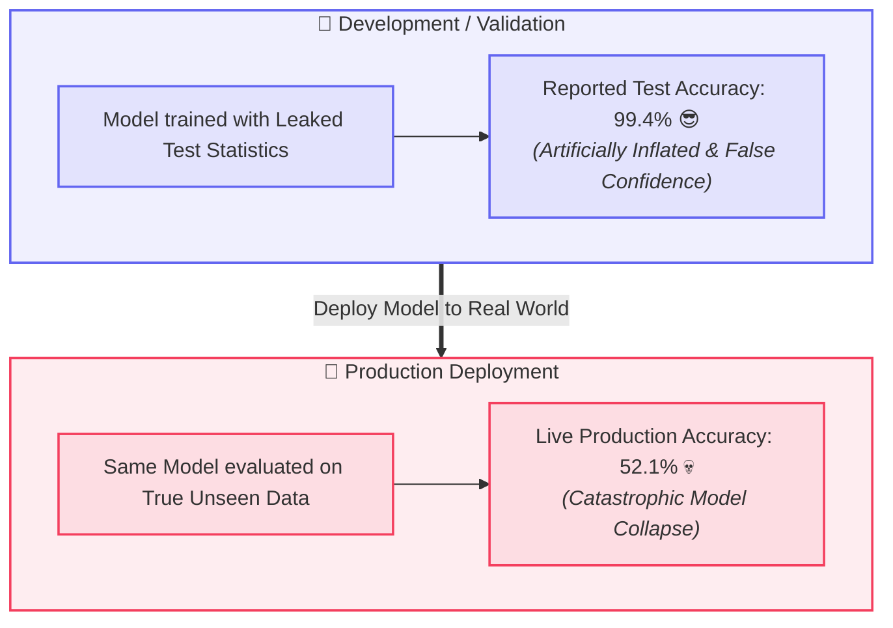
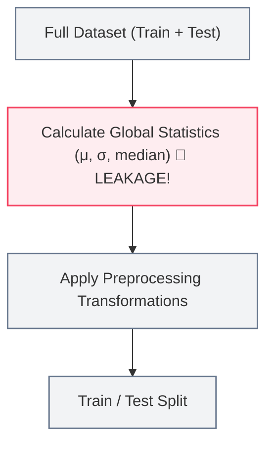
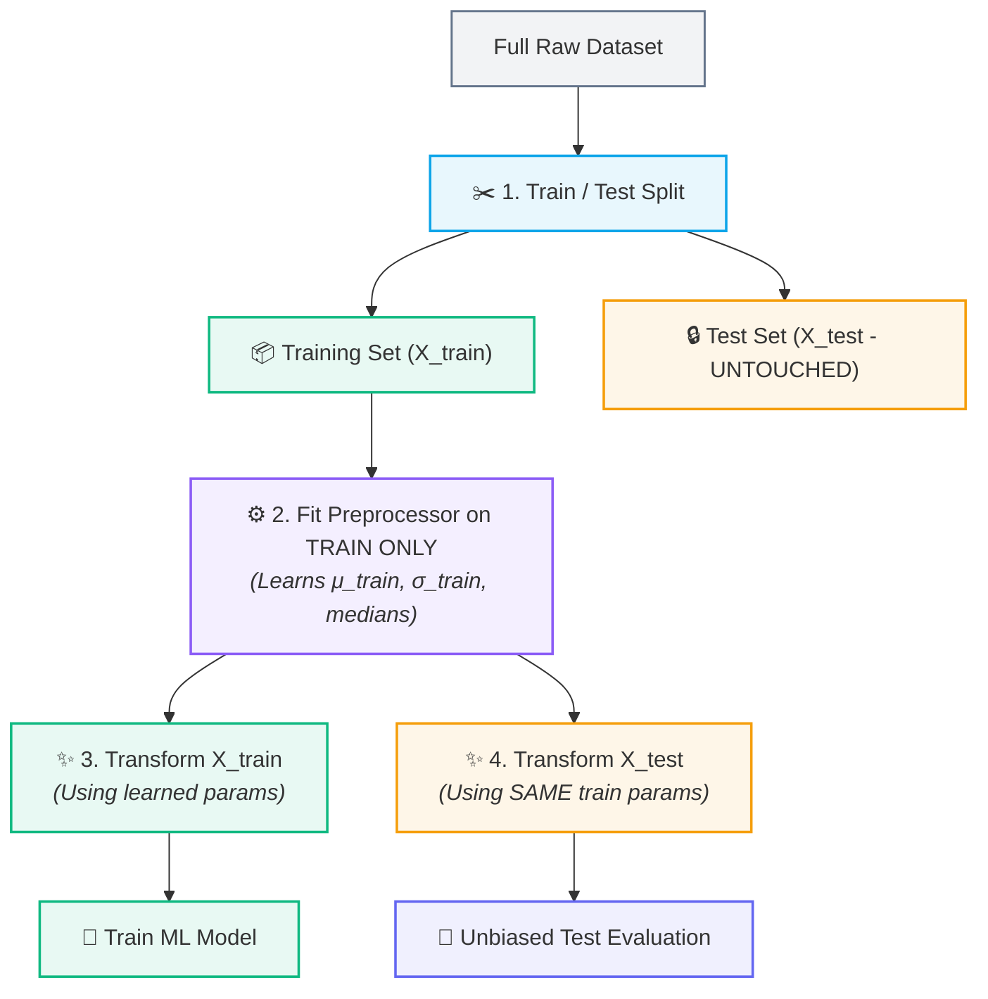

# 🚨 Data Leakage

## 🔍 What is Data Leakage?

**Data Leakage** occurs when information from outside the training dataset (specifically from the test set, target labels, or future unseen data) inadvertently contaminates the model training or preprocessing pipeline.

> [!example] 📝 The Leaked Exam Analogy
> Imagine a student preparing for a 100-question exam. The student studies 80 practice questions. If someone secretly leaks the answers to the remaining 20 test questions beforehand, the student will score 100% on the exam. 
> 
> However, that 100% score does not reflect genuine learning or problem-solving capability. When presented with completely new questions in the real world, performance collapses.



---

## 🛑 Why is Data Leakage Dangerous?

> [!warning] The 3 Hidden Risks of Leakage
> 1. **False Confidence:** Gives misleadingly optimistic performance metrics during development.
> 2. **Failure in Production:** Models that memorize leaked artifacts fail to generalize to actual unseen inputs in production.
> 3. **Subtle & Silent:** Unlike syntax errors or runtime crashes, data leakage runs without errors — it silently destroys model validity.

---

## 🔄 Preprocessing Leakage: The Most Common Form

Preprocessing leakage happens when data transformations (e.g., scaling, missing value imputation, encoding) calculate summary statistics across the **entire dataset** before performing the train-test split.

### ❌ The Wrong Order (Causes Leakage)



> [!danger] Why this fails
> The training process indirectly learns the mean, standard deviation, or median of the test set before the model is even trained. The test set is no longer truly "unseen."

---

### ✅ The Correct Order (Leakage-Free Protocol)



---

## ⚙️ The `fit()` vs. `transform()` Paradigm

Understanding how Scikit-Learn transformers operate is critical to enforcing leakage boundaries:

| Method | Role | Where to Use |
| :--- | :--- | :--- |
| **`fit(X)`** | **LEARNS** parameters ($\mu, \sigma$, medians, vocabulary) from data. | **`X_train` ONLY** |
| **`transform(X)`** | **APPLIES** previously learned parameters to transform data. | **`X_train` AND `X_test`** |
| **`fit_transform(X)`** | Convenience method that fits parameters and transforms in one step. | **`X_train` ONLY** |

### 🚫 Prohibited Code Patterns

```python
# ❌ INCORRECT: Leaks test set distribution into the scaler
scaler.fit(X_test)

# ❌ INCORRECT: Re-calculates new parameters on test set
X_test_scaled = scaler.fit_transform(X_test)

# ❌ INCORRECT: Fits on the whole dataset before splitting
X_scaled = scaler.fit_transform(X)
X_train, X_test, y_train, y_test = train_test_split(X_scaled, y)
```

### ✅ Approved Safe Pattern

```python
from sklearn.model_selection import train_test_split
from sklearn.preprocessing import StandardScaler

# 1. Split FIRST
X_train, X_test, y_train, y_test = train_test_split(X, y, test_size=0.2, random_state=42)

# 2. Initialize transformer
scaler = StandardScaler()

# 3. Fit and transform on TRAINING data only
X_train_scaled = scaler.fit_transform(X_train)

# 4. Transform TEST data using training parameters
X_test_scaled = scaler.transform(X_test)
```

---

## 🧠 The Golden Rule of Preprocessing

> [!important] The Universal Law of ML Validation
> **Always split first. Fit all transformers strictly on the training set. Apply the fitted transformers to both the training and test sets without re-fitting.**

### ❓ Why must transformers be fitted on training data only?
> [!quote] Core Principle
> Fitting on the test set allows properties of the test distribution (e.g., test mean, standard deviation, median, or categories) to influence preprocessing parameters. This invalidates the fundamental assumption that the test partition is strictly unseen, resulting in biased, overly optimistic validation metrics that fail to generalize to real-world data.

This golden rule applies identically across all preprocessing stages:
- [[Feature Scaling]] (StandardScaler, MinMaxScaler)
- [[Missing Value Imputation]] (SimpleImputer)
- [[Categorical Encoding]] (OneHotEncoder, OrdinalEncoder)
- Dimensionality Reduction (PCA)

---

## 🔗 Prerequisites & Next Steps

### Prerequisites
- [[Train-Test Split and Generalization]]
- [[Features, Targets, and Datasets]]

### Next Steps
- [[Categorical Encoding]] — Encoding nominal and ordinal features without data leakage.
- [[Missing Value Imputation]] — Handling missing entries without leaking statistical properties across splits.
- [[Feature Scaling]] — Standardizing feature ranges while respecting data split boundaries.

---

## 🔗 Related Notes
- [[Data Preprocessing/README|🧹 Data Preprocessing MOC]]
- [[Categorical Encoding|🏷️ Categorical Encoding Note]]
- [[Missing Value Imputation]]
- [[Feature Scaling]]
- [[Train-Test Split and Generalization]]
- [[End-to-End ML Pipeline]]

