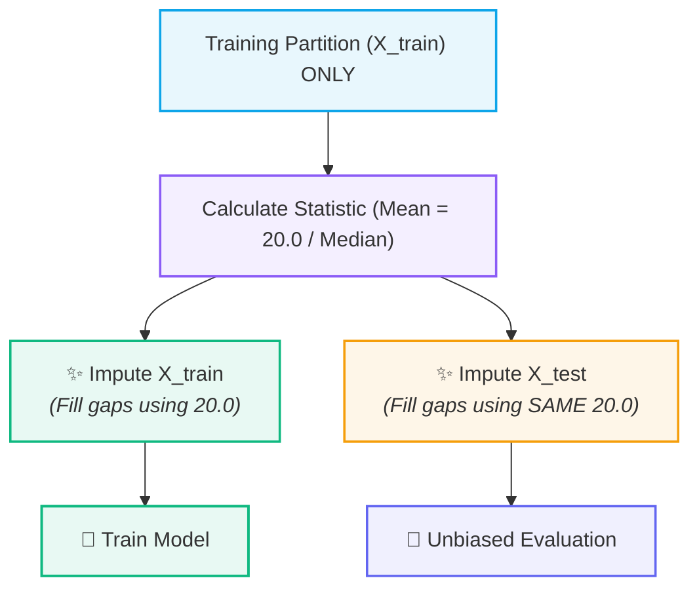

# 🩹 Missing Value Imputation

## ❓ The Problem of Missing Data

Real-world datasets frequently arrive with missing entries (`NaN`, `null`, `None`, `?`) caused by sensor drops, non-responses, recording errors, or system failures.

| 🧑‍🎓 Student | 🎂 Age | ⏱️ Study Hours | 🎯 Exam Score |
| :---: | :---: | :---: | :---: |
| 1 | 18 | 5 | 70 |
| 2 | 19 | 8 | 85 |
| 3 | 18 | 3 | 55 |
| 4 | 20 | <mark><b>? (Missing)</b></mark> | 90 |

> [!warning] Algorithmic Limitation
> Most machine learning algorithms (Linear Regression, SVMs, Neural Networks) rely on complete mathematical matrix multiplications and **will throw fatal errors if fed missing values**.

---

## 🩹 What is Imputation?

> [!abstract] Definition
> **Imputation** is the process of replacing missing data values with substituted, statistically estimated values.
> 
> *Why not just delete rows?* Dropping rows throws away all the other valid feature values in those rows, destroying valuable sample size.

---

## 📊 Numerical Imputation Strategies

When dealing with numerical features, three primary baseline imputation strategies are used:

### 1. 🧮 Mean Imputation
Replaces missing entries with the arithmetic average of observed values:

$$\mu = \frac{1}{N} \sum_{i=1}^{N} x_i$$

- **Best used when:** The feature follows a symmetric, normal distribution without extreme outliers.

> [!example] Calculation
> $$\text{Ages} = [18, 20, \mathbf{?}, 22, 25]$$
> $$\mu = \frac{18 + 20 + 22 + 25}{4} = \frac{85}{4} = 21.25$$
> $$\text{Imputed Ages} = [18, 20, \mathbf{21.25}, 22, 25]$$

---

### 2. 🛡️ Median Imputation (Outlier-Robust)
Replaces missing entries with the middle value of sorted observations.

- **Best used when:** The feature contains **extreme outliers** or has a highly skewed distribution (e.g., income, house prices).
- **Why median?** Extreme values pull the mean heavily, whereas the median remains robust and resistant to distortion.

> [!tip] Mean vs. Median with Outliers
> If salaries are $[25\text{k}, 30\text{k}, 35\text{k}, \mathbf{1\text{Cr}}]$:
> - **Mean:** $\approx 25.2\text{ Lakh}$ *(heavily distorted!)*
> - **Median:** $32.5\text{k}$ *(accurately reflects typical salary)*

---

### 3. 🎯 Constant / Arbitrary Imputation
Replaces missing entries with a specific fixed constant (such as `0`, `-1`, or `999`).

- **Best used when:** The absence of data itself carries specific semantic meaning (e.g., missing *"number of previous loan defaults"* means $0$).

---

## 🚨 Imputation Leakage (The Trap)

Imputation is susceptible to [[Data Leakage]] if statistical estimates are calculated over the whole dataset before splitting.

```text
               TRAINING AGES                       TEST AGES
               [18, 20, 22, ?]                     [30, 40, ?]
```

> [!danger] ❌ The Wrong Way: Global Imputation
> Computing the mean across both sets:
> $$\mu_{\text{global}} = \frac{18 + 20 + 22 + 30 + 40}{5} = 26.0$$
> *Result:* Test values ($30, 40$) contaminate training values.

---

### ✅ The Safe Workflow: Leakage-Free Imputation

Compute the summary statistic **strictly from the training partition**:

$$\mu_{\text{train}} = \frac{18 + 20 + 22}{3} = 20.0$$



---

## 💻 Python / Scikit-Learn Implementation

Scikit-Learn provides `SimpleImputer` to implement this workflow safely:

```python
from sklearn.model_selection import train_test_split
from sklearn.impute import SimpleImputer
import numpy as np

# 1. Split FIRST
X_train, X_test, y_train, y_test = train_test_split(X, y, test_size=0.2, random_state=42)

# 2. Instantiate imputer (strategy: 'mean', 'median', or 'constant')
imputer = SimpleImputer(strategy='median')

# 3. Fit on TRAINING data only, then transform training data
X_train_imputed = imputer.fit_transform(X_train)

# 4. Transform TEST data using training set median
X_test_imputed = imputer.transform(X_test)
```

---

## 🔑 Summary Comparison

| Strategy | Formula / Logic | Outlier Sensitivity | Typical Use Case |
| :--- | :--- | :--- | :--- |
| **Mean** | $\frac{\sum x}{N}$ | High (distorted by outliers) | Symmetric / bell-curve numerical features |
| **Median** | Middle sorted value | Low (robust) | Skewed data (income, prices, age distributions) |
| **Constant** | Fixed value ($0, -1$) | None | Indicator/flagged features where null = zero |

---

## 🔗 Prerequisites & Next Steps

### Prerequisites
- [[Data Leakage]] — Understanding why parameter estimation must be isolated to training sets.
- [[Features, Targets, and Datasets]]

### Next Steps
- [[Feature Scaling]] — Standardizing the range of imputed numerical features.
- Categorical Encoding — Converting categorical text columns to numerical representations.

## 🔗 Related Notes
- [[Data Preprocessing/README|🧹 Data Preprocessing MOC]]
- [[Data Leakage]]
- [[Feature Scaling]]
- [[Train-Test Split and Generalization]]
- [[End-to-End ML Pipeline]]
