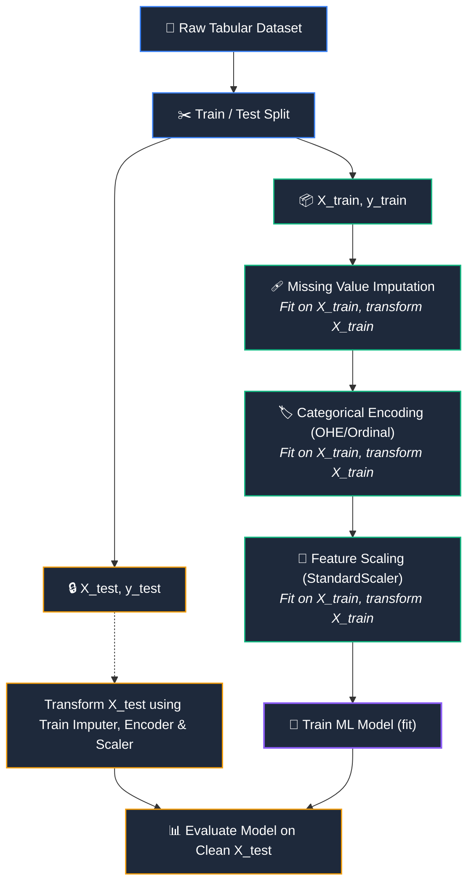

# 🧹 Data Preprocessing & Feature Engineering

> [!abstract] Module Overview
> Raw real-world data is noisy, incomplete, categorical, and measured across disparate scales. This module covers the core transformation techniques used to convert raw features into optimal mathematical representations for machine learning algorithms without data leakage.

---

## 📖 Module Topics

1. **[[Data Leakage]]**
   - Definition: Unintended information transfer from outside the training partition
   - False confidence in development vs catastrophic real-world failure
   - Preprocessing leakage & why fitting before splitting fails
   - The Golden Workflow: `Split` $\to$ `fit() on train` $\to$ `transform() on train & test`

2. **[[Categorical Encoding]]**
   - Nominal vs. Ordinal categorical variables
   - Ordinal Encoding: Preserving natural monotonic rankings ($0 < 1 < 2$)
   - The False Ordering Hazard of integer encoding nominal features
   - One-Hot Encoding (OHE): Orthogonal indicator columns and equidistant vectors

3. **[[Missing Value Imputation]]**
   - Handling incomplete data matrices (`NaN` / null values)
   - Numerical strategies: Mean, Median (outlier-robust), and Constant imputation
   - Preventing Imputation Leakage across train/test splits
   - Implementation via Scikit-Learn `SimpleImputer`

4. **[[Feature Scaling|Feature Scaling & StandardScaler]]**
   - The scale disparity problem (e.g., hours vs income)
   - Why scale matters: Loss surface geometry & Gradient Descent optimization
   - **StandardScaler**: Formula ($z = \frac{x - \mu}{\sigma}$), zero-centering, and unit variance
   - The `fit()` vs `transform()` paradigm in scaling

---

## 🔄 Module Workflow Graph

---

## 🔗 Prerequisites & Next Steps

### Prerequisites
- [[AI & ML/Classical ML/README|Classical ML Foundations MOC]]
- [[AI & ML/Classical ML/Introduction to Machine Learning|Introduction to Machine Learning]]
- [[AI & ML/Classical ML/Supervised vs Unsupervised Learning|Supervised vs Unsupervised Learning]]

### Next Steps
- [[AI & ML/Data Preprocessing/Data Leakage|Data Leakage]]
- [[AI & ML/Data Preprocessing/Categorical Encoding|Categorical Encoding]]
- [[AI & ML/Data Preprocessing/Missing Value Imputation|Missing Value Imputation]]
- [[AI & ML/Data Preprocessing/Feature Scaling|Feature Scaling]]

---

## 🔗 Related Notes
- [[AI & ML/README|🤖 AI & ML Master MOC]]
- [[AI & ML/Classical ML/README|📁 Classical ML Foundations MOC]]
- [[Dashboard|🧭 Main Command Center]]

