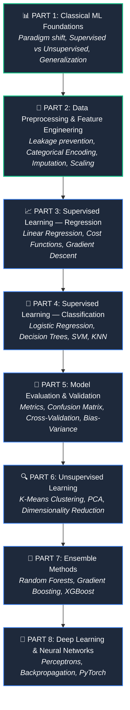
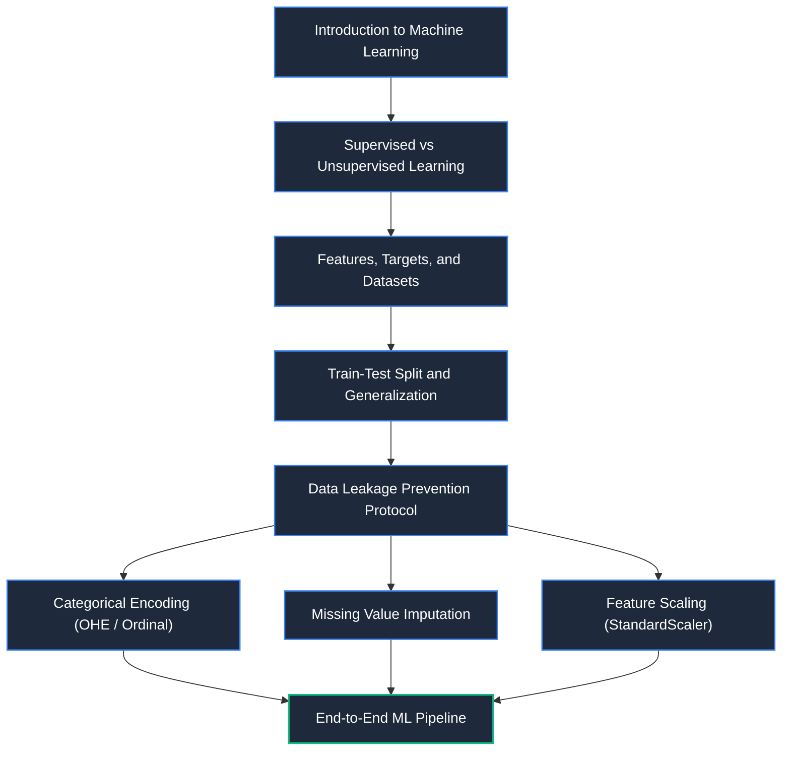

# 🤖 Artificial Intelligence & Machine Learning Knowledge Base

> [!abstract] Master AI & ML Hub
> Welcome to the **AI & Machine Learning Knowledge Base**. This repository contains interconnected study notes covering the principles, mathematical patterns, algorithms, and practical workflows of modern Machine Learning — from foundational classical algorithms to deep learning.

---

## 🗺️ Machine Learning Learning Path

---

## 📚 Core Modules

### 1. [[Classical ML/README|01. Classical ML Foundations]]
The fundamental paradigm, mental models, and vocabulary of machine learning:
- [[Introduction to Machine Learning]] — Traditional Programming vs ML paradigm & what is a "Model"
- [[Supervised vs Unsupervised Learning]] — Supervised (Regression vs Classification) & Unsupervised (Clustering, PCA)
- [[Features, Targets, and Datasets]] — Features ($X$), Targets ($y$), Samples, and matrix representation
- [[Train-Test Split and Generalization]] — Unseen data evaluation & introduction to Overfitting
- [[End-to-End ML Pipeline]] — The complete 10-step lifecycle from raw data to model iteration

### 2. [[Data Preprocessing/README|02. Data Preprocessing & Feature Engineering]]
Preparing and transforming raw numerical & categorical features for optimal algorithmic performance:
- [[Data Leakage]] — Test contamination, development vs production performance, and the golden workflow protocol
- [[Categorical Encoding]] — Nominal vs. Ordinal features, Ordinal Encoding, the False Ordering Hazard, and One-Hot Encoding
- [[Missing Value Imputation]] — Handling missing values via mean, median (outlier-robust), and preventing imputation leakage
- [[Feature Scaling]] — Scale disparity, StandardScaler ($z = \frac{x-\mu}{\sigma}$), loss surface geometry, and the `fit()` vs `transform()` paradigm

---

## 🔄 Knowledge Flow Graph

---

## 🔗 Quick Links
- [[Dashboard|🧭 Main Command Center]]
- [[Classical ML/README|📁 Classical ML Foundations MOC]]
- [[Data Preprocessing/README|🧹 Data Preprocessing MOC]]
- [[Categorical Encoding|🏷️ Categorical Encoding Note]]
- [[Data Leakage|🚨 Data Leakage Note]]
- [[Missing Value Imputation|🩹 Missing Value Imputation]]
- [[Feature Scaling|📏 Feature Scaling & StandardScaler]]
- [[Introduction to Machine Learning|🧠 Introduction to ML Note]]
- [[End-to-End ML Pipeline|⚙️ End-to-End ML Pipeline]]

