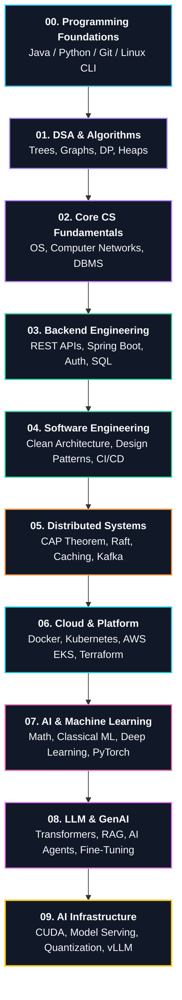

# 🧠 BrainOS — Computer Science Master Curriculum & Navigation Hub

> **The High-Level Curriculum Map:** Defining **WHAT** to learn, **WHEN** to learn it, **WHY** it matters, and **WHAT** it unlocks next on the path from Software Engineer to Distributed Systems & AI Infrastructure Engineer.

---

## 🧭 1. Navigation & Quick Status

| Status Question | Curriculum State | Target Action / Next Milestone |
| :--- | :--- | :--- |
| **🧠 Where Am I?** | **Stage 1: DSA & Foundations** | Mastering Trees, Graphs, DP & Thread-Safe Data Structures |
| **🗺️ What Comes Next?** | **Stage 2: Core CS** | Operating Systems, Computer Networks & Relational DBs |
| **🔗 Active Prerequisites** | Java / Python / C++ | Object-Oriented Design, Memory Basics & CLI Tools |
| **🚀 What It Unlocks** | Backend & Distributed Systems | Low-Latency Services, High-Throughput APIs, System Design |
| **🧪 Active Project** | Custom Data Structure Engine | Thread-Safe LRU Cache & Priority Queue Heap in Java |

---

## 🗺️ 2. The 10-Stage CS Curriculum Progression

---

## 📂 3. Curriculum Modules & Roadmaps

### 01. Roadmap & Architecture
- **Master Plan:** [[BrainOS/01 - Roadmap/CS Engineering Roadmap|CS Master Roadmap]]
- **Dependency Graph:** [[BrainOS/01 - Roadmap/Skill Dependency Map|Skill Dependency Map]]
- **Milestone Tracker:** [[BrainOS/01 - Roadmap/Learning Progress|Learning Progress]]

### 02. Foundations
- **Language & Tooling:** [[BrainOS/02 - Foundations/Programming/Java|Java]], [[BrainOS/02 - Foundations/Programming/Python|Python]], [[BrainOS/02 - Foundations/Programming/Git & Linux|Git & Linux]]
- **DSA Roadmap:** [[BrainOS/02 - Foundations/DSA/DSA|Data Structures & Algorithms Master Roadmap]]

### 03. Core Computer Science
- **OS:** [[BrainOS/03 - Core CS/Operating Systems|Operating Systems Roadmap]]
- **Networking:** [[BrainOS/03 - Core CS/Computer Networks|Computer Networks Roadmap]]
- **Databases:** [[BrainOS/03 - Core CS/Databases|Databases Roadmap]]
- **Architecture:** [[BrainOS/03 - Core CS/Computer Architecture|Computer Architecture Roadmap]]

### 04. Software Engineering & Architecture
- **Backend Services:** [[BrainOS/04 - Software Engineering/Backend Engineering|Backend Engineering Roadmap]]
- **Architecture & APIs:** [[BrainOS/04 - Software Engineering/APIs & Authentication|APIs & Authentication]], [[BrainOS/04 - Software Engineering/Software Architecture|Software Architecture]]
- **Quality & CI/CD:** [[BrainOS/04 - Software Engineering/Testing & CI-CD|Testing & CI-CD Pipeline]]

### 05. Systems & Scale
- **Distributed Scale:** [[BrainOS/05 - Systems/Distributed Systems|Distributed Systems Roadmap]]
- **Concurrency:** [[BrainOS/05 - Systems/Concurrency & Multithreading|Concurrency & Multithreading]]
- **High-Level Design:** [[BrainOS/05 - Systems/System Design|System Design Roadmap]]
- **Storage & Messaging:** [[BrainOS/05 - Systems/Caching & Message Queues|Caching & Message Queues]], [[BrainOS/05 - Systems/Scalability & Fault Tolerance|Scalability & Fault Tolerance]]

### 06. Infrastructure & Platform
- **Cloud:** [[BrainOS/06 - Infrastructure/Cloud & AWS|Cloud & AWS Roadmap]]
- **Containers & Orchestration:** [[BrainOS/06 - Infrastructure/Docker & Kubernetes|Docker & Kubernetes]]
- **DevOps:** [[BrainOS/06 - Infrastructure/DevOps & Observability|DevOps & Observability]]

### 07. AI & Machine Learning
- **Math:** [[BrainOS/07 - AI & Machine Learning/Mathematics & Statistics|Mathematics & Statistics]]
- **Classical ML:** [[BrainOS/07 - AI & Machine Learning/Machine Learning|Machine Learning Roadmap]]
- **Deep Learning:** [[BrainOS/07 - AI & Machine Learning/Deep Learning & PyTorch|Deep Learning & PyTorch]]
- **Transformers:** [[BrainOS/07 - AI & Machine Learning/Transformers|Transformer Architecture]]

### 08. LLM & GenAI
- **LLM Engineering:** [[BrainOS/08 - LLM & GenAI/LLM Engineering|LLM Engineering Roadmap]]
- **RAG:** [[BrainOS/08 - LLM & GenAI/RAG & Vector Databases|RAG & Vector Databases]]
- **Autonomous Agents:** [[BrainOS/08 - LLM & GenAI/AI Agents|AI Agents]]
- **Tuning:** [[BrainOS/08 - LLM & GenAI/Fine Tuning & Evaluation|Fine-Tuning & Evaluation]]

### 09. AI Infrastructure
- **Hardware & CUDA:** [[BrainOS/09 - AI Infrastructure/GPU Computing & CUDA|GPU Computing & CUDA]]
- **Serving Engines:** [[BrainOS/09 - AI Infrastructure/Model Serving & Inference|Model Serving & Inference]]
- **Scale:** [[BrainOS/09 - AI Infrastructure/Quantization & Distributed Inference|Quantization & Distributed Inference]]
- **Master Plan:** [[BrainOS/09 - AI Infrastructure/AI Infrastructure|AI Infrastructure Master Roadmap]]

### 10. Projects & Portfolio
- **11-Level Progression:** [[BrainOS/10 - Projects/Project Progression|The 11-Level Project Progression Ladder]]
- **Project Ideas:** [[BrainOS/10 - Projects/Project Ideas|Curated Project Ideas]]

---

## 📚 4. Vault Navigation Layer (Where Detailed Notes Live)
- Detailed DSA Notes: `[[CS/DSA/00. DSA Nexus|CS > DSA Library]]`
- Detailed Networking Notes: `[[CS/Computer Networking/00. Networking Nexus|CS > Computer Networking]]`
- Detailed Machine Learning Notes: `[[CS/AI & ML/00. AI & ML Nexus|CS > AI & ML Library]]`
- Detailed Web & Backend Notes: `[[CS/WebDev/Backend/00. Backend Nexus|CS > Backend WebDev]]`
