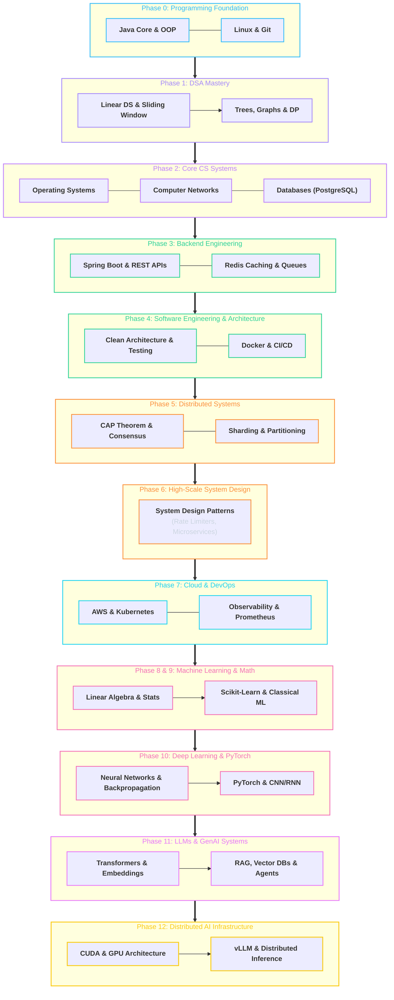

# 🗺️ Master CS & AI Engineering Roadmap

> The comprehensive 12-phase curriculum structuring your progression from programming foundations to high-throughput distributed systems and AI infrastructure over 4–5 years.

---

## 🧭 Master Progression Diagram

---

## 🟢 Phase 0 — Programming Foundation
- **Goal:** Master core language semantics so syntax stops being an obstacle.
- **What to Learn:**
  - [[BrainOS/02 - Foundations/Programming/Java|Java Basics]]: Variables, OOP, Classes, Interfaces, Collections Framework, Generics, Exceptions, File I/O.
  - [[BrainOS/02 - Foundations/Programming/Git & Linux|Linux & Git]]: CLI navigation, bash scripting, SSH, process control (`ps`, `top`, `kill`), Git branching, rebasing, and merge conflicts.
- **Why It Matters:** Every advanced system is compiled, executed, and debugged on Linux servers with strict object-oriented patterns.
- **Suggested Project:** [[BrainOS/10 - Projects/Project Progression#Level 1 CLI File Organizer & Parser|CLI File Organizer & Metadata Parser]]
- **Completion Criteria:** Write clean, modular OOP code with automated tests and comfortable Linux terminal workflows.

---

## 🔵 Phase 1 — Data Structures & Algorithms
- **Goal:** Develop algorithmic thinking and pattern recognition.
- **Core Topics:**
  - [[BrainOS/02 - Foundations/DSA/Arrays & Strings|Arrays & Strings]]
  - [[BrainOS/02 - Foundations/DSA/Two Pointers & Sliding Window|Two Pointers & Sliding Window]]
  - [[BrainOS/02 - Foundations/DSA/Hashing & Prefix Sum|Hashing & Prefix Sum]]
  - [[BrainOS/02 - Foundations/DSA/Stack & Queue|Stack & Queue]]
  - [[BrainOS/02 - Foundations/DSA/Linked Lists|Linked Lists]]
  - [[BrainOS/02 - Foundations/DSA/Binary Search|Binary Search]]
  - [[BrainOS/02 - Foundations/DSA/Trees & BST|Trees & Binary Search Trees]]
  - [[BrainOS/02 - Foundations/DSA/Heaps & Priority Queues|Heaps & Priority Queues]]
  - [[BrainOS/02 - Foundations/DSA/Graphs|Graphs (BFS, DFS, Dijkstra, TopoSort)]]
  - [[BrainOS/02 - Foundations/DSA/Greedy & Backtracking|Greedy & Backtracking]]
  - [[BrainOS/02 - Foundations/DSA/Dynamic Programming|Dynamic Programming (1D, 2D, Knapsack)]]
- **Why It Matters:** DSA teaches memory layout, time/space trade-offs, and optimization strategies vital for database indexes and network caches.
- **Suggested Project:** [[BrainOS/10 - Projects/Project Progression#Level 2 DSA Implementations|Custom Data Structure Engine (Thread-safe LRU Cache, Heap, B-Tree)]]
- **Completion Criteria:** Instantly recognize patterns for standard medium LeetCode problems within 25 minutes.

---

## 🟡 Phase 2 — Core Computer Science
- **Goal:** Understand hardware abstraction, networking protocols, and persistent storage.
- **Modules:**
  - [[BrainOS/03 - Core CS/Operating Systems|Operating Systems]]: Processes, Threads, CPU scheduling, Virtual Memory, Paging, Mutex, Semaphores, Deadlocks.
  - [[BrainOS/03 - Core CS/Computer Networks|Computer Networks]]: OSI/TCP-IP, DNS, TCP Handshake, Sockets, HTTP/1.1, HTTP/2, HTTPS/TLS.
  - [[BrainOS/03 - Core CS/Databases|Databases]]: Relational Model, SQL, B-Tree Indexing, Transactions, ACID Properties, Isolation Levels, Locks.
  - [[BrainOS/03 - Core CS/Computer Architecture|Computer Architecture]]: CPU Caches (L1/L2/L3), Memory Hierarchy, SIMD, Branch Prediction.
- **Why It Matters:** You cannot design high-scale backend or distributed systems without understanding kernel boundaries and packet flows.
- **Suggested Project:** [[BrainOS/10 - Projects/Project Progression#Level 3 HTTP Server from Scratch|Multi-threaded HTTP/1.1 Server in Pure Java Sockets]]

---

## 🟠 Phase 3 — Backend Engineering
- **Goal:** Build robust, production-grade Web APIs and services.
- **Modules:**
  - [[BrainOS/04 - Software Engineering/Backend Engineering|Spring Boot & Java Backend]]: RESTful API design, Dependency Injection, JPA/Hibernate.
  - [[BrainOS/04 - Software Engineering/APIs & Authentication|APIs & Auth]]: JWT, OAuth2, Session Management, Role-Based Access Control (RBAC).
  - [[BrainOS/05 - Systems/Caching & Message Queues|Caching & Async]]: Redis caching strategies, background job workers, Kafka/RabbitMQ events.
- **Suggested Project:** [[BrainOS/10 - Projects/Project Progression#Level 4 Production E-Commerce Backend|Production E-Commerce REST API with PostgreSQL & Redis]]

---

## 🔴 Phase 4 — Software Engineering & Architecture
- **Goal:** Master maintainability, modularity, and operational deployment.
- **Modules:**
  - [[BrainOS/04 - Software Engineering/Software Architecture|Clean Architecture & SOLID]]: Hexagonal architecture, domain-driven design.
  - [[BrainOS/04 - Software Engineering/Design Patterns|Design Patterns]]: Factory, Singleton, Observer, Strategy, Decorator, Adapter.
  - [[BrainOS/04 - Software Engineering/Testing & CI-CD|Testing & CI/CD]]: Unit testing (JUnit, Mockito), Integration testing, GitHub Actions, Docker.
- **Suggested Project:** [[BrainOS/10 - Projects/Project Progression#Level 5 Scalable URL Shortener|High-Throughput Distributed URL Shortener (ShortLink)]]

---

## 🟣 Phase 5 & 6 — Distributed Systems & System Design
- **Goal:** Design fault-tolerant systems handling millions of concurrent users.
- **Modules:**
  - [[BrainOS/05 - Systems/Distributed Systems|Distributed Systems Fundamentals]]: CAP Theorem, PACELC, Consensus (Raft/Paxos), Leader Election, Gossip Protocols.
  - [[BrainOS/05 - Systems/Scalability & Fault Tolerance|Scalability]]: Database Replication, Read Replicas, Horizontal Partitioning, Consistent Hashing.
  - [[BrainOS/05 - Systems/System Design|System Design]]: Rate Limiters, Distributed Caches, Notification Engines, Video Streaming.
- **Suggested Project:** [[BrainOS/10 - Projects/Project Progression#Level 6 Real-time Chat with WebSockets & Kafka|Distributed Real-Time Chat Engine with WebSockets & Kafka]]

---

## ☁️ Phase 7 — Cloud, DevOps & Observability
- **Goal:** Deploy, scale, and monitor distributed applications in the cloud.
- **Modules:**
  - [[BrainOS/06 - Infrastructure/Cloud & AWS|Cloud & AWS]]: EC2, S3, RDS, VPC, IAM, CloudFront, ALB, ECS, EKS.
  - [[BrainOS/06 - Infrastructure/Docker & Kubernetes|Containers & Kubernetes]]: Pods, Deployments, Services, Ingress, Autoscaling (HPA).
  - [[BrainOS/06 - Infrastructure/DevOps & Observability|Observability]]: Prometheus metrics, Grafana dashboards, Distributed Tracing (OpenTelemetry).
- **Suggested Project:** [[BrainOS/10 - Projects/Project Progression#Level 7 Cloud-Native Microservices Deployment|Kubernetes-Deployed Microservices Cluster on AWS with GitOps]]

---

## 🤖 Phase 8 & 9 — Mathematics & Machine Learning
- **Goal:** Transition into AI through mathematical rigor and classical algorithms.
- **Modules:**
  - [[BrainOS/07 - AI & Machine Learning/Mathematics & Statistics|Mathematics for AI]]: Linear algebra (matrix ops, eigenvalues), Calculus (gradients), Probability, Statistics.
  - [[BrainOS/07 - AI & Machine Learning/Machine Learning|Classical ML]]: Supervised/Unsupervised learning, Regression, Random Forests, SVMs, Scikit-Learn pipelines.
- **Suggested Project:** [[BrainOS/10 - Projects/Project Progression#Level 8 End-to-End ML Prediction Service|End-to-End ML Predictive Pricing Service with FastAPIs & Docker]]

---

## 🔥 Phase 10 — Deep Learning & PyTorch
- **Goal:** Master representation learning and neural architectures.
- **Modules:**
  - [[BrainOS/07 - AI & Machine Learning/Deep Learning & PyTorch|Deep Learning]]: Multi-layer Perceptrons, Activation functions, Backpropagation, Optimizers (AdamW), PyTorch tensors and modules.
  - [[BrainOS/07 - AI & Machine Learning/Transformers|Architectures]]: CNNs, RNNs/LSTMs, Self-Attention mechanisms.
- **Suggested Project:** [[BrainOS/10 - Projects/Project Progression#Level 9 PyTorch Neural Vision & Text Classifier|Custom PyTorch Multi-Modal Classifier with GPU Training]]

---

## 🧠 Phase 11 — LLM Engineering & GenAI Systems
- **Goal:** Build real-world generative AI and Agentic applications.
- **Modules:**
  - [[BrainOS/08 - LLM & GenAI/LLM Engineering|LLM Fundamentals]]: Tokenization (BPE), KV-Caching, Temperature, Top-p, Prompt Engineering.
  - [[BrainOS/08 - LLM & GenAI/RAG & Vector Databases|RAG Systems]]: Dense Retrieval, Chunking, Vector Databases (Qdrant, Pinecone), Hybrid Search, Re-ranking.
  - [[BrainOS/08 - LLM & GenAI/AI Agents|AI Agents]]: Tool calling, ReAct loops, Multi-agent orchestration, Memory models.
  - [[BrainOS/08 - LLM & GenAI/Fine Tuning & Evaluation|Fine-Tuning & Eval]]: LoRA, QLoRA, RAGAS, LLM-as-a-Judge, Guardrails.
- **Suggested Project:** [[BrainOS/10 - Projects/Project Progression#Level 10 Production RAG Knowledge Engine|Enterprise Production RAG Platform with Hybrid Search & Citations]]

---

## ⚡ Phase 12 — Distributed AI Infrastructure
- **Goal:** High-throughput, low-latency GPU cluster orchestration and model serving.
- **Modules:**
  - [[BrainOS/09 - AI Infrastructure/AI Infrastructure|AI Infrastructure Hub]]: Architecture of modern AI clusters.
  - [[BrainOS/09 - AI Infrastructure/GPU Computing & CUDA|GPU Computing & CUDA]]: Streaming Multiprocessors (SM), SRAM/HBM, CUDA Kernels, Tensor Cores.
  - [[BrainOS/09 - AI Infrastructure/Model Serving & Inference|Inference Engines]]: vLLM, TensorRT-LLM, Continuous Batching, PagedAttention.
  - [[BrainOS/09 - AI Infrastructure/Quantization & Distributed Inference|Quantization & Scaling]]: AWQ, GPTQ, FP8, Tensor Parallelism (Megatron-LM), Pipeline Parallelism.
- **Suggested Project:** [[BrainOS/10 - Projects/Project Progression#Level 11 High-Throughput Distributed LLM Inference Engine|Distributed High-Throughput LLM Inference Gateway with Continuous Batching]]

---

## 🔗 Next Steps & Navigation
- Track your real-time milestones in **[[BrainOS/01 - Roadmap/Learning Progress|Learning Progress Tracker]]**
- Inspect the topological graph in **[[BrainOS/01 - Roadmap/Skill Dependency Map|Skill Dependency Map]]**
- Return to the **[[BrainOS/00 - BrainOS Dashboard|Main Dashboard]]**
