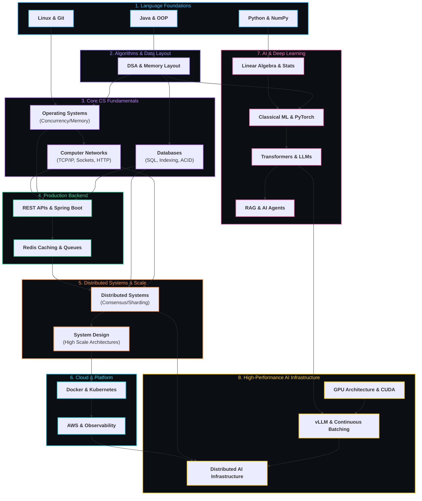

# 🗺️ Skill Dependency & Topology Map

> Topological graph showing how prerequisite concepts unlock downstream engineering domains across Software Engineering, Distributed Systems, and AI.

---

## 🌳 Interactive Topological Dependency Graph

---

## 🔗 Key Conceptual Crossroads

### 1. The Systems Crossroads: `OS + CN + DB ➔ Backend ➔ Distributed Systems`
- Without understanding **Virtual Memory & Page Faults** from [[BrainOS/03 - Core CS/Operating Systems|Operating Systems]], database buffer pool management in [[BrainOS/03 - Core CS/Databases|Databases]] cannot be understood.
- Without understanding **TCP Flow Control & Socket Backlogs** from [[BrainOS/03 - Core CS/Computer Networks|Computer Networks]], [[BrainOS/05 - Systems/Distributed Systems|Distributed Systems]] consensus timeouts and connection pooling fail.

### 2. The AI Infrastructure Intersection: `Systems + Cloud + LLMs ➔ AI Infrastructure`
- AI Infrastructure is not just machine learning—it is **90% Systems Engineering**:
  - Memory bandwidth bottlenecks (HBM3 vs PCIe Gen5)
  - Distributed tensor partitioning across NVLink clusters
  - Asynchronous continuous batching and PagedAttention memory management (directly mirroring OS paging!)

---

## 🧭 Navigation
- Complete Stage Details: **[[BrainOS/01 - Roadmap/CS Engineering Roadmap]]**
- Main Dashboard: **[[BrainOS/00 - BrainOS Dashboard]]**
- Project Progression: **[[BrainOS/10 - Projects/Project Progression]]**
