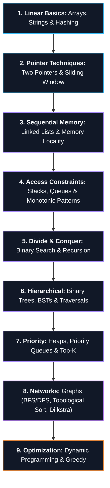

# 🌲 Data Structures & Algorithms Master Roadmap

> **Roadmap:** The core computational foundation. Teaches algorithmic pattern recognition, time/space complexity analysis, and pointer/memory manipulation before entering systems or machine learning.

---

## 🎯 Why Learn This?
- **Computational Efficiency:** Understand the fundamental trade-offs between CPU execution time and memory consumption ($O(1)$ vs $O(N)$ vs $O(N^2)$).
- **System Internals:** Operating systems, databases (B-Trees, LSM-Trees), memory allocators (Heaps), and network routers (Graphs) are built entirely on core data structures.
- **Pattern Recognition:** Moving from memorizing LeetCode solutions to recognizing algorithmic archetypes (Two Pointers, Sliding Window, Monotonic Stack, DP).

---

## 🔗 Prerequisites
- [[BrainOS/02 - Foundations/Programming/Java|Java]] or [[BrainOS/02 - Foundations/Programming/Python|Python]] (Basic Syntax, Loops, Functions, OOP)
- Basic Memory Concepts (Stack vs Heap, References/Pointers)

---

## 🗺️ Learning Order & Topic Breakdown

### 1. Linear Foundations
- Arrays, Dynamic Arrays, amortized resizing
- Strings, immutable character buffers, ASCII vs UTF-8
- HashMaps, HashSets, hash collisions (Chaining vs Open Addressing)

### 2. Pointer Techniques & Windows
- Two Pointers (Left/Right convergence, Fast/Slow pointers)
- Sliding Window (Fixed size, Variable dynamic window)
- Prefix Sum & 2D Prefix Sum

### 3. Pointer & Linked Memory
- Singly and Doubly Linked Lists
- Pointer reversal, cycle detection (Floyd's Tortoise and Hare)
- Linked List partitioning and merge algorithms

### 4. Stack & Queue Archetypes
- LIFO / FIFO operations and array/linked representations
- Monotonic Stack (Next Greater Element, Stock Span)
- Monotonic Deque (Sliding Window Maximum)

### 5. Logarithmic Search & Divide and Conquer
- Binary Search on sorted arrays
- Binary Search on answer space (Monotonic search spaces)
- Recursion call stack tree and Backtracking search

### 6. Hierarchical Structures (Trees)
- Binary Trees, Full/Complete/Balanced properties
- Traversals: Preorder, Inorder, Postorder (Recursive vs Iterative with Stack)
- Breadth-First Search (Level Order with Queue)
- Binary Search Trees (BST validation, insertion, deletion, LCA)

### 7. Priority & Heaps
- Binary Min-Heap and Max-Heap implementations (Array representation)
- Priority Queues, Heapify algorithm in $O(N)$
- Top-K frequent elements, Two-Heap running median pattern

### 8. Non-Linear Graphs
- Representations: Adjacency Matrix vs Adjacency List
- BFS (Shortest path in unweighted graph) & DFS (Connected components, Cycle detection)
- Topological Sort (Kahn's Algorithm, In-degree tracking)
- Shortest Path: Dijkstra's Algorithm, Bellman-Ford

### 9. Dynamic Programming
- Overlapping subproblems and optimal substructure
- Memoization (Top-Down) vs Tabulation (Bottom-Up)
- 1D DP (Fibonacci, Climbing Stairs, House Robber)
- 2D DP & Knapsack (0/1 Knapsack, Unbounded Knapsack, LCS, LIS)

---

## 🚀 Unlocks
- → [[BrainOS/03 - Core CS/Operating Systems|Operating Systems]] (Memory management, page tables, CPU run-queues)
- → [[BrainOS/03 - Core CS/Databases|Databases]] (B+ Trees, indexing algorithms, hash joins)
- → [[BrainOS/04 - Software Engineering/Backend Engineering|Backend Engineering]] (In-memory caching, indexing, data processing)
- → [[BrainOS/05 - Systems/Distributed Systems|Distributed Systems]] (Consistent hashing, graph consensus)

---

## 🧪 Suggested Project
- **Custom Data Structure Engine (Level 2):** Implement a thread-safe in-memory LRU Cache and Priority Queue from scratch in Java without using `java.util.LinkedHashMap`.

---

## 📚 Detailed Notes in Vault
- [[CS/DSA/00. DSA Nexus|CS > DSA Master Directory]]
- [[CS/DSA/01. Strings/00. Strings Core|Strings & String Arithmetic]]
- [[CS/DSA/02. Binary Search/Binary Search|Binary Search]]
- [[CS/DSA/03. Linked Lists/00. Linked Lists Core|Linked Lists & Memory Models]]
- [[CS/DSA/04. Bit Manipulation/Bit Manipulation|Bit Manipulation]]
- [[CS/DSA/05. Recursion & Backtracking/00. Recursion Core|Recursion & Backtracking]]
- [[CS/DSA/06. Stacks & Queues/00. Stacks & Queues Core|Stacks & Queues]]
- [[CS/DSA/07. Trees & BSTs/00. Trees & BSTs Core|Trees & BSTs]]
