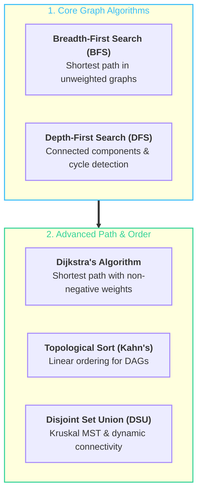

# 🕸️ Graph Algorithms & Network Topology

> Mathematical structures representing pairwise relations between entities through vertices (nodes) and connecting directed/undirected edges.

---

## 🎯 Why It Matters
- **Internet & Network Routing:** Link-State (OSPF) routing uses Dijkstra to route IP packets along lowest-latency cables.
- **Dependency Resolvers:** Build systems (Maven, Gradle, Webpack) and CI/CD pipelines model task graphs and detect circular dependencies using Topological Sort.
- **Social Networks & Knowledge Graphs:** Recommender systems, Knowledge Bases, and Graph Neural Networks (GNNs) operate natively on graph topologies.

---

## 🧠 Core Graph Paradigms



---

## 🛠️ Code Example: Dijkstra's Shortest Path Algorithm

```java
import java.util.*;

public class DijkstraAlgorithm {
    static class Edge {
        int target, weight;
        Edge(int target, int weight) { this.target = target; this.weight = weight; }
    }

    public static int[] dijkstra(int n, List<List<Edge>> adj, int src) {
        int[] dist = new int[n];
        Arrays.fill(dist, Integer.MAX_VALUE);
        dist[src] = 0;

        // Min-Heap: [node, distance]
        PriorityQueue<int[]> pq = new PriorityQueue<>(Comparator.comparingInt(a -> a[1]));
        pq.offer(new int[]{src, 0});

        while (!pq.isEmpty()) {
            int[] curr = pq.poll();
            int u = curr[0], d = curr[1];

            if (d > dist[u]) continue; // Stale heap entry

            for (Edge edge : adj.get(u)) {
                if (dist[u] + edge.weight < dist[edge.target]) {
                    dist[edge.target] = dist[u] + edge.weight;
                    pq.offer(new int[]{edge.target, dist[edge.target]});
                }
            }
        }
        return dist;
    }
}
```

---

## 🔗 Related Notes
- In-depth study note: **[[CS/Computer Networking/04. Routing & Network Layer/01. Routing Fundamentals - Routing vs Forwarding and Graph Models|🗺️ Routing & Graph Models]]**
- Trees & Hierarchies: **[[BrainOS/02 - Foundations/DSA/Trees & BST|Trees & BSTs]]**
- DSA Master Hub: **[[BrainOS/02 - Foundations/DSA/DSA|DSA Master Hub]]**
