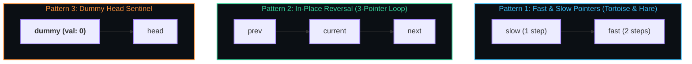

# 🔗 Linked Lists Master Note

> Linear collection of data elements whose order is not given by their physical placement in memory, but rather through reference pointers linking independent heap nodes.

---

## 🎯 Why It Matters
- **$O(1)$ Insertion and Deletion:** Unlike arrays, inserting or deleting at the head or after a known node requires zero element shifts ($O(1)$).
- **Core Systems Infrastructure:** Forms the foundation of memory allocators (free lists in OS kernels), hash map collision buckets, and LRU cache chains.
- **Pointer Fluency:** Teaches pristine pointer manipulation without memory corruption or lost references.

---

## 🧠 Core Patterns



---

## 🛠️ Code Example: In-Place Reverse Linked List

```java
public class LinkedListReversal {
    static class ListNode {
        int val;
        ListNode next;
        ListNode(int val) { this.val = val; }
    }

    public static ListNode reverseList(ListNode head) {
        ListNode prev = null;
        ListNode curr = head;

        while (curr != null) {
            ListNode next = curr.next; // 1. Save next
            curr.next = prev;          // 2. Reverse link
            prev = curr;               // 3. Move prev forward
            curr = next;               // 4. Move curr forward
        }
        return prev; // New head
    }
}
```

---

## 🔗 Related Notes
- In-depth study note: **[[CS/DSA/03. Linked Lists/01. Linked List Fundamentals|🧱 Detailed Linked List Fundamentals]]**
- Patterns study note: **[[CS/DSA/03. Linked Lists/02. Linked List Patterns|🧠 Linked List Patterns]]**
- DSA Master Hub: **[[BrainOS/02 - Foundations/DSA/DSA|DSA Master Hub]]**
