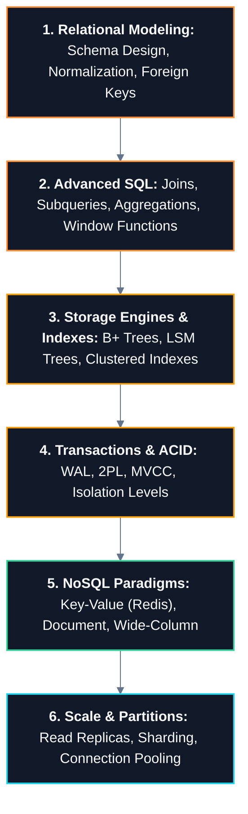

# 🗄️ Databases & Data Storage Master Roadmap

> **Roadmap:** The persistence foundation of computing. Master relational modeling, SQL optimization, ACID transaction guarantees, and database storage engines before architecting enterprise distributed databases.

---

## 🎯 Why Learn This?
- **Data Integrity is Non-Negotiable:** Understand ACID properties and isolation levels to avoid financial double-spends and corrupt states.
- **Query Optimization:** Learn how B-Trees, indexes, and execution plans work to turn 10-second queries into 2-millisecond lookups.
- **Choose the Right Tool:** Distinguish when to use Relational (PostgreSQL), Key-Value (Redis), Document (MongoDB), or Wide-Column (Cassandra) stores.

---

## 🔗 Prerequisites
- [[BrainOS/02 - Foundations/Programming/Java|Programming Foundations]]
- [[BrainOS/02 - Foundations/DSA/DSA|DSA]] (B-Trees, Hash Tables, Binary Search)
- [[BrainOS/03 - Core CS/Operating Systems|Operating Systems]] (File systems, Page Cache, Disk I/O)

---

## 🗺️ Learning Order & Topic Breakdown

### 1. Relational Data Modeling & Normalization
- Entities, Attributes, Primary Keys, Foreign Keys, Unique Constraints
- Normalization forms: 1NF, 2NF, 3NF, BCNF vs intentional Denormalization
- Entity-Relationship Diagrams (ERD) and relational schema design

### 2. SQL Mastery & Query Optimization
- Inner, Left, Right, Full Outer Joins and Cross Joins
- Aggregations (`GROUP BY`, `HAVING`) and Window Functions (`ROW_NUMBER`, `RANK`, `LEAD/LAG`)
- Query Analysis: `EXPLAIN ANALYZE`, Sequential Scans vs Index Scans

### 3. Database Internals & Indexing Structures
- B+ Tree indexing: Branching factors, leaf page linked lists, range scans
- Clustered vs Non-Clustered / Covering indexes, Composite Index column ordering
- Write-Ahead Logging (WAL) and Buffer Pool management
- Log-Structured Merge Trees (LSM Trees) for write-heavy engines (RocksDB, Cassandra)

### 4. Transactions, Concurrency & ACID
- **Atomicity:** Rollbacks, WAL replay on crash recovery
- **Consistency:** Schema constraints, invariant validation
- **Isolation:** Dirty Reads, Non-repeatable Reads, Phantom Reads
- Isolation Levels: Read Uncommitted, Read Committed, Repeatable Read, Serializable
- Concurrency Control: Two-Phase Locking (2PL), Multi-Version Concurrency Control (MVCC)
- **Durability:** `fsync` flush guarantees to non-volatile storage

### 5. NoSQL & Alternative Storage Models
- In-Memory Key-Value: Redis (Strings, Hashes, ZSETs)
- Document Store: MongoDB (JSON/BSON documents, flexible schemas)
- Time-Series & Analytical: TimescaleDB, ClickHouse (Columnar storage)

### 6. Scaling Databases
- Connection Pooling: HikariCP, PgBouncer
- Read Replicas: Master-Slave asynchronous vs synchronous replication
- Partitioning: Range, List, Hash partitioning
- Database Sharding & Distributed transactions (2-Phase Commit)

---

## 🚀 Unlocks
- → [[BrainOS/04 - Software Engineering/Backend Engineering|Backend Engineering]] (JPA/Hibernate, Flyway migrations, Repository pattern)
- → [[BrainOS/05 - Systems/Distributed Systems|Distributed Systems]] (Replication lag, consensus, distributed databases)
- → [[BrainOS/05 - Systems/System Design|System Design]] (Data partitioning, caching layers, write scaling)

---

## 🧪 Suggested Project
- **Production E-Commerce Schema (Level 4):** Design and benchmark a PostgreSQL database schema handling orders, inventory locking with pessimistic row locks (`SELECT FOR UPDATE`), and Flyway migrations.

---

## 📚 Detailed Notes in Vault
- [[BrainOS/05 - Systems/Caching & Message Queues|Caching & Message Queues]]
