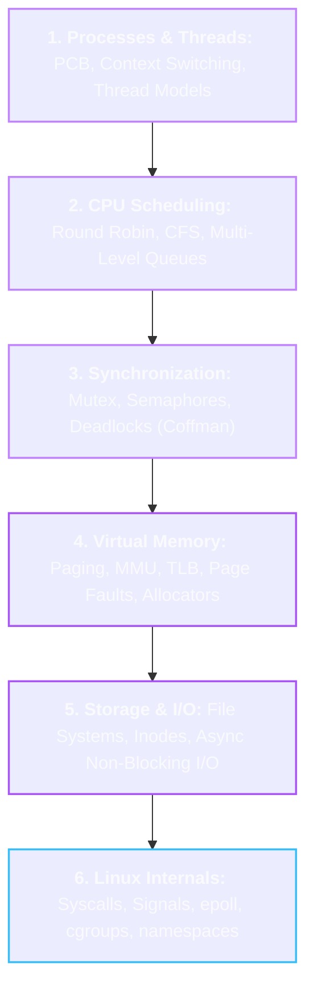

# 💻 Operating Systems Master Roadmap

> **Roadmap:** The software layer directly governing hardware resources. Understand process management, virtual memory, concurrency, and Linux kernel fundamentals before building scalable backend or distributed systems.

---

## 🎯 Why Learn This?
- **Demystify the Machine:** Understand how code transitions from high-level instructions to threads, context switches, system calls, and hardware interrupts.
- **Master Concurrency & Deadlocks:** Prevent race conditions, thread starvation, and synchronization locks in production services.
- **Hardware-Aware Engineering:** Learn virtual memory paging and cache lines to write memory-efficient, cache-friendly backend and AI workloads.

---

## 🔗 Prerequisites
- [[BrainOS/02 - Foundations/Programming/Java|Java]] / [[BrainOS/02 - Foundations/Programming/Git & Linux|Linux Terminal]]
- [[BrainOS/02 - Foundations/DSA/DSA|DSA]] (Stacks, Queues, Heaps, Tree structures)
- Basic Computer Architecture (Registers, ALU, RAM hierarchy)

---

## 🗺️ Learning Order & Topic Breakdown

### 1. Process & Thread Management
- Process Control Block (PCB), Process lifecycle states
- User-space vs Kernel-space threads, Context switching overhead
- Fork/Exec model, inter-process communication (IPC: Pipes, Shared Memory, Sockets)

### 2. CPU Scheduling
- Preemptive vs Non-preemptive scheduling
- First-Come First-Served (FCFS), Shortest Job First (SJF), Round Robin (RR)
- Linux Completely Fair Scheduler (CFS) and Red-Black tree runqueues

### 3. Concurrency & Synchronization
- Critical sections, race conditions, atomic hardware instructions (CAS)
- Mutex locks vs Counting Semaphores vs Spinlocks
- Deadlocks: 4 Coffman conditions, detection, prevention, Banker's algorithm

### 4. Memory Management & Virtual Memory
- Contiguous memory allocation vs Paging and Segmentation
- Virtual address translation: Page Tables, Multi-level Paging, MMU, TLB caches
- Page Faults, Page Replacement algorithms (LRU, Clock algorithm)

### 5. File Systems & I/O Subsystems
- Inode structure, file descriptors, directory tables
- Disk scheduling, page cache, dirty page flush
- Blocking vs Non-Blocking I/O, I/O Multiplexing (`select`, `poll`, `epoll`)

### 6. Linux Kernel Internals & Containers
- System call boundary (`syscall`), interrupt handlers, trap handling
- Linux namespaces (Process isolation) and cgroups (Resource limits)
- Signals (`SIGTERM`, `SIGKILL`, `SIGSEGV`)

---

## 🚀 Unlocks
- → [[BrainOS/04 - Software Engineering/Backend Engineering|Backend Engineering]] (Thread pooling, async I/O, event loops)
- → [[BrainOS/05 - Systems/Distributed Systems|Distributed Systems]] (Node failure models, consensus, IPC)
- → [[BrainOS/06 - Infrastructure/Docker & Kubernetes|Docker & Containers]] (Linux cgroups, namespaces)
- → [[BrainOS/09 - AI Infrastructure/GPU Computing & CUDA|GPU Computing & CUDA]] (Thread warps, shared memory architectures)

---

## 🧪 Suggested Project
- **Multi-Threaded HTTP/1.1 Socket Server (Level 3):** Implement a multi-threaded web server in Java using raw `ServerSocket`, thread pools, and POSIX signal handling.

---

## 📚 Detailed Notes in Vault
- [[CS/OS/README|CS > Operating Systems Directory]]
- [[CS/WebDev/Backend/Node.js/Event Loop and Non-Blocking IO|Event Loop and Non-Blocking I/O]]
