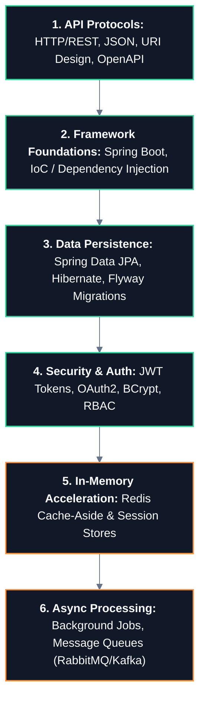

# ⚙️ Backend Engineering Master Roadmap

> **Roadmap:** The server-side domain translating business logic into secure, maintainable, and scalable APIs, background workers, and database transactions.

---

## 🎯 Why Learn This?
- **Build Real Products:** Move beyond local scripts into production services handling real user traffic, authentication, and payments.
- **Master Layered Architecture:** Structure code into Clean/Hexagonal boundaries (Controllers, Services, Repositories, DTOs).
- **Handle Concurrency & State:** Safely manage database connections, cache invalidation, and background async job processing.

---

## 🔗 Prerequisites
- [[BrainOS/02 - Foundations/Programming/Java|Java]] (OOP, Streams, Exceptions, Generics)
- [[BrainOS/03 - Core CS/Computer Networks|Computer Networks]] (HTTP/HTTPS, Status codes, TCP sockets)
- [[BrainOS/03 - Core CS/Databases|Databases & SQL]] (PostgreSQL, Queries, Transactions, Indexes)

---

## 🗺️ Learning Order & Topic Breakdown

### 1. HTTP Protocols & RESTful API Design
- REST architectural constraints (Statelessness, Client-Server, Uniform Interface)
- HTTP Verbs (`GET`, `POST`, `PUT`, `PATCH`, `DELETE`) and Status Codes (`200`, `201`, `400`, `401`, `403`, `404`, `500`)
- Request validation, Error Handling middleware, OpenAPI / Swagger documentation

### 2. Framework Foundations (Spring Boot)
- Inversion of Control (IoC) and Dependency Injection (DI)
- Layered Architecture: `@RestController` → `@Service` → `@Repository`
- Profiles and Environment Configuration (`application.yml`)

### 3. Data Persistence & ORM
- Spring Data JPA, Hibernate ORM, Entity Relationships (`@OneToMany`, `@ManyToMany`)
- The N+1 query problem and solving it via `@EntityGraph` and `JOIN FETCH`
- Database schema migrations with Flyway / Liquibase

### 4. Authentication, Authorization & Security
- Password Hashing (BCrypt, Argon2) and Salting
- Stateless JWT (JSON Web Token) issuance, signing, validation, and refresh tokens
- Role-Based Access Control (RBAC), CORS, CSRF, and SQL Injection prevention

### 5. In-Memory Caching & Session Stores
- Redis integration with Spring Cache (`@Cacheable`, `@CacheEvict`)
- Cache invalidation strategies (Cache-Aside pattern)
- Distributed session management and Rate Limiting

### 6. Asynchronous Jobs & Event Processing
- Asynchronous task execution (`@Async`, ThreadPoolTaskExecutor)
- Decoupled messaging with RabbitMQ / Apache Kafka producers and consumers

---

## 🚀 Unlocks
- → [[BrainOS/04 - Software Engineering/Testing & CI-CD|Automated Testing & CI/CD]] (JUnit 5, Testcontainers)
- → [[BrainOS/05 - Systems/Distributed Systems|Distributed Systems]] (State management, consensus, microservices)
- → [[BrainOS/05 - Systems/System Design|System Design Architecture]] (High-throughput backend scaling)

---

## 🧪 Suggested Project
- **Production E-Commerce REST API (Level 4):** Build a complete backend in Spring Boot + PostgreSQL + Redis with JWT authentication, cart management, and inventory checkout transactions.

---

## 📚 Detailed Notes in Vault
- [[CS/WebDev/Backend/00. Backend Nexus|CS > Backend WebDev Hub]]
- [[CS/WebDev/Backend/ShopKart Auth Project|ShopKart Auth Project Walkthrough]]
- [[CS/WebDev/Backend/Node.js/00. Node.js Core|Node.js Architecture]]
