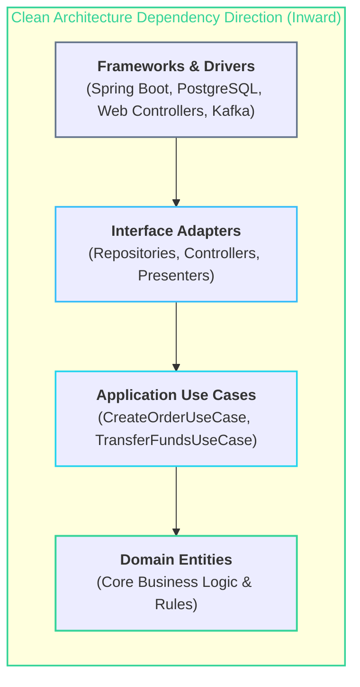

# 🏛️ Software Architecture & SOLID Principles

> The high-level organizational structure, component boundaries, and design heuristics that keep codebases extensible, testable, and maintainable over decades.

---

## 🎯 The SOLID Principles

| Principle | Meaning | Real-World Application |
| :--- | :--- | :--- |
| **S — Single Responsibility** | A class should have only one reason to change. | Separate Email Sending logic from User Registration service. |
| **O — Open/Closed** | Open for extension, closed for modification. | Add new payment providers via Strategy interface without editing checkout code. |
| **L — Liskov Substitution** | Subtypes must be substitutable for base types without breaking code. | Never throw `UnsupportedOperationException` in interface implementations. |
| **I — Interface Segregation** | Prefer small, client-specific interfaces over fat ones. | Split `PaymentGateway` from `RefundableGateway` and `RecurringGateway`. |
| **D — Dependency Inversion** | Depend on abstractions (interfaces), not concrete implementations. | Inject `NotificationService` interface instead of `SendGridClient` class. |

---

## 🧠 Hexagonal (Ports & Adapters) & Clean Architecture

> [!important] The Dependency Rule
> Source code dependencies must **only point inward**. The Domain Entity layer knows nothing about Spring Boot, SQL, HTTP, or external cloud providers.

---

## 🔗 Related Topics
- [[BrainOS/04 - Software Engineering/Backend Engineering|Backend Engineering]]
- [[BrainOS/04 - Software Engineering/Design Patterns|Design Patterns]]
- [[BrainOS/05 - Systems/Distributed Systems|Distributed Systems]]
