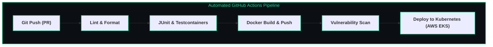

# 🧪 Automated Testing & CI/CD Pipelines

> The verification methodologies and automated delivery pipelines ensuring code correctness, regression protection, and zero-downtime production releases.

---

## 🎯 The Test Automation Pyramid

```text
       /\
      /  \      E2E / UI Tests (Cypress / Playwright)
     /────\     - Slowest, most brittle, tests whole system
    /      \
   / Integr \   Integration Tests (Testcontainers, MockMvc, DB tests)
  /──────────\  - Validates SQL queries, HTTP endpoints, Redis
 /            \
/  Unit Tests  \ Unit Tests (JUnit 5, Mockito)
/────────────────\ - Fast, isolated, tests pure business logic
```

---

## 🚀 GitHub Actions CI/CD Pipeline Architecture

![[testing_and_cicd_pipeline.drawio.svg]]



---

## 🛠️ Code Example: Integration Test with Testcontainers

```java
@SpringBootTest(webEnvironment = SpringBootTest.WebEnvironment.RANDOM_PORT)
@Testcontainers
class OrderServiceIntegrationTest {

    @Container
    static PostgreSQLContainer<?> postgres = new PostgreSQLContainer<>("postgres:16-alpine");

    @DynamicPropertySource
    static void configureProperties(DynamicPropertyRegistry registry) {
        registry.add("spring.datasource.url", postgres::getJdbcUrl);
        registry.add("spring.datasource.username", postgres::getUsername);
        registry.add("spring.datasource.password", postgres::getPassword);
    }

    @Autowired
    private OrderService orderService;

    @Test
    void shouldCreateAndPersistOrderSuccessfully() {
        OrderDTO dto = new OrderDTO("ITEM_100", 2, 49.99);
        OrderResponse response = orderService.createOrder(dto);
        assertNotNull(response.getId());
        assertEquals("CREATED", response.getStatus());
    }
}
```

---

## 🔗 Related Topics
- [[BrainOS/04 - Software Engineering/Backend Engineering|Backend Engineering]]
- [[BrainOS/06 - Infrastructure/Docker & Kubernetes|Docker & Kubernetes]]
- [[BrainOS/00 - BrainOS Dashboard|Main Dashboard]]
