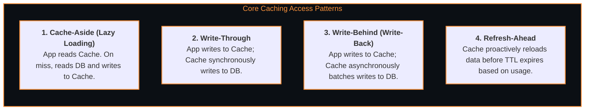

# 🚀 Caching Strategies & Event Message Queues

> The architectural components that accelerate read latency via in-memory key-value stores (Redis) and decouple high-volume asynchronous workflows via distributed append-only event logs (Kafka).

---

## 🎯 Caching Patterns & Invalidation

![[caching_and_queues_architecture.drawio.svg]]

### Redis Internals & Data Structures
- **Strings:** Key-value caching, Distributed locks (via `SET resource_name my_random_value NX PX 30000`).
- **Hashes:** Storing structured entity objects without serializing entire JSON.
- **Sorted Sets (ZSET):** In-memory skip list powering real-time leaderboards and sliding-window rate limiters.
- **Bitmaps & HyperLogLog:** Space-efficient tracking of millions of active users with minimal memory footprint.

---

## 📬 Message Queues & Event Streaming (Kafka vs RabbitMQ)

| Feature | RabbitMQ (Message Queue) | Apache Kafka (Distributed Event Log) |
| :--- | :--- | :--- |
| **Model** | Smart Broker / Dumb Consumer | Dumb Broker / Smart Consumer (Offset tracking) |
| **Storage** | Ephemeral (Deleted once acknowledged) | Persistent append-only disk log (Configurable retention) |
| **Throughput** | ~50,000 msg/sec | Millions of msg/sec (Zero-copy DMA disk reads) |
| **Ordering** | Guaranteed per queue | Strictly guaranteed per **Partition Key** |
| **Replayability** | No (Once consumed, it's gone) | Yes (Rewind consumer offset to replay past events) |

---

## 🔗 Related Topics
- [[BrainOS/04 - Software Engineering/Backend Engineering|Backend Engineering]]
- [[BrainOS/05 - Systems/Distributed Systems|Distributed Systems]]
- [[BrainOS/05 - Systems/System Design|System Design Architecture]]
