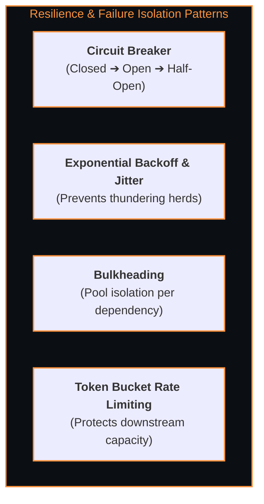

# 📈 Scalability & Fault Tolerance Engineering

> The architectural strategies for scaling computation and storage linearly while maintaining high availability through redundant topology and resilient failure-isolation patterns.

---

## 🎯 Scaling Strategies

### 1. Vertical Scaling (Scale-Up) vs. Horizontal Scaling (Scale-Out)
- **Vertical:** Adding CPU/RAM to a single box (hits physical hardware limits & cost curves).
- **Horizontal:** Adding commodity machines in parallel (requires stateless application tier and partitioned data).

### 2. Database Partitioning & Sharding
- **Vertical Partitioning:** Splitting tables by domain (e.g. `UserTable` on DB 1, `OrderTable` on DB 2).
- **Horizontal Sharding:** Distributing rows of the same table across multiple database nodes based on a **Shard Key**.
  - **Hash-Based Sharding:** $\text{Shard ID} = \text{Hash}(\text{Key}) \pmod N$.
  - **Consistent Hashing:** Uses a hash ring with virtual nodes, minimizing key migration to $K/N$ when adding/removing nodes.

---

## 🛡️ Fault Tolerance & Resilience Patterns

### 1. Circuit Breaker Pattern (Resilience4j)
- **Closed:** Requests flow normally. If error rate exceeds threshold (e.g. 50%), trip to **Open**.
- **Open:** Fast-fails requests immediately without calling failing downstream service.
- **Half-Open:** Periodically lets a small trial percentage of traffic through to test service recovery.

### 2. Thundering Herd & Cache Stampede Mitigation
- Use Mutex / Distributed Lock on cache miss so only one worker queries the database while others wait.

---

## 🔗 Related Topics
- [[BrainOS/05 - Systems/Distributed Systems|Distributed Systems]]
- [[BrainOS/05 - Systems/Caching & Message Queues|Caching & Message Queues]]
- [[BrainOS/05 - Systems/System Design|System Design]]
