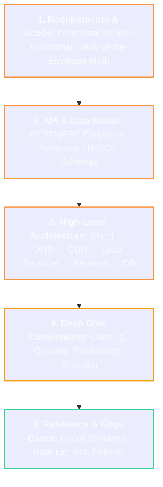

# 🏗️ System Design Master Roadmap

> **Roadmap:** The methodology for architecting large-scale, reliable, maintainable software systems from initial requirements to distributed deployment.

---

## 🎯 Why Learn This?
- **End-to-End Holistic Thinking:** Connect databases, caches, queues, load balancers, and microservices into a unified production architecture.
- **Trade-off Analysis:** Master the art of justifying engineering decisions (e.g. SQL vs NoSQL, Sync vs Async, AP vs CP).
- **Senior Engineering Bar:** The primary differentiator for senior software engineers and technical leaders.

---

## 🔗 Prerequisites
- [[BrainOS/03 - Core CS/Computer Networks|Computer Networks]] & [[BrainOS/03 - Core CS/Databases|Databases]]
- [[BrainOS/04 - Software Engineering/Backend Engineering|Backend Engineering]]
- [[BrainOS/05 - Systems/Distributed Systems|Distributed Systems]]

---

## 🗺️ Learning Order & System Design Framework

### 1. Requirements & Capacity Estimation
- Functional Requirements (What the system does)
- Non-Functional Requirements (Availability, Latency, Consistency, Durability, SLA/SLO)
- Back-of-the-envelope calculations: QPS, Daily Active Users (DAU), Storage sizing over 5 years, Network bandwidth

### 2. Core Building Blocks
- **Load Balancing:** DNS Round Robin, L4 vs L7 (ALB, Nginx, Envoy), Algorithms (Round Robin, Least Connections, Consistent Hash)
- **Caching:** Cache-Aside, Write-Through, Invalidation (TTL, LRU eviction), Redis / Memcached
- **Databases:** PostgreSQL (Relational), Cassandra (High-write append), MongoDB (Documents), DynamoDB
- **Asynchronous Queues:** Apache Kafka, RabbitMQ, Amazon SQS
- **Rate Limiters:** Token Bucket, Leaky Bucket, Sliding Window Counter (Redis)

### 3. Classic System Architectures to Master
- **Beginner:** Scalable URL Shortener (TinyURL), Pastebin, Rate Limiter
- **Intermediate:** Instagram / Twitter Newsfeed, WhatsApp / Chat Engine, YouTube Video Streaming
- **Advanced:** Uber / Ride-Sharing (Geohashing, QuadTrees), Distributed Web Crawler, Real-Time Collaborative Document Editor (OT / CRDT)

---

## 🚀 Unlocks
- → [[BrainOS/06 - Infrastructure/Cloud & AWS|Cloud & Platform Engineering]]
- → [[BrainOS/09 - AI Infrastructure/AI Infrastructure|AI Infrastructure Systems]]
- → High-Level System Architecture Leadership

---

## 🧪 Suggested Project
- **High-Throughput Scalable URL Shortener (Level 5):** Build a distributed TinyURL service with Base62 encoding, Redis caching, and Token Bucket rate limiting handling 10,000 requests/sec.

---

## 📚 Detailed Notes in Vault
- [[BrainOS/05 - Systems/Caching & Message Queues|Caching & Message Queues]]
- [[BrainOS/05 - Systems/Scalability & Fault Tolerance|Scalability & Fault Tolerance]]
