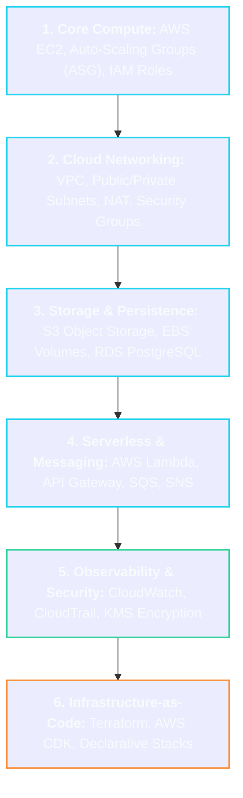

# ☁️ Cloud Computing & AWS Master Roadmap

> **Roadmap:** On-demand cloud infrastructure, managed services, virtual networks, and Infrastructure-as-Code (IaC) powering modern internet deployments.

---

## 🎯 Why Learn This?
- **Deploy Anywhere:** Move from running applications on `localhost` to automated, resilient multi-region cloud infrastructure.
- **Elastic Auto-Scaling:** Automatically scale server compute up during peak traffic and down to zero to save costs.
- **Cloud-Native Architecture:** Leverage managed databases, object storage, and serverless compute without managing physical hardware.

---

## 🔗 Prerequisites
- [[BrainOS/03 - Core CS/Computer Networks|Computer Networks]] (IP addressing, Subnets, DNS, Load balancers)
- [[BrainOS/03 - Core CS/Operating Systems|Operating Systems & Linux CLI]]
- [[BrainOS/04 - Software Engineering/Backend Engineering|Backend Engineering]]

---

## 🗺️ Learning Order & Topic Breakdown

### 1. Identity & Core Compute
- AWS IAM: Users, Groups, Roles, Policies, Principle of Least Privilege
- AWS EC2: Instance types (Compute, Memory, GPU), AMIs, UserData startup scripts
- Auto Scaling Groups (ASG) and Target Tracking policies

### 2. Virtual Private Cloud (VPC) Networking
- VPC creation, CIDR block allocation, Internet Gateways (IGW)
- Public Subnets (Facing Internet) vs Private Subnets (Database & Backend isolated)
- NAT Gateways, Route Tables, Security Groups (Stateful) vs Network ACLs (Stateless)
- Application Load Balancer (ALB) and TLS termination with AWS Certificate Manager (ACM)

### 3. Cloud Storage & Managed Databases
- Amazon S3: Buckets, Storage classes, Lifecycle policies, Presigned URLs, CORS
- Amazon RDS: Managed PostgreSQL/MySQL, Multi-AZ high availability, Automated backups
- Amazon ElastiCache: Managed Redis clusters

### 4. Serverless & Asynchronous Pipelines
- AWS Lambda: Event-driven serverless functions, Cold starts, Concurrency limits
- Amazon SQS (Standard vs FIFO Queues) and Amazon SNS (Pub/Sub notifications)

### 5. Infrastructure-as-Code (Terraform)
- Declarative infrastructure, Terraform state files, Providers, Modules
- Plan, Apply, Destroy lifecycles and GitOps infrastructure pipelines

---

## 🚀 Unlocks
- → [[BrainOS/06 - Infrastructure/Docker & Kubernetes|Docker & Kubernetes]] (Container orchestration on AWS EKS)
- → [[BrainOS/09 - AI Infrastructure/AI Infrastructure|AI Cloud Infrastructure]] (GPU clusters, Slurm, vLLM on AWS)

---

## 🧪 Suggested Project
- **Automated Cloud Terraform Deployment:** Provision an isolated VPC with public ALB, private EC2 auto-scaling backend, and managed RDS PostgreSQL via Terraform.

---

## 📚 Detailed Notes in Vault
- [[BrainOS/06 - Infrastructure/Docker & Kubernetes|Docker & Kubernetes]]
- [[BrainOS/06 - Infrastructure/DevOps & Observability|DevOps & Observability]]
