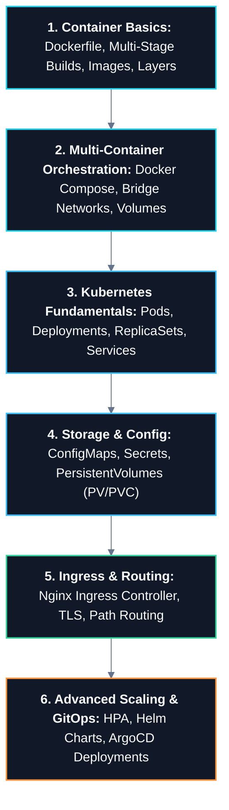

# 🐳 Docker & Kubernetes Master Roadmap

> **Roadmap:** Containerization packaging and declarative distributed cluster orchestration ensuring reproducible deployments across any cloud or local environment.

---

## 🎯 Why Learn This?
- **Eliminate "Works on My Machine":** Package application code, runtimes, system dependencies, and configs into immutable container images.
- **Automated Self-Healing:** Kubernetes automatically restarts crashed pods, rolls out updates with zero downtime, and scales replicas based on CPU/memory metrics.
- **The Universal Cloud OS:** Kubernetes is the industry-standard substrate for microservices, data pipelines, and AI training workloads.

---

## 🔗 Prerequisites
- [[BrainOS/03 - Core CS/Operating Systems|Operating Systems & Linux]] (Namespaces, cgroups, file systems)
- [[BrainOS/04 - Software Engineering/Backend Engineering|Backend Engineering]] (Dockerizing web services)
- [[BrainOS/06 - Infrastructure/Cloud & AWS|Cloud Fundamentals]]

---

## 🗺️ Learning Order & Topic Breakdown

### 1. Docker & Container Internals
- Linux cgroups (Resource limits) and namespaces (PID, Mount, Network isolation)
- Dockerfile optimization: Layer caching, Multi-stage builds, Minimal distroless/alpine bases
- Container networking, volume mounts, and container lifecycle commands

### 2. Multi-Container Systems (Docker Compose)
- Defining local microservice stacks (App + PostgreSQL + Redis) in `docker-compose.yml`
- Environment variables, health checks, and service dependency ordering (`depends_on`)

### 3. Kubernetes Core Architecture
- Control Plane (API Server, etcd, Scheduler, Controller Manager) vs Worker Nodes (Kubelet, Kube-Proxy, Container Runtime)
- Workloads: Pods (Atomic scheduling unit), ReplicaSets, Deployments
- Rolling updates, rollbacks, and readiness/liveness health probes

### 4. Kubernetes Networking & Services
- ClusterIP (Internal cluster communication), NodePort, and LoadBalancer
- Ingress Controllers (Nginx Ingress, Traefik, AWS ALB Ingress)
- CoreDNS service discovery and Kubernetes Network Policies

### 5. Configuration, Storage & Packaging
- ConfigMaps (Non-sensitive configuration) and Secrets (Encrypted credentials)
- PersistentVolumes (PV) and PersistentVolumeClaims (PVC)
- Helm: Templating manifests, values files, chart dependencies, and releases

### 6. Production Operations & GitOps
- Horizontal Pod Autoscaler (HPA) based on CPU/memory and custom Prometheus metrics
- GitOps continuous delivery with ArgoCD / Flux

---

## 🚀 Unlocks
- → [[BrainOS/06 - Infrastructure/DevOps & Observability|DevOps & Production Observability]]
- → [[BrainOS/09 - AI Infrastructure/Model Serving & Inference|vLLM Model Serving on Kubernetes]]
- → Enterprise Microservices Operations

---

## 🧪 Suggested Project
- **Cloud-Native Microservices Cluster (Level 7):** Deploy a multi-service application with Redis, PostgreSQL, and Ingress on a local Minikube / AWS EKS cluster managed with Helm charts.

---

## 📚 Detailed Notes in Vault
- [[BrainOS/04 - Software Engineering/Testing & CI-CD|Testing & CI-CD]]
- [[BrainOS/06 - Infrastructure/Cloud & AWS|Cloud & AWS]]
