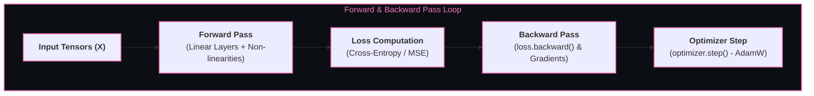

# 🔥 Deep Learning & PyTorch Mastery

> Computational graph frameworks and multi-layer neural networks capable of learning hierarchical feature representations directly from raw multi-dimensional sensory data.

---

## 🎯 Why It Matters
- **Automatic Differentiation (`autograd`):** PyTorch builds dynamic computational graphs during the forward pass, automatically computing exact gradients during the backward pass via the chain rule.
- **Hardware Acceleration:** Seamless GPU memory tensor allocation (`tensor.to("cuda")`) scaling to multi-GPU clusters.
- **Industry Standard Framework:** The overwhelmingly dominant framework for modern AI research, Hugging Face models, and LLM implementations.

---

## 🧠 Core Neural Network Mechanics



### 1. Activation Functions
- **ReLU ($\max(0, x)$):** Computationally fast, avoids vanishing gradients for positive inputs.
- **GELU (Gaussian Error Linear Unit):** Standard smooth non-linearity used in modern Transformers (BERT, GPT, Llama).
- **Softmax:** Normalizes raw logits into a valid probability distribution ($\sum p_i = 1$).

### 2. Regularization & Optimization
- **AdamW Optimizer:** Adaptive moment estimation with decoupled weight decay (the gold standard for deep learning).
- **Dropout:** Randomly deactivates neurons during training to prevent co-adaptation and overfitting.
- **Layer Normalization:** Normalizes activations across the channel/feature dimension for each token independently (essential for stable Transformer training).

---

## 🛠️ Complete PyTorch Training Loop Template

```python
import torch
import torch.nn as nn
import torch.optim as optim
from torch.utils.data import DataLoader, TensorDataset

# 1. Define Model Architecture
class SimpleClassifier(nn.Module):
    def __init__(self, input_dim, hidden_dim, num_classes):
        super().__init__()
        self.net = nn.Sequential(
            nn.Linear(input_dim, hidden_dim),
            nn.LayerNorm(hidden_dim),
            nn.GELU(),
            nn.Dropout(0.1),
            nn.Linear(hidden_dim, num_classes)
        )

    def forward(self, x):
        return self.net(x)

# 2. Setup Device, Loss & Optimizer
device = torch.device("cuda" if torch.cuda.is_available() else "cpu")
model = SimpleClassifier(input_dim=128, hidden_dim=256, num_classes=10).to(device)
criterion = nn.CrossEntropyLoss()
optimizer = optim.AdamW(model.parameters(), lr=1e-3, weight_decay=1e-2)

# 3. Training Epoch
def train_epoch(model, loader, optimizer, criterion):
    model.train()
    total_loss = 0.0
    for batch_x, batch_y in loader:
        batch_x, batch_y = batch_x.to(device), batch_y.to(device)

        optimizer.zero_grad()               # 1. Clear stale gradients
        outputs = model(batch_x)            # 2. Forward pass
        loss = criterion(outputs, batch_y)  # 3. Compute loss
        loss.backward()                     # 4. Backward pass (Autograd)
        torch.nn.utils.clip_grad_norm_(model.parameters(), max_norm=1.0) # 5. Clip gradients
        optimizer.step()                    # 6. Update weights

        total_loss += loss.item()
    return total_loss / len(loader)
```

---

## 🔗 Related Topics
- [[BrainOS/07 - AI & Machine Learning/Transformers|Transformer Architecture]]
- [[BrainOS/08 - LLM & GenAI/LLM Engineering|LLM Engineering]]
- [[BrainOS/09 - AI Infrastructure/GPU Computing & CUDA|GPU Computing & CUDA]]
- [[BrainOS/00 - BrainOS Dashboard|Main Dashboard]]
