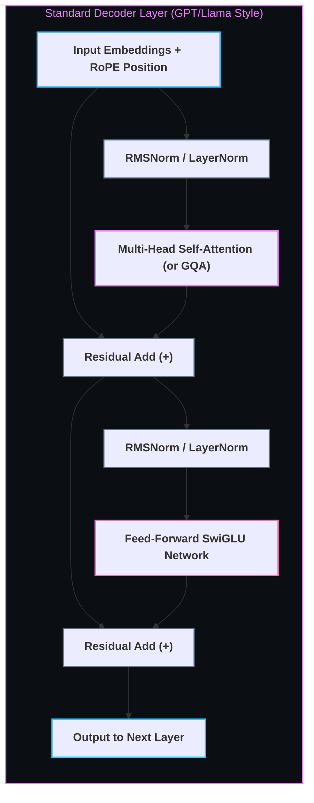

# 🧬 The Transformer Architecture & Self-Attention

> The revolutionary neural network architecture based entirely on the Self-Attention mechanism, enabling massive parallelization across sequence tokens and powering modern Foundation Models (GPT-4, Claude, Llama 3).

---

## 🎯 Why It Matters
- **Eliminated Recurrence Bottlenecks:** RNNs and LSTMs processed tokens sequentially ($t_1 \rightarrow t_2 \rightarrow t_3$), preventing full GPU parallelization. Transformers compute token interactions simultaneously via matrix multiplication.
- **Global Context & Long-Range Dependencies:** Self-attention allows every token to directly attend to any other token in the sequence with an $O(1)$ direct path.

---

## 🧠 Scaled Dot-Product Attention Equation

$$\text{Attention}(Q, K, V) = \text{softmax}\left(\frac{Q K^T}{\sqrt{d_k}}\right) V$$

Where:
- **Queries ($Q$):** What a token is searching for.
- **Keys ($K$):** What a token contains / offers.
- **Values ($V$):** The actual information content delivered.
- **$\sqrt{d_k}$ Scaling Factor:** Prevents the dot product magnitudes from exploding for large embedding dimensions, avoiding vanishing gradients in the softmax.

---

## 🏗️ Transformer Block Architecture

---

## 🔗 Key Architectural Variants
- **Encoder-Only (BERT):** Bi-directional attention; optimal for classification, embeddings, and extraction.
- **Decoder-Only (GPT, Llama, Mistral):** Causal/Masked attention (tokens only attend to prior tokens); optimal for auto-regressive text generation.
- **Grouped-Query Attention (GQA):** Multiple query heads share single key/value heads, drastically reducing KV-Cache memory during inference.

---

## 🔗 Related Topics
- [[BrainOS/07 - AI & Machine Learning/Deep Learning & PyTorch|Deep Learning & PyTorch]]
- [[BrainOS/08 - LLM & GenAI/LLM Engineering|LLM Engineering]]
- [[BrainOS/09 - AI Infrastructure/Model Serving & Inference|vLLM & KV-Cache Management]]
- [[BrainOS/00 - BrainOS Dashboard|Main Dashboard]]
