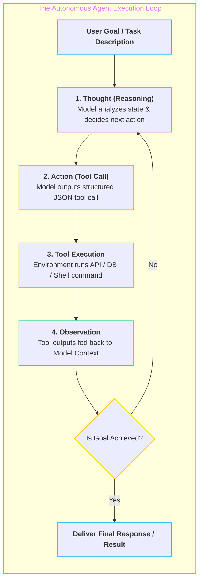

# 🤖 Autonomous AI Agents & Tool Execution

> Autonomous software entities that use Large Language Models as reasoning engines to iteratively break down complex goals, select external tools, observe environment feedback, and execute multi-step workflows.

---

## 🎯 The ReAct (Reason + Act) Loop

---

## 🧠 Core Agent Architectures

### 1. Single Agent with Dynamic Tooling
- Equipped with typed tools (e.g. `execute_sql`, `search_web`, `send_email`).
- Standard OpenAI/Anthropic Function Calling API format with JSON Schema.

### 2. Multi-Agent Collaboration & Routing
- **Supervisor / Router Pattern:** A master orchestrator routes incoming sub-tasks to specialized domain agents (e.g. `ResearchAgent`, `CoderAgent`, `TesterAgent`).
- **Shared Scratchpad / Memory:** State passed between agents via structured blackboard memory.

### 3. Safety, Guardrails & Human-in-the-Loop (HITL)
- Requiring explicit confirmation before executing destructive/irreversible actions (e.g. deleting production tables, sending financial transactions).

---

## 🔗 Related Topics
- [[BrainOS/08 - LLM & GenAI/LLM Engineering|LLM Engineering]]
- [[BrainOS/08 - LLM & GenAI/RAG & Vector Databases|RAG & Vector Databases]]
- [[BrainOS/00 - BrainOS Dashboard|Main Dashboard]]
