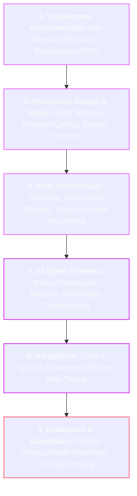

# 🧠 LLM & Generative AI Engineering Master Roadmap

> **Roadmap:** Architecting, integrating, augmenting, and deploying Large Language Models via RAG pipelines, autonomous AI agents, and fine-tuning.

---

## 🎯 Why Learn This?
- **The Modern AI Engineering Stack:** Move from basic prompt prompting to deterministic, hallucination-resistant enterprise AI systems.
- **RAG & Vector Search:** Ground LLMs in proprietary domain knowledge with sub-second hybrid retrieval.
- **Autonomous Tool-Calling Agents:** Build systems that reason, call APIs, execute code, and self-correct complex multi-step workflows.

---

## 🔗 Prerequisites
- [[BrainOS/04 - Software Engineering/Backend Engineering|Backend Engineering & APIs]]
- [[BrainOS/07 - AI & Machine Learning/Deep Learning & PyTorch|Deep Learning & PyTorch]]
- [[BrainOS/07 - AI & Machine Learning/Transformers|Transformer Architecture]]

---

## 🗺️ Learning Order & Topic Breakdown

### 1. LLM Core Mechanics
- Byte-Pair Encoding (BPE), Token vocabularies, Tokenizer mechanics
- Autoregressive generation, Temperature, Top-P, Top-K, Repetition penalty
- KV-Cache mechanics and Context Window constraints

### 2. Retrieval-Augmented Generation (RAG)
- Document Parsing & Semantic Chunking strategies (Recursive, Markdown, Sliding window)
- Embedding Models (Text-embedding-3, BGE, Cohere)
- Vector Databases: Qdrant, Milvus, Chroma, Pgvector (HNSW indexing)
- Hybrid Retrieval: Dense Vector Search + BM25 Sparse Search + Reciprocal Rank Fusion (RRF)
- Re-ranking: Cross-encoder re-rankers (Cohere Re-rank, BGE-Reranker)

### 3. Autonomous AI Agents & Tool Calling
- Function Calling / Tool Calling with strict JSON Schema validation
- ReAct Prompting Architecture (Reasoning + Action + Observation loop)
- Agent Memory: Short-term scratchpad vs Long-term vector memory
- Agent Frameworks: LangGraph, LlamaIndex Workflows, CrewAI

### 4. Fine-Tuning & Model Adaptation
- Prompt Engineering vs RAG vs Fine-Tuning decision tree
- Parameter-Efficient Fine-Tuning (PEFT): Low-Rank Adaptation (LoRA) and QLoRA (4-bit quantized base)
- Instruction Tuning datasets formatting (Alpaca, ShareGPT formats)

### 5. Production Evaluation & Safety Guardrails
- RAG Evaluation (RAGAS): Faithfulness, Answer Relevance, Context Precision, Context Recall
- Hallucination detection, PII masking, LLM Guardrails (NeMo Guardrails, Llama Guard)

---

## 🚀 Unlocks
- → [[BrainOS/09 - AI Infrastructure/AI Infrastructure|AI Infrastructure & High-Throughput Serving]] (vLLM, TensorRT-LLM, Triton)
- → Enterprise Production GenAI Platforms

---

## 🧪 Suggested Project
- **Enterprise Production RAG Knowledge Engine (Level 10):** Build a full-stack RAG service using Qdrant hybrid search, Cohere re-rankers, LangGraph agent tool calling, and RAGAS evaluation metrics.

---

## 📚 Detailed Notes in Vault
- [[BrainOS/08 - LLM & GenAI/RAG & Vector Databases|RAG & Vector Databases]]
- [[BrainOS/08 - LLM & GenAI/AI Agents|AI Agents]]
- [[BrainOS/08 - LLM & GenAI/Fine Tuning & Evaluation|Fine-Tuning & Evaluation]]
