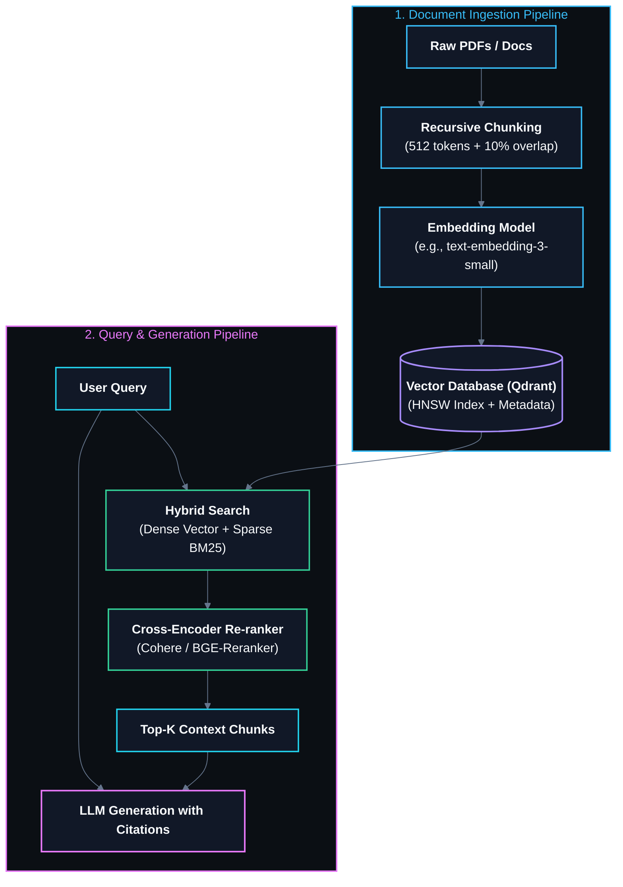

# 📚 Retrieval-Augmented Generation (RAG) & Vector Databases

> The architecture that grounds LLM responses with proprietary, up-to-date external knowledge by retrieving relevant context from vector indices before generation, eliminating hallucinations.

---

## 🎯 Why It Matters
- **Eliminating Hallucinations:** LLM parametric memory is fixed at training cutoff and prone to hallucinating facts. RAG injects verified source documents directly into the prompt context.
- **Cost & Efficiency:** Updating domain knowledge via vector embeddings costs fractions of a cent, whereas full model retraining or fine-tuning costs thousands of dollars.
- **Enterprise Access Control:** Vector retrieval allows document-level metadata filtering matching user role permissions (RBAC).

---

## 🏗️ Advanced Production RAG Pipeline

---

## 🧠 Core Vector Database Mechanics
- **Hierarchical Navigable Small World (HNSW):** Multi-layer graph index enabling sub-linear $O(\log N)$ approximate nearest neighbor (ANN) vector search.
- **Cosine Distance vs Dot Product vs Euclidean ($L_2$):**
  $$\text{Cosine Similarity}(u, v) = \frac{u \cdot v}{\|u\|_2 \|v\|_2}$$
- **Hybrid Search with Reciprocal Rank Fusion (RRF):** Merges dense semantic embeddings (captures conceptual meaning) with sparse BM25 keyword search (captures exact product IDs, acronyms, and names).

---

## 🔗 Related Topics
- [[BrainOS/08 - LLM & GenAI/LLM Engineering|LLM Engineering]]
- [[BrainOS/08 - LLM & GenAI/AI Agents|AI Agents]]
- [[BrainOS/08 - LLM & GenAI/Fine Tuning & Evaluation|Evaluation & RAGAS]]
- [[BrainOS/00 - BrainOS Dashboard|Main Dashboard]]
