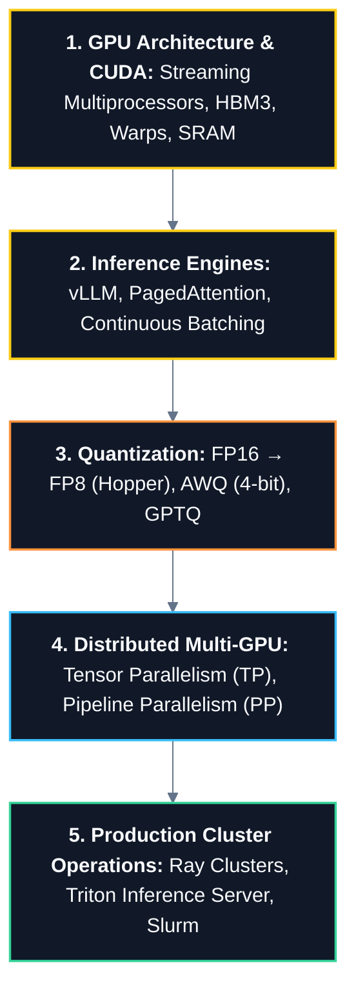

# ⚡ AI Infrastructure & GPU Systems Master Roadmap

> **Roadmap:** The pinnacle intersection of Systems Engineering and Artificial Intelligence: optimizing GPU hardware, kernel execution, distributed model parallelism, and high-throughput inference serving.

---

## 🎯 Why Learn This?
- **The Ultimate Systems Frontier:** Modern AI models are compute and memory-bandwidth bound; optimization requires deep GPU systems knowledge.
- **Slash Production Serving Costs:** PagedAttention, Continuous Batching, and FP8 Quantization reduce GPU hosting costs by 80%+.
- **Rare, High-Value Skill:** Bridges low-level CUDA, high-performance distributed networking (NVLink, InfiniBand), and ML model architectures.

---

## 🔗 Prerequisites
- [[BrainOS/03 - Core CS/Operating Systems|Operating Systems]] (Memory hierarchy, page tables, cache locality)
- [[BrainOS/05 - Systems/Distributed Systems|Distributed Systems]] (Consensus, network communication, RPCs)
- [[BrainOS/08 - LLM & GenAI/LLM Engineering|LLM & Transformer Architecture]] (KV Cache, Attention mechanisms)

---

## 🗺️ Learning Order & Topic Breakdown

### 1. GPU Hardware Architecture & CUDA Internals
- GPU vs CPU architecture: High Throughput vs Low Latency
- Streaming Multiprocessors (SMs), CUDA Cores, Tensor Cores
- GPU Memory Hierarchy: Registers → Shared Memory (SRAM) → L2 Cache → High Bandwidth Memory (HBM3 / VRAM)
- CUDA Execution Model: Threads, Warps (32 threads), Thread Blocks, Grid scheduling, Warp Divergence
- Memory Coalescing and Arithmetic Intensity (Roofline Model)

### 2. High-Performance Model Serving Engines
- The Memory Bottleneck: KV Cache memory consumption during autoregressive generation
- **PagedAttention (vLLM):** Virtual memory paging applied to KV Cache, eliminating internal/external memory fragmentation
- **Continuous (Iteration-Level) Batching:** Dynamic request insertion/eviction without waiting for entire batch completion
- Speculative Decoding (Draft models) and Chunked Prefill

### 3. Quantization & Precision Optimization
- Numerical Formats: FP32, FP16, BF16, FP8 (E4M3, E5M2), INT8, INT4
- Post-Training Quantization (PTQ): Activation-Aware Weight Quantization (AWQ) and GPTQ
- NVIDIA Hopper FP8 Tensor Core acceleration

### 4. Distributed Multi-GPU Parallelism
- Inter-GPU interconnects: NVLink (900 GB/s) vs PCIe vs InfiniBand RDMA
- **Tensor Parallelism (TP - Megatron-LM):** Intra-node layer slicing across GPUs with fast `All-Reduce`
- **Pipeline Parallelism (PP):** Inter-node sequential layer distribution with micro-batching
- **Data Parallelism & ZeRO:** Zero Redundancy Optimizer (ZeRO-1, ZeRO-2, ZeRO-3 / FSDP)

### 5. Production Cluster Orchestration & Observability
- Ray Core & Ray Serve for distributed model orchestration
- Triton Inference Server: Dynamic batching, multi-model execution, ensemble pipelines
- GPU Cluster Monitoring: DCGM (Data Center GPU Manager), GPU utilization, VRAM memory fragmentation metrics

---

## 🚀 Unlocks
- → High-Performance AI Infrastructure Engineering
- → Scaling 70B+ Frontier Models at Enterprise Production Scale

---

## 🧪 Suggested Project
- **Distributed LLM Inference Gateway (Level 11 - Capstone):** Deploy a multi-GPU vLLM serving engine utilizing Continuous Batching, PagedAttention, and AWQ 4-bit quantization with a high-throughput streaming API proxy.

---

## 📚 Detailed Notes in Vault
- [[BrainOS/09 - AI Infrastructure/GPU Computing & CUDA|GPU Computing & CUDA]]
- [[BrainOS/09 - AI Infrastructure/Model Serving & Inference|Model Serving & Inference]]
- [[BrainOS/09 - AI Infrastructure/Quantization & Distributed Inference|Quantization & Distributed Inference]]
