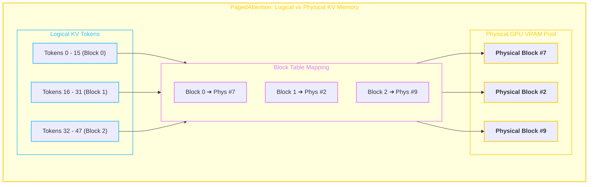

# 🚀 Model Serving & High-Throughput Inference (vLLM)

> Modern high-throughput LLM inference architectures designed to eliminate memory fragmentation and maximize GPU utilization through PagedAttention and Continuous Iteration-Level Batching.

---

## 🎯 The Two Key Breakthroughs of vLLM

### 1. PagedAttention (Virtual Memory for KV-Cache)
- **The Problem:** Traditional inference pre-allocated contiguous memory blocks for the maximum context window (e.g. 8K tokens) per request, resulting in 60%–80% memory waste due to internal/external fragmentation.
- **The Solution:** Inspired by **Virtual Memory Paging in Operating Systems**, PagedAttention splits KV-Cache into fixed-size physical blocks (e.g. 16 tokens) mapped dynamically via a logical Block Table.

### 2. Continuous (Iteration-Level) Batching
- Traditional static batching waited for the slowest sequence in a batch to finish before accepting new requests (massive idle time).
- Continuous batching operates at the token-iteration level: as soon as a sequence generates `<EOS>`, it is evicted and a new pending request enters the next iteration instantly.

---

## 📊 Core Serving Metrics
- **Time to First Token (TTFT):** Measures prefill speed and queue latency (critical for interactive user responsiveness).
- **Time Per Output Token (TPOT) / Inter-Token Latency (ITL):** Measures auto-regressive generation speed (e.g., 20ms/token $\approx$ 50 tokens/sec).
- **Tokens Per Second Per Dollar:** The true operational efficiency benchmark of model serving platforms.

---

## 🔗 Related Topics
- [[BrainOS/03 - Core CS/Operating Systems|Operating Systems (Paging & Virtual Memory)]]
- [[BrainOS/09 - AI Infrastructure/Quantization & Distributed Inference|Quantization & Scaling]]
- [[BrainOS/09 - AI Infrastructure/AI Infrastructure|AI Infrastructure Master Hub]]
