# 🧪 Project Progression & Learning Ladder

> The 11-level progressive project ladder designed to force deep learning by building increasingly complex software systems from local CLI tools to distributed AI infrastructure.

---

## 🧗 The 11-Level Project Progression Ladder

```mermaid
flowchart TD
    L1["<b>Level 1:</b> CLI File Organizer & Metadata Parser<br/><i>(Java OOP, File I/O, CLI Flags)</i>"] --> L2["<b>Level 2:</b> Custom Data Structure Engine<br/><i>(Thread-Safe LRU Cache, Heap, B-Tree)</i>"]
    L2 --> L3["<b>Level 3:</b> Multi-Threaded HTTP/1.1 Socket Server<br/><i>(Raw Sockets, ThreadPool, HTTP Parser)</i>"]
    L3 --> L4["<b>Level 4:</b> Production E-Commerce REST API<br/><i>(Spring Boot, PostgreSQL, Redis, JWT Auth)</i>"]
    L4 --> L5["<b>Level 5:</b> High-Throughput Scalable URL Shortener<br/><i>(Consistent Hashing, Redis Cache-Aside, Rate Limiter)</i>"]
    L5 --> L6["<b>Level 6:</b> Distributed Real-Time Chat Engine<br/><i>(WebSockets, Redis Pub/Sub, Apache Kafka)</i>"]
    L6 --> L7["<b>Level 7:</b> Cloud-Native Microservices Cluster<br/><i>(Docker, Kubernetes, AWS EKS, Prometheus, GitOps)</i>"]
    L7 --> L8["<b>Level 8:</b> End-to-End ML Predictive Pricing Service<br/><i>(Python, Scikit-Learn, FastAPI, ONNX Runtime)</i>"]
    L8 --> L9["<b>Level 9:</b> PyTorch Multi-Modal Classifier<br/><i>(CNN/Transformer, PyTorch, GPU Training, Loss Optimization)</i>"]
    L9 --> L10["<b>Level 10:</b> Enterprise Production RAG Engine<br/><i>(Qdrant Hybrid Search, Cohere Re-ranker, AI Agents)</i>"]
    L10 --> L11["<b>Level 11:</b> Distributed LLM Inference Gateway<br/><i>(vLLM, Continuous Batching, PagedAttention, CUDA)</i>"]

    style L1 fill:#111827,stroke:#38BDF8,stroke-width:1.8px,color:#F8FAFC
    style L2 fill:#111827,stroke:#A78BFA,stroke-width:1.8px,color:#F8FAFC
    style L3 fill:#111827,stroke:#C084FC,stroke-width:1.8px,color:#F8FAFC
    style L4 fill:#111827,stroke:#34D399,stroke-width:1.8px,color:#F8FAFC
    style L5 fill:#111827,stroke:#FB923C,stroke-width:1.8px,color:#F8FAFC
    style L6 fill:#111827,stroke:#FB923C,stroke-width:1.8px,color:#F8FAFC
    style L7 fill:#111827,stroke:#22D3EE,stroke-width:1.8px,color:#F8FAFC
    style L8 fill:#111827,stroke:#F472B6,stroke-width:1.8px,color:#F8FAFC
    style L9 fill:#111827,stroke:#F472B6,stroke-width:1.8px,color:#F8FAFC
    style L10 fill:#111827,stroke:#E879F9,stroke-width:1.8px,color:#F8FAFC
    style L11 fill:#111827,stroke:#FACC15,stroke-width:2.2px,color:#F8FAFC
```

---

## 🛠️ Detailed Project Specifications

### Level 1: CLI File Organizer & Parser
- **Core Skills:** Java OOP, Streams, File I/O, CLI argument parsing, Unit testing with JUnit 5.
- **What It Teaches:** Clean modular coding, robust error handling, recursive directory traversal.

### Level 2: Custom Data Structure Engine
- **Core Skills:** In-memory pointer management, Thread-safe synchronization (`ReentrantReadWriteLock`), Generics.
- **What It Teaches:** Low-level memory layout, pointer integrity, custom LRU Cache and Min-Heap implementations.

### Level 3: Multi-threaded HTTP/1.1 Socket Server
- **Core Skills:** Raw Java `ServerSocket`, TCP stream parsing, thread pool dispatching, static asset delivery, HTTP status code handling.
- **What It Teaches:** What web frameworks (Tomcat, Netty) actually do behind the scenes; crossing TCP socket barriers.

### Level 4: Production E-Commerce Backend
- **Core Skills:** Spring Boot, PostgreSQL, Spring Data JPA, Redis Cache-Aside, JWT Authentication, OpenAPI / Swagger documentation.
- **What It Teaches:** Multi-tier architectural boundaries, database migrations (Flyway/Liquibase), relational integrity, and session security.

### Level 5: Scalable URL Shortener (ShortLink)
- **Core Skills:** Base62 encoding, Redis caching, Rate limiting (Token Bucket), horizontal database partitioning strategy.
- **What It Teaches:** High-throughput read optimization, 301 vs 302 redirects, handling cache stampedes.

### Level 6: Distributed Real-Time Chat with WebSockets & Kafka
- **Core Skills:** Full-duplex WebSockets, Redis Pub/Sub for local connection state, Apache Kafka for cross-cluster event delivery, PostgreSQL history persistence.
- **What It Teaches:** Stateful vs stateless server scaling, handling dropped connections, message delivery guarantees (At-least-once).

### Level 7: Cloud-Native Microservices Deployment on AWS
- **Core Skills:** Docker multi-stage builds, Kubernetes Helm charts, AWS EKS, ALB Ingress Controller, Prometheus & Grafana metrics, Jaeger distributed tracing.
- **What It Teaches:** Production SRE operations, container isolation, automated rolling updates, horizontal pod autoscaling (HPA).

### Level 8: End-to-End ML Prediction Service
- **Core Skills:** Python, Pandas, Scikit-Learn pipelines, FastAPI, ONNX Runtime, Docker.
- **What It Teaches:** Bridging machine learning models with production backend APIs; low-latency model inference.

### Level 9: PyTorch Neural Vision & Text Classifier
- **Core Skills:** PyTorch tensors, GPU memory management (`cuda`), custom loss functions, backpropagation loop, AdamW optimizer.
- **What It Teaches:** Deep representation learning, tensor manipulation, gradient clipping, avoiding vanishing/exploding gradients.

### Level 10: Production RAG Knowledge Engine
- **Core Skills:** LangChain / LlamaIndex, Qdrant vector database, Hybrid search (Dense + BM25), Cohere cross-encoder re-ranking, ReAct AI Agent with tool calling.
- **What It Teaches:** Deterministic LLM engineering, context assembly, metadata filtering, preventing hallucinations.

### Level 11: High-Throughput Distributed LLM Inference Engine
- **Core Skills:** vLLM integration, Continuous Batching, PagedAttention memory profiling, Triton / CUDA kernels, Multi-GPU Tensor Parallelism.
- **What It Teaches:** The pinnacle of AI Systems Engineering: GPU memory bandwidth optimization, serving token streams at minimal cost.

---

## 🔗 Navigation
- Additional Ideas: **[[BrainOS/10 - Projects/Project Ideas|Curated Project Ideas & Extensions]]**
- Master Roadmap: **[[BrainOS/01 - Roadmap/CS Engineering Roadmap|Master Roadmap]]**
- Main Dashboard: **[[BrainOS/00 - BrainOS Dashboard|Main Dashboard]]**
