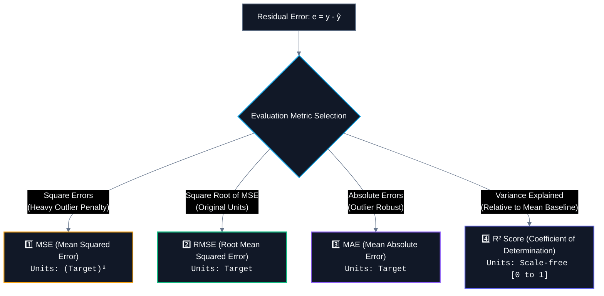

# 📊 Regression Evaluation Metrics (MSE, RMSE, MAE, $R^2$)

> [!abstract] Executive Summary
> Regression evaluation metrics measure the discrepancy between the model's predicted continuous output ($\hat{y}$) and the true ground-truth target ($y$). Choosing the right metric depends on **unit interpretability**, **sensitivity to extreme outliers**, and **mathematical differentiability** during optimization.

---

## 🎯 The Four Essential Regression Metrics



---

## 1️⃣ Mean Squared Error (MSE)

$$\boxed{\text{MSE} = \frac{1}{n} \sum_{i=1}^{n} (y_i - \hat{y}_i)^2}$$

### Core Characteristics:
- **How it works:** Computes the average of squared differences between actual and predicted values.
- **Unit problem:** The units are **squared** relative to the target variable. If predicting house prices in $\text{dollars} \; (\$)$, MSE is in $\text{dollars}^2 \; (\$^2)$, making direct interpretation difficult.
- **Outlier sensitivity:** Because errors are squared, large mistakes are penalized exponentially ($10 \to 100$, $100 \to 10,000$).
- **Optimization:** Smooth and differentiable everywhere $\to$ ideal loss function for Gradient Descent.

```python
from sklearn.metrics import mean_squared_error

mse = mean_squared_error(y_test, y_pred)
```

---

## 2️⃣ Root Mean Squared Error (RMSE)

$$\boxed{\text{RMSE} = \sqrt{\text{MSE}} = \sqrt{\frac{1}{n} \sum_{i=1}^{n} (y_i - \hat{y}_i)^2}}$$

### Core Characteristics:
- **How it works:** Takes the square root of the MSE.
- **Unit restoration:** Converts error back into the **exact same units as the target variable**. If predicting exam scores ($0-100$), an $\text{RMSE} = 4.5$ means predictions are off by roughly $\pm 4.5\text{ marks}$ on average.
- **Outlier sensitivity:** Retains the heavy penalty for large mistakes while remaining intuitively readable for humans.

```python
import numpy as np
from sklearn.metrics import mean_squared_error

# In modern scikit-learn or via numpy
rmse = float(np.sqrt(mean_squared_error(y_test, y_pred)))
```

---

## 3️⃣ Mean Absolute Error (MAE)

$$\boxed{\text{MAE} = \frac{1}{n} \sum_{i=1}^{n} |y_i - \hat{y}_i|}$$

### Core Characteristics:
- **How it works:** Computes the average magnitude of absolute errors.
- **Robust to Outliers:** Does not square errors. An error of $10$ is penalized exactly twice as much as an error of $5$ (linear scaling).
- **Unit:** In the original target units.

```python
from sklearn.metrics import mean_absolute_error

mae = mean_absolute_error(y_test, y_pred)
```

---

## 4️⃣ $R^2$ Score (Coefficient of Determination)

$$\boxed{R^2 = 1 - \frac{\text{SS}_{\text{res}}}{\text{SS}_{\text{tot}}} = 1 - \frac{\sum_{i=1}^{n} (y_i - \hat{y}_i)^2}{\sum_{i=1}^{n} (y_i - \bar{y})^2}}$$

### What Does $R^2$ Measure?
$R^2$ quantifies the **proportion of variance in the target $y$ that is explained by the model** relative to a simple baseline that always predicts the sample mean ($\bar{y}$).

- **$\text{SS}_{\text{res}}$ (Residual Sum of Squares):** Unexplained variance remaining after model predictions ($\sum (y - \hat{y})^2$).
- **$\text{SS}_{\text{tot}}$ (Total Sum of Squares):** Baseline variance in the target before applying any model ($\sum (y - \bar{y})^2$).

> [!example] 💡 Concrete Percentage Intuition
> If $\text{SS}_{\text{tot}} = 100$ and $\text{SS}_{\text{res}} = 20$:
> $$R^2 = 1 - \frac{20}{100} = 1 - 0.20 = \mathbf{0.80} \quad (\text{Model explains } 80\% \text{ of target variance})$$

### Interpretation Scale:
- **$R^2 = 1.0$:** Perfect predictions ($\text{SS}_{\text{res}} = 0$).
- **$R^2 = 0.0$:** Model performs no better than always predicting the dataset average ($\bar{y}$).
- **$R^2 < 0.0$:** Model performs **worse** than simply predicting the mean (indicates severe underfitting / misfitting on test data).

---

## 🚨 The Critical Flaw of $R^2$: Monotonic Inflation

> [!warning] The Feature Addition Trap
> **$R^2$ NEVER decreases when you add new features to a model**, even if the added features are pure, meaningless random noise!
> 
> Ordinary Least Squares will assign tiny non-zero weights to noise features to fit random training fluctuations, artificially inflating $R^2$ while hurting real-world generalization.

```chart
type: line
labels: [2 Features (Real), 3 Features (Real), 4 Features (+Noise), 5 Features (+Noise), 6 Features (+Noise)]
series:
  - title: Ordinary R² (Inflates with Noise)
    data: [0.78, 0.82, 0.825, 0.831, 0.838]
  - title: Adjusted R² (Penalizes Complexity)
    data: [0.775, 0.812, 0.805, 0.795, 0.782]
width: 60%
```

---

## 5️⃣ Adjusted $R^2$ ($R^2_{\text{adj}}$)

To penalize model complexity and prevent overfitting through unnecessary feature expansion, **Adjusted $R^2$** incorporates degrees of freedom:

$$\boxed{R^2_{\text{adj}} = 1 - (1 - R^2) \left(\frac{n - 1}{n - p - 1}\right)}$$

Where:
- $R^2$ = Ordinary Coefficient of Determination
- $n$ = Total number of observations (samples / rows)
- $p$ = Total number of explanatory features (predictors / columns)
- $n - p - 1$ = Residual degrees of freedom

### Why the Adjustment Works:
- As you add **useful features**, $R^2$ increases enough to overcome the penalty multiplier $\frac{n-1}{n-p-1} \implies R^2_{\text{adj}}$ **increases**.
- As you add **useless noise features**, $R^2$ barely changes, but $p$ increases $\implies \frac{n-1}{n-p-1}$ grows larger $\implies R^2_{\text{adj}}$ **decreases**.

> [!example] 🔢 Concrete Calculation Example
> Given: $R^2 = 0.80$, $n = 100$ samples, $p = 5$ features:
> $$R^2_{\text{adj}} = 1 - (1 - 0.80) \left(\frac{100 - 1}{100 - 5 - 1}\right) = 1 - (0.20)\left(\frac{99}{94}\right) = 1 - (0.20 \times 1.0532) = \mathbf{0.789}$$
> Notice $R^2_{\text{adj}} = 0.789 < R^2 = 0.800$. The penalty accounts for the 5 parameters used.

---

## 🛡️ The 2 Critical Edge Cases for Production & Coding

When writing custom NumPy functions for $R^2$ and Adjusted $R^2$, you must guard against two fatal mathematical edge cases:

### ⚠️ Edge Case 1: Zero Target Variance ($\text{SS}_{\text{tot}} == 0$)
- **Cause:** All target values in $y$ are identical (e.g., $y = [5, 5, 5, 5]$).
- **Issue:** $\sum (y_i - \bar{y})^2 = 0$, causing a division-by-zero crash in $\frac{\text{SS}_{\text{res}}}{\text{SS}_{\text{tot}}}$.
- **Resolution:** Check `if ss_tot == 0.0:` return appropriate fallback ($1.0$ if $\text{SS}_{\text{res}} == 0$ else $0.0$).

### ⚠️ Edge Case 2: Insufficient Degrees of Freedom ($n - p - 1 \le 0$)
- **Cause:** The number of features $p$ equals or exceeds the number of observations ($p \ge n - 1$).
- **Issue:** Denominator $n - p - 1 \le 0$, making the penalty undefined or negative.
- **Resolution:** Guard check `if n - p - 1 <= 0:` fallback or raise error.

---

## 💻 Pure NumPy Implementation: `r2_and_adjusted_r2`

```python
import numpy as np

def compute_r2_scores(y_true: np.ndarray, y_pred: np.ndarray, p: int) -> dict:
    """
    Computes R² and Adjusted R² from scratch with edge case protection.
    
    Parameters:
        y_true: Ground truth target vector of shape (n,)
        y_pred: Predicted values vector of shape (n,)
        p: Number of feature predictors used by the model
        
    Returns:
        dict: {'r2': float, 'r2_adj': float}
    """
    y_true = np.asarray(y_true, dtype=float)
    y_pred = np.asarray(y_pred, dtype=float)
    n = len(y_true)
    
    # 1. Compute SS_res and SS_tot
    ss_res = np.sum((y_true - y_pred) ** 2)
    ss_tot = np.sum((y_true - np.mean(y_true)) ** 2)
    
    # Edge Case 1: Zero variance in target
    if ss_tot == 0.0:
        r2 = 1.0 if ss_res == 0.0 else 0.0
    else:
        r2 = 1.0 - (ss_res / ss_tot)
        
    # Edge Case 2: Degrees of freedom check
    df_res = n - p - 1
    if df_res <= 0:
        r2_adj = float('nan')  # Undefined when p >= n - 1
    else:
        r2_adj = 1.0 - (1.0 - r2) * ((n - 1) / df_res)
        
    return {
        "r2": float(r2),
        "r2_adj": float(r2_adj)
    }
```

---

## ⚖️ Side-by-Side Comparison Matrix

| Metric | Mathematical Formula | Units | Outlier Penalty | Handles Complexity? | Primary Use Case |
| :--- | :--- | :--- | :--- | :---: | :--- |
| **MSE** | $\frac{1}{n}\sum(y-\hat{y})^2$ | Squared ($\text{units}^2$) | Quadratic (Very High) | ❌ No | Mathematical Loss Function optimization |
| **RMSE** | $\sqrt{\frac{1}{n}\sum(y-\hat{y})^2}$ | Natural ($\text{units}$) | Quadratic (High) | ❌ No | Executive reporting when large errors are costly |
| **MAE** | $\frac{1}{n}\sum\|y-\hat{y}\|$ | Natural ($\text{units}$) | Linear (Robust) | ❌ No | Datasets with extreme noise / anomalies |
| **$R^2$** | $1 - \frac{\text{SS}_{\text{res}}}{\text{SS}_{\text{tot}}}$ | Dimensionless ($0 \to 1$) | Proportional | ❌ No | Measuring percentage of target variance explained |
| **Adjusted $R^2$** | $1 - (1-R^2)\frac{n-1}{n-p-1}$ | Dimensionless ($0 \to 1$) | Proportional | ✅ **Yes** | Feature selection & comparing models with different $p$ |

---

## 💻 Complete Production Pattern: `fit_linreg_rmse`

Here is the standard leak-free implementation pattern combining a full Scikit-Learn Pipeline with Root Mean Squared Error evaluation:

```python
import numpy as np
from sklearn.pipeline import Pipeline
from sklearn.preprocessing import StandardScaler
from sklearn.linear_model import LinearRegression
from sklearn.metrics import mean_squared_error

def fit_linreg_rmse(X_train, y_train, X_test, y_test) -> float:
    """
    Trains a leak-free Linear Regression pipeline and evaluates RMSE.
    
    1. StandardScaler learns μ and σ strictly from X_train.
    2. LinearRegression fits parameters (w, b) using X_train_scaled and y_train.
    3. X_test is transformed using training statistics and evaluated.
    4. Computes RMSE in original target units.
    """
    # 1. Instantiate atomic Pipeline
    pipe = Pipeline([
        ("scaler", StandardScaler()),
        ("model", LinearRegression()),
    ])

    # 2. Fit preprocessor and model on training set ONLY
    pipe.fit(X_train, y_train)

    # 3. Predict on unseen test set
    pred = pipe.predict(X_test)

    # 4. Compute RMSE and return as standard Python float
    return float(np.sqrt(mean_squared_error(y_test, pred)))
```

---

## 🔗 Prerequisites & Next Steps

### Prerequisites
- [[04. Train-Test Split and Generalization]]
- [[02. Data Preprocessing/05. Scikit-Learn Pipeline|🚂 Scikit-Learn Pipeline]]

### Next Steps
- [[06. Linear Regression Assumptions|📐 Linear Regression Assumptions & Residual Diagnostics]]
- **Classification Metrics** — Precision, Recall, F1-Score, and ROC-AUC.

## 🔗 Related Notes
- [[01. Classical ML/README|📁 Classical ML Foundations MOC]]
- [[04. Train-Test Split and Generalization]]
- [[05. End-to-End ML Pipeline]]
- [[06. Linear Regression Assumptions]]
- [[02. Data Preprocessing/05. Scikit-Learn Pipeline]]
