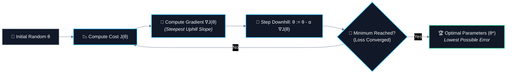
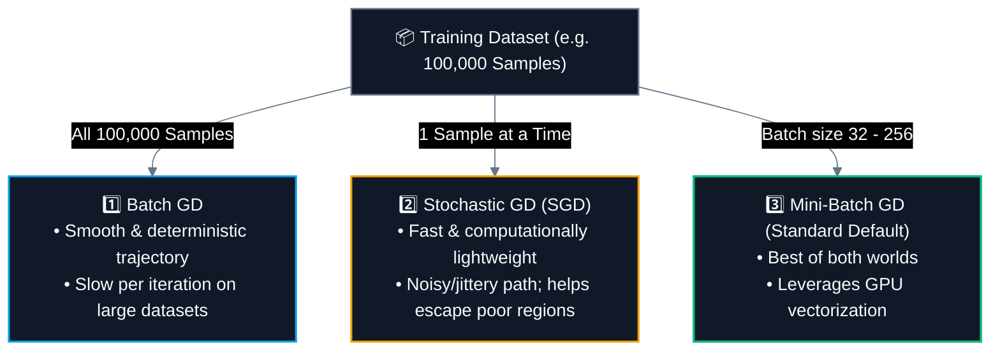

# 🏔️ Gradient Descent & Cost Functions

> [!abstract] Executive Summary
> **Gradient Descent** is the primary general-purpose mathematical optimization algorithm used across machine learning and deep learning to find optimal model parameters ($\mathbf{\theta}$ or $\mathbf{w}, b$) by iteratively stepping in the direction of steepest decrease of a differentiable **Cost Function** $J(\mathbf{\theta})$.

---

## 🎯 1. The Optimization Problem

In Linear Regression, predictions are generated as:

$$\hat{y} = \theta_0 + \theta_1 x$$

Where:
- $\theta_0$ = Intercept (bias $b$)
- $\theta_1$ = Slope (feature weight $w_1$)

To evaluate how poorly our model predicts reality, we compute the **Mean Squared Error (Cost Function)**:

$$J(\theta) = \text{MSE} = \frac{1}{n}\sum_{i=1}^{n} \left(y_i - \hat{y}_i\right)^2$$

$$\boxed{\text{Optimization Goal:} \quad \min_{\mathbf{\theta}} J(\mathbf{\theta})}$$



---

## 🏔️ 2. Intuition: The Foggy Mountain Metaphor

> [!example] 🌫️ The Foggy Mountain Valley
> Imagine being stranded on a mountain slope in thick fog. You cannot see the lowest point in the valley floor, but you can feel the **slope of the ground directly under your feet**:
> - **Hillside Surface:** The Cost Landscape $J(\theta)$.
> - **Current Position:** Current parameter values $\theta$.
> - **Slope Under Feet:** The **Gradient** $\nabla J(\theta)$ (points in the direction of steepest **uphill** climb).
> - **Opposite Direction:** Downhill descent toward the valley.
> - **Step Size:** The **Learning Rate** ($\alpha$).
> - **Valley Bottom:** The global minimum (lowest cost / best model).

---

## 🧭 3. The Core Gradient Descent Update Rule

$$\boxed{\mathbf{\theta} := \mathbf{\theta} - \alpha \nabla J(\mathbf{\theta})}$$

### 🔍 Anatomy of the Equation:

| Component | Symbol | Meaning | Role in Optimization |
| :--- | :---: | :--- | :--- |
| **Old Parameters** | $\mathbf{\theta}$ | Current weights and intercept | Starting coordinate before the step. |
| **Assignment Operator** | $:=$ | In-place update | Overwrites the old parameter with the new value. |
| **The Minus Sign** | $-$ | **Descent Direction** | The gradient points **uphill** ($+\nabla J$). We subtract it to step **downhill** ($-$). |
| **Learning Rate** | $\alpha$ | Step size hyperparameter | Dictates how far we travel along the gradient direction. |
| **Gradient** | $\nabla J(\mathbf{\theta})$ | Vector of partial derivatives $\left[\frac{\partial J}{\partial \theta_0}, \frac{\partial J}{\partial \theta_1}\right]$ | Direction and steepness of maximum error increase. |

---

## 📈 4. Visualizing the Cost Function & Loss Convergence

### 📉 1. The Cost Landscape: $J(\theta) = \theta^2$

| Parameter ($\theta$) | -5 | -4 | -3 | -2 | -1 | **0** | 1 | 2 | 3 | 4 | 5 |
| :--- | :---: | :---: | :---: | :---: | :---: | :---: | :---: | :---: | :---: | :---: | :---: |
| **Cost $J(\theta)$** | 25 | 16 | 9 | 4 | 1 | **0 (Min)** | 1 | 4 | 9 | 16 | 25 |

```chart
type: line
labels: [-5, -4, -3, -2, -1, 0, 1, 2, 3, 4, 5]
series:
  - title: Cost J(θ) = θ²
    data: [25, 16, 9, 4, 1, 0, 1, 4, 9, 16, 25]
width: 60%
```

---

### 📉 2. Loss Curve Over Iterations ($\alpha = \text{Reasonable}$)

| Iteration | 0 | 1 | 2 | 3 | 4 | 5 | 6 | 7 | 8 | 9 | 10 |
| :--- | :---: | :---: | :---: | :---: | :---: | :---: | :---: | :---: | :---: | :---: | :---: |
| **Loss $J(\theta)$** | 25.0 | 16.0 | 10.0 | 6.5 | 4.2 | 2.8 | 1.9 | 1.3 | 0.9 | 0.65 | **0.50** |

```chart
type: line
labels: [0, 1, 2, 3, 4, 5, 6, 7, 8, 9, 10]
series:
  - title: Loss Convergence J(θ)
    data: [25, 16, 10, 6.5, 4.2, 2.8, 1.9, 1.3, 0.9, 0.65, 0.5]
width: 60%
```

---

## ⚡ 5. The Impact of Learning Rate ($\alpha$)

The learning rate $\alpha$ is the most critical hyperparameter in Gradient Descent:

```mermaid
%%{init: {'theme': 'base', 'themeVariables': { 'darkMode': true, 'background': '#0B0F14', 'mainBkg': '#111827', 'primaryColor': '#111827', 'primaryTextColor': '#F8FAFC', 'primaryBorderColor': '#38BDF8', 'lineColor': '#64748B', 'secondaryColor': '#0B0F14', 'tertiaryColor': '#0B0F14', 'clusterBkg': '#0B0F14', 'clusterBorder': '#38BDF8' }}}%%
flowchart TD
    subgraph Small ["🐌 1. α Too Small"]
        direction TB
        S1["Tiny incremental steps"]
        S2["Loss is flat for hundreds of iterations"]
        S3["Risk: Trapped in local minima / high compute time"]
    end

    subgraph Good ["🎯 2. α Reasonable"]
        direction TB
        G1["Smooth, steady downhill progression"]
        G2["Loss drops rapidly then stabilizes"]
        G3["Result: Fast convergence to minimum"]
    end

    subgraph Large ["💥 3. α Too Large"]
        direction TB
        L1["Overshoots the valley floor"]
        L2["Loss begins oscillating and rising"]
        L3["Result: Divergence (J(θ) → ∞) 💀"]
    end

    classDef small fill:#111827,stroke:#64748b,stroke-width:1.5px,color:#F8FAFC;
    classDef good fill:#111827,stroke:#10b981,stroke-width:1.8px,color:#F8FAFC;
    classDef large fill:#111827,stroke:#f43f5e,stroke-width:1.8px,color:#F8FAFC;

    class Small,S1,S2,S3 small;
    class Good,G1,G2,G3 good;
    class Large,L1,L2,L3 large;
```



> [!important] 🧠 Diagnostic Rules of Thumb
> - **If loss is flat for hundreds of iterations:** $\alpha$ is **too low** (increase learning rate).
> - **If loss rises or oscillates violently:** $\alpha$ is **too high** (decrease learning rate).

---

## 🔄 6. Batch vs. Stochastic vs. Mini-Batch Gradient Descent

The key operational distinction is: **"How much data is evaluated to compute a single parameter update step?"**



### ⚖️ Comprehensive Comparison Matrix

| Property | Batch Gradient Descent | Stochastic Gradient Descent (SGD) | Mini-Batch Gradient Descent |
| :--- | :--- | :--- | :--- |
| **Samples per Update** | **All $N$ samples** | **Exactly 1 sample** | **Small batch (32 to 256)** |
| **Path to Minimum** | Direct, smooth line | Highly erratic / zigzag | Moderately smooth with mild noise |
| **Computational Speed** | Slow for massive datasets | Very fast per iteration | Optimal (GPU parallelization) |
| **Memory Requirement** | High (Entire dataset in RAM) | Minimal ($1$ sample in RAM) | Low (Single batch in RAM) |
| **Local Minima Escape** | Vulnerable to saddle points | High noise helps jump out | Balanced escape ability |
| **Industry Usage** | Small / academic datasets | Online streaming data | **Standard deep learning default** |

---

## ✍️ 7. Step-by-Step Hand-Calculation Example (1 Complete Step)

Let's calculate **one full Gradient Descent parameter update by hand** using concrete numbers:

### 📦 Given:
- **Model:** $\hat{y} = \theta x$ *(predicting target $y$ from feature $x$)*
- **1 Training Sample:** $(x = 2, \; y = 8)$ *(Ideal $\theta^* = 4$ since $4 \times 2 = 8$)*
- **Initial Parameter Guess:** $\theta_{\text{old}} = 1.0$
- **Learning Rate:** $\alpha = 0.1$
- **Cost Function (Squared Error):** $J(\theta) = (y - \hat{y})^2$
- **Gradient Formula:** $\nabla J(\theta) = \frac{\partial J}{\partial \theta} = -2(y - \hat{y})x$

---

### 🔢 The 5 Step-by-Step Calculations:

| Step | Operation | Formula | Calculation | Result |
| :---: | :--- | :---: | :--- | :---: |
| **1** | **Predict** | $\hat{y} = \theta_{\text{old}} \cdot x$ | $1.0 \times 2$ | **$\hat{y} = 2.0$** |
| **2** | **Error** | $e = y - \hat{y}$ | $8.0 - 2.0$ | **$e = +6.0$** |
| **3** | **Current Cost** | $J(\theta_{\text{old}}) = e^2$ | $(6.0)^2$ | **$J = 36.0$** |
| **4** | **Gradient** | $\nabla J = -2 \cdot e \cdot x$ | $-2 \times 6.0 \times 2$ | **$\nabla J = -24.0$** |
| **5** | **Update Parameter** | $\theta_{\text{new}} = \theta_{\text{old}} - \alpha \nabla J$ | $1.0 - (0.1 \times -24.0) = 1.0 + 2.4$ | **$\theta_{\text{new}} = 3.4$** |

---

### 🎯 Proof of Error Reduction:

Let's test our updated parameter ($\theta_{\text{new}} = 3.4$):
- **New Prediction:** $\hat{y}_{\text{new}} = 3.4 \times 2 = \mathbf{6.8}$
- **New Error:** $8.0 - 6.8 = \mathbf{+1.2}$
- **New Cost:** $J(\theta_{\text{new}}) = (1.2)^2 = \mathbf{1.44}$

```chart
type: bar
labels: [Initial State (θ = 1.0), Updated State (θ = 3.4)]
series:
  - title: Cost J(θ)
    data: [36.0, 1.44]
width: 60%
```

> [!important] The Mechanism in Action
> In just **one single step**, Gradient Descent adjusted $\theta$ from $1.0 \to 3.4$ (moving directly towards $\theta^* = 4$), slashing the prediction cost from **$36.0 \implies 1.44$**!

---

## 🔑 8. Key Summary Takeaways

| Concept | Key Rule |
| :--- | :--- |
| **Cost Function $J(\theta)$** | Quantifies prediction error (MSE). We aim to find $\theta^* = \arg\min J(\theta)$. |
| **Gradient $\nabla J(\theta)$** | Vector indicating the direction of steepest **increase** in error. |
| **Minus Sign ($-$)** | Subtracting the gradient forces parameters to move **downhill** toward lower cost. |
| **Learning Rate $\alpha$** | Controls step size (Too low $\to$ slow; Too high $\to$ overshoots/diverges). |
| **Batch GD** | Evaluates all $N$ records per update. |
| **SGD** | Evaluates 1 record per update. |
| **Mini-Batch GD** | Evaluates batches of 32–256 records (practical default). |

---

## 🔗 Prerequisites & Next Steps

### Prerequisites
- [[03. Features, Targets, and Datasets]]
- [[07. Regression Evaluation Metrics|📊 Regression Evaluation Metrics (MSE, RMSE)]]
- [[06. Linear Regression Assumptions]]

### Next Steps
- **Hand Calculation of Gradient Descent** — Stepping through 1 epoch of parameter updates with pencil and paper.
- **Regularization (L1 Lasso / L2 Ridge)** — Adding penalty terms to the cost function $J(\theta)$.

## 🔗 Related Notes
- [[01. Classical ML/README|📁 Classical ML Foundations MOC]]
- [[07. Regression Evaluation Metrics]]
- [[04. Train-Test Split and Generalization]]
- [[05. End-to-End ML Pipeline]]
- [[CS/AI & ML/02. Data Preprocessing/04. Feature Scaling|Feature Scaling & Loss Surface Geometry]]
