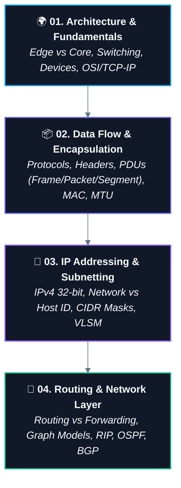

# 🌐 Computer Networks MOC (Map of Content)

> [!abstract] 📚 Domain Overview
> A computer network is an interconnected collection of autonomous computing devices capable of exchanging data and sharing resources. This Map of Content tracks the four-stage foundational roadmap from foundational physics and edge architecture to advanced binary subnetting and packet routing.

---

## 🗺️ Curriculum Roadmap

---

## 📚 Roadmap Stages & Core Notes

### 🌍 01. Architecture & Fundamentals
- [[01. Introduction to Computer Networks|🌐 01. Introduction to Computer Networks (Definition, Scale, LAN/MAN/WAN, Internet Model)]]
- [[02. Packets and Packet Switching|📦 02. Packets and Packet Switching (Data vs Packet, Headers, Multiplexing, Store-and-Forward)]]
- [[03. Switching Techniques - Packet vs Circuit|🔄 03. Switching Techniques - Packet vs Circuit (Dedicated vs Shared, Bursty Traffic, Statistical Multiplexing)]]
- [[04. Network Performance - Delay, Latency, Throughput|⏱️ 04. Network Performance - Delay, Latency, Throughput (Nodal Delays, Bandwidth, Throughput, Bottleneck Law)]]
- [[05. Network Hardware - Hub, Switch, Router, Modem|🔌 05. Network Hardware - Hub, Switch, Router, Modem (Layer 1-3 Devices, MAC Table, Collision Domains)]]
- [[06. OSI vs TCP-IP Model|🧱 06. Layered Models - OSI vs TCP-IP (5-Layer vs 7-Layer, PDU Hierarchy, Encapsulation Flow)]]
- `[[Network Edge and Core]]` — Hosts, Access Networks, Physical Media vs Packet-Switched Core

---

### 📦 02. Data Flow & Encapsulation
- [[01. Network Protocols and Standards|📜 01. Network Protocols and Standards (Syntax, Semantics, Timing, Stack of Agreements, RFCs)]]
- [[02. Encapsulation and Decapsulation|📦 02. Encapsulation and Decapsulation (Nested Envelopes, Headers vs Payloads, Hop-by-Hop Device Processing)]]
- [[03. Data Units - Segment, Packet, Frame, Bits|📦 03. Protocol Data Units (Segment, Packet, Frame, Bits & TCP vs UDP Trade-offs)]]
- [[04. Ethernet and MAC Addressing|🪪 04. Ethernet and MAC Addressing (48-bit Hex, OUI, MAC vs IP, Hop-by-Hop Link Delivery)]]
- [[05. MTU and Fragmentation|📏 05. MTU and IP Fragmentation (1500-Byte Limit, Flags DF/MF, Offset, IPv4 vs IPv6 Rules)]]

---

### 🏠 03. IP Addressing & Subnetting
- [[01. IP Addressing Fundamentals|🏠 01. IP Addressing Fundamentals (IPv4 32-bit Structure, Binary Math, 8-Bit Magic Table, Octets)]]
- [[02. Network ID and Host ID|🏘️ 02. Network ID vs Host ID (Street & House Analogy, Ambiguity Dilemma, Role of Subnet Mask)]]
- [[03. Subnet Masks and CIDR Notation|🥸 03. Subnet Masks & CIDR Notation (/8 to /32 Reference Table, Slash Notation, Bitwise AND)]]
- `[[04. Subnetting and Host Range Calculation]]` — Network address, broadcast address, first/last usable IP
- `[[05. Variable Length Subnet Masking (VLSM)]]` — Efficient address allocation without waste
- `[[Special IP Addresses]]` — Public vs Private (RFC 1918), Loopback (`127.0.0.1`), APIPA, Broadcast

---

### 🧮 04. Routing & Network Layer
- [[01. Routing Fundamentals - Routing vs Forwarding and Graph Models|🌐 01. Routing Fundamentals (Routing vs Forwarding, Graph Models, Metrics, Algorithms vs Protocols)]]
- [[02. Distance Vector Routing and RIP|📡 02. Distance Vector Routing and RIP (Bellman-Ford Formula, Hop-by-Hop Updates, Convergence)]]
- [[03. Bellman-Ford Algorithm|🧠 03. Bellman-Ford Algorithm (Edge Relaxation, V-1 Passes, Negative Cycles)]]
- `[[04. Link-State Routing and OSPF]]` — LSAs, Dijkstra SPF tree calculation, OSPF areas, DR/BDR election
- `[[05. Border Gateway Protocol (BGP)]]` — Autonomous Systems (AS), Path Vector routing, Inter-Domain routing policies

- `[[Default Gateway and ARP]]` — How packets leave the local LAN (Address Resolution Protocol)
- `[[Network Address Translation (NAT)]]` — Private-to-public IP translation, PAT, port mapping
- `[[IPv6 Fundamentals]]` — 128-bit addressing, hex notation, motivation, coexistence with IPv4

---

## 🔗 Cross-Domain CS Connections

| Related CS Domain | Connection Point |
| :--- | :--- |
| **[[Operating Systems]]** | Sockets, network system calls (`socket()`, `bind()`, `connect()`), I/O multiplexing (`epoll`), kernel network buffers. |
| **[[CS/WebDev/Backend/00. Backend Nexus\|Backend Development]]** | HTTP/HTTPS, WebSockets, REST APIs, TCP handshake latency, load balancing. |
| **[[Distributed Systems]]** | Network partitions (CAP theorem), consensus over unreliable networks, RPC mechanisms. |
| **Security** | Firewalls, packet filtering, ARP spoofing, Man-in-the-Middle (MitM), TLS/SSL encryption. |
