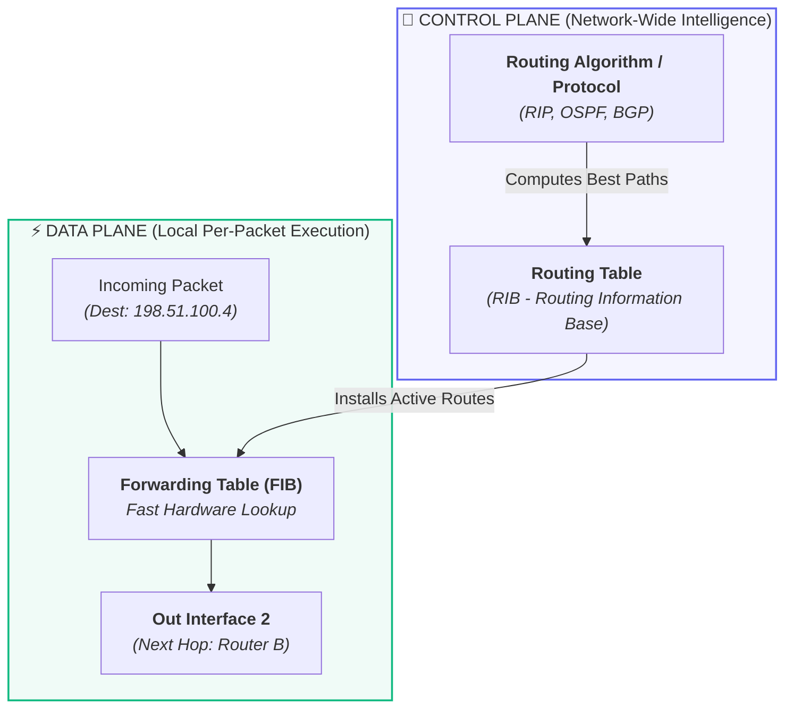
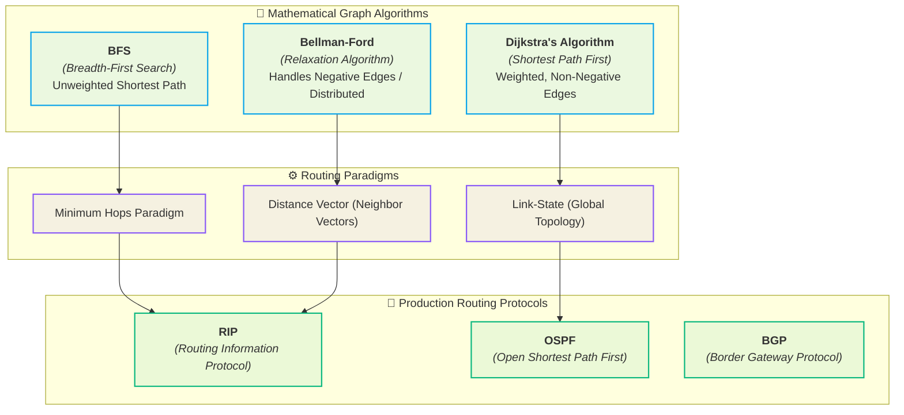

	
# 🌐 Routing Fundamentals — Routing vs Forwarding & Graph Models

> [!important] 🎯 Executive Summary
> - **Routing** is the **control plane** process of finding, calculating, and choosing the optimal end-to-end path for packets across an interconnected network graph.
> - **Forwarding** is the **data plane** action of transferring an incoming packet from a router's input interface to the appropriate output interface (the next hop).
> - **Network Graph Model:** Routers represent **Nodes/Vertices**, links represent **Edges**, and link metrics (hops, latency, cost) represent **Weights**.
> - **Algorithm vs Protocol:** A *Routing Algorithm* is the mathematical shortest-path method (BFS, Dijkstra, Bellman-Ford), while a *Routing Protocol* is the distributed communication standard (RIP, OSPF, BGP) routers run to exchange graph topology and reachability data.

---

## 🗺️ 1. What is Routing?

Consider sending traffic from your local client to a remote game server (e.g., Minecraft server):

```text
  [ Your PC ]
       │
  [ Router A ]
     ┌─┴─┐
     │   │
  [Router B] ── [Router C]
     └─┬─┘         │
       └─────┬─────┘
             │
     [ Router D ]
             │
   [ Minecraft Server ]
```

The fundamental problem of the Network Layer is:
> **Which path should the packet take through the mesh of interconnected routers to reach the destination?**

### ⭐ Definition
* **Routing:** The network-wide process of discovering, determining, and selecting the **best path** for packets to travel from a source network to a destination network.
* **Router:** An OSI [[06. OSI vs TCP-IP Model|Layer 3 (Network Layer)]] device that executes routing algorithms, maintains routing tables, and directs packets across distinct broadcast domains and subnets.

---

## 🧠 2. Routing vs Forwarding (Control Plane vs Data Plane)

Understanding the distinction between **routing** and **forwarding** is one of the most critical foundational concepts in networking:



### Key Differences Comparison

| Dimension | 🌐 Routing (Path Decision) | ⚡ Forwarding (Packet Switching) |
| :--- | :--- | :--- |
| **Primary Question** | *"What end-to-end path should packets take?"* | *"Which local interface should this specific packet exit on?"* |
| **Plane** | **Control Plane** (software / routing engine) | **Data Plane / Forwarding Plane** (hardware / ASIC / line cards) |
| **Scope** | Network-wide, end-to-end decision making | Local, hop-by-hop hardware action |
| **Time Scale** | Seconds to minutes (dynamic background updates) | Nanoseconds to microseconds (per-packet speed) |
| **Analogy** | Planning a cross-country roadmap from City A to City D | Taking exit ramp 4B at an individual highway junction |

---

## 🗺️ 3. Modeling Networks as Graphs

Modern network routing algorithms model physical and logical internet topologies using mathematical **Graph Theory**:

```text
          (2)
   [A] ───────── [B]
    │             │
 (5)│             │(3)
    │     (1)     │
   [C] ───────── [D]
```

### Graph Components in Networking

1. **Vertex / Node ($V$):**
   * Represents a **Router** (or host / gateway).
2. **Edge / Link ($E$):**
   * Represents a physical or logical **communication link** between routers (Ethernet, fiber, serial link).
3. **Weight / Cost ($W$):**
   * A numerical value assigned to an edge representing the "expense" or penalty of traversing that link.
   * Can represent:
     * **Hop Count** (simple unit hop = $1$)
     * **Latency / Delay** (milliseconds)
     * **Bandwidth / Speed** (e.g., $10^8 / \text{bandwidth}$)
     * **Financial / Policy Cost** (administrative weighting)

---

## 🚦 4. Metrics: Evaluating the "Best" Path

When multiple candidate paths exist between a source and a destination, a router selects the optimal route based on its **Metric**.

> [!definition] 📏 Metric
> A **Metric** is a quantifiable standard or cost value computed by a routing algorithm to evaluate, compare, and determine the most preferable path to a destination.

```text
        Path 1: A ──[50 Mbps]── B ──[50 Mbps]── D  (2 hops, lower bandwidth)
      ╱                                            ╲
    A                                                D
      ╲                                            ╱
        Path 2: A ──[1 Gbps]── C ──[1 Gbps]── E ──[1 Gbps]── D (3 hops, high bandwidth)
```

Depending on the metric used:
* If metric is **Hop Count**: Path 1 is chosen ($2 < 3$).
* If metric is **Link Speed / Bandwidth**: Path 2 is chosen (faster transit time despite an extra hop).

### Standard Protocol Metrics

| Protocol | Protocol Full Form | Primary Metric | Characteristic |
| :--- | :--- | :--- | :--- |
| **RIP** | Routing Information Protocol | **Hop Count** | Simple; ignores link bandwidth; max 15 hops. |
| **OSPF** | Open Shortest Path First | **Cost** ($\frac{10^8}{\text{Bandwidth in bps}}$) | Bandwidth-aware; dynamically finds lowest-cost tree. |
| **BGP** | Border Gateway Protocol | **Path / Policy Attributes** | AS-Path length, Local Preference, Multi-Exit Discriminator (MED). |

---

## 🛣️ 5. Hop Count Explained

A **hop** represents one router-to-router transition across a layer-3 boundary.

```text
[Host A] ──> (Router 1) ──> (Router 2) ──> (Router 3) ──> [Host B]
                  │              │              │
              Hop 1 ───>     Hop 2 ───>     Hop 3
```

* $\text{Host A} \to \text{Router 1} \to \text{Router 2} \to \text{Router 3} \to \text{Host B} \implies \mathbf{3\text{ Hops}}$.
* In protocols like **RIP**, each transit through a router increments the hop count by $1$.
* **Max limit:** In RIP, the maximum valid hop count is **15**. A hop count of **16** is interpreted as *Infinity / Destination Unreachable* (used as a loop prevention mechanism).

---

## 🔥 6. Routing Algorithms vs Graph Theory

A **Routing Algorithm** is the underlying mathematical computation used to determine optimal shortest paths through a network graph.



### 1. Breadth-First Search (BFS)
* **Property:** Traverses graph level-by-level in $O(V + E)$.
* **Networking Mapping:** Finds the path with the **fewest hops** in an unweighted graph.
* **Protocol Analogy:** Foundation for understanding minimum-hop routing (as used by **RIP**).

### 2. Dijkstra's Shortest Path Algorithm
* **Property:** Greedy single-source shortest path algorithm on graphs with non-negative edge weights in $O(E + V \log V)$.
* **Networking Mapping:** Every router builds a complete topological database (Link-State Database) and runs Dijkstra to compute a Shortest Path Tree (SPT) rooted at itself.
* **Protocol Implementation:** Utilized directly by **OSPF** (Open Shortest Path First) and **IS-IS**.

### 3. Bellman-Ford Algorithm
* **Property:** Computes shortest paths by iteratively relaxing edges $V-1$ times; can handle negative weights in $O(V \cdot E)$.
* **Networking Mapping:** Distributed asynchronous mathematical model where routers only know neighbor costs and iterate routing updates.
* **Protocol Implementation:** The theoretical foundation of **Distance Vector Routing** and **RIP**.

---

## 📡 7. Routing Algorithm vs Routing Protocol

It is essential not to confuse the algorithm with the protocol:

```text
┌────────────────────────────────────────────────────────-┐
│                   ROUTING DOMAIN                        │
│                                                         │
│   [ Routing Algorithm ]        [ Routing Protocol ]     │
│    The mathematical method       The communication rules│
│    to calculate paths            to discover topology   │
│    (e.g., Dijkstra, BF)          (e.g., RIP, OSPF, BGP) │
└────────────────────────────────────────────────────────-┘
```

* **Routing Algorithm:** The mathematical formula executed inside the router CPU to compute shortest distances from stored data.
* **Routing Protocol:** The standardized message formats, packet exchanges (Hello packets, Link State Advertisements, Route Updates), timer intervals, and authentication rules routers use to communicate with neighbor routers and build the routing database.

---

## 🧩 8. The Big Picture Taxonomy

```text
                                  ROUTING
                           ("Where should I go?")
                                     │
                  ┌──────────────────┴──────────────────┐
                  │                                     │
         Routing Algorithm                      Routing Protocol
        (Mathematical Engine)                 (Network Standard)
                  │                                     │
        ┌─────────┼─────────┐                 ┌─────────┼─────────┐
        │         │         │                 │         │         │
       BFS    Dijkstra  Bellman-Ford         RIP       OSPF      BGP
        │         │         │                 │         │         │
    Min Hops  Min Cost   Dist. Vector       (IGP)     (IGP)     (EGP)
```

### 🧠 Core Distinctions to Remember
> [!tip] Conceptual Precision
> - **BFS vs RIP:** Do not say "RIP is BFS". Rather, RIP uses **Hop Count** as its metric, and BFS is the graph algorithm that finds minimum-hop paths. RIP in reality implements distributed **Bellman-Ford**.
> - **Dijkstra vs OSPF:** OSPF is a **Link-State** protocol where routers flood link states so every node possesses the full network map, then independently executes **Dijkstra's SPF algorithm** to build its routing table.

---

## 🎯 Knowledge Checkpoint & Exam-Ready Definitions

| # | Question | Exam-Ready Definition |
| :-: | :--- | :--- |
| **1** | **What is routing?** | **Routing = determining the best path for packets from source to destination.** |
| **2** | **Routing vs Forwarding?** | **Routing chooses the path (Control Plane); forwarding sends the packet to the next hop (Data Plane).** |
| **3** | **Vertex in a network graph?** | **A vertex/node represents a router (or network node) in our network graph.** |
| **4** | **What is a metric?** | **Metric = a quantifiable standard/value used to evaluate and compare routes.** |
| **5** | **RIP full form?** | **RIP = Routing Information Protocol** |
| **6** | **Metric used by RIP?** | **RIP metric = hop count (valid 1–15; 16 = $\infty$).** |
| **7** | **OSPF full form?** | **OSPF = Open Shortest Path First** |
| **8** | **Algorithm for OSPF?** | **OSPF uses Dijkstra's Shortest Path First (SPF) calculation.** |

> [!important] ⭐ Key Concept: Metric $\neq$ Physical Distance
> A metric is an algorithmic evaluation, not necessarily physical length:
> - $\text{Path 1: } A \to B \to C \implies \mathbf{2\text{ hops}}$
> - $\text{Path 2: } A \to D \to E \to C \implies \mathbf{3\text{ hops}}$
> 
> Under **RIP**, Path 1 is preferred because its metric is **hop count**. However, if Path 1 is a slow $64\text{ kbps}$ satellite link and Path 2 is a $10\text{ Gbps}$ fiber link, **OSPF** (cost metric based on bandwidth) will choose Path 2.


---

## 🔗 Cross-Domain & Vault Connections

- **Prerequisites:**
  - [[05. Network Hardware - Hub, Switch, Router, Modem|05. Network Hardware — Routers & Collision/Broadcast Domains]]
  - [[06. OSI vs TCP-IP Model|06. Layered Models — Network Layer (Layer 3)]]
  - [[03. Subnet Masks and CIDR Notation|03. Subnet Masks & CIDR Notation]]
- **Graph Algorithm Foundations:**
  - `[[Breadth-First Search (BFS)]]`
  - `[[Dijkstra's Shortest Path Algorithm]]`
  - `[[Bellman-Ford Algorithm]]`
- **Next Routing Notes in Roadmap:**
  - `[[02. Distance Vector Routing and RIP]]` — Bellman-Ford equation, count-to-infinity problem, split horizon, poison reverse.
  - `[[03. Link-State Routing and OSPF]]` — LSAs, Dijkstra SPF tree calculation, OSPF areas, DR/BDR election.
  - `[[04. Border Gateway Protocol (BGP)]]` — Autonomous Systems (AS), Path Vector routing, Inter-Domain routing policies.

