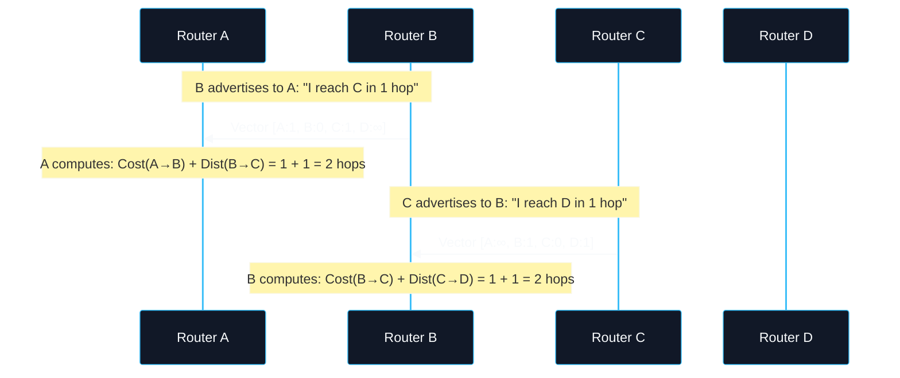
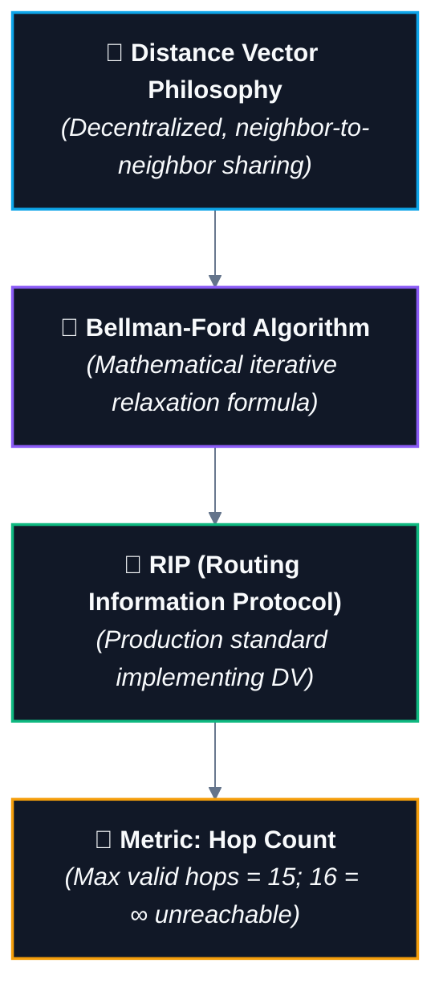

# 📡 Distance Vector Routing & RIP Foundations

> [!important] 🎯 Executive Summary
> - **Distance Vector (DV)** is a decentralized routing paradigm where a router does **not** know the complete network topology. Instead, each router iteratively computes shortest paths by communicating exclusively with its **immediate physical neighbors**.
> - **Distance:** The metric/cost required to reach a destination (e.g., hop count in RIP).
> - **Vector:** The direction or **Next Hop** interface/neighbor to forward traffic toward that destination.
> - **Core Update Equation:** $\text{Cost}(X \to Y \text{ via } V) = c(X, V) + D(V, Y)$.
> - **RIP (Routing Information Protocol):** A real-world Interior Gateway Protocol (IGP) implementing Distance Vector using **Hop Count** (metric maximum = 15; 16 = $\infty$).

---

## 🧭 1. What Does "Distance Vector" Mean?

The name cleanly defines the two pieces of information stored in every routing table entry:

```text
┌─────────────────────────────────────────────────────────────┐
│                    DISTANCE VECTOR ENTRY                    │
│                                                             │
│       [ Destination ]  ──>  [ Distance ]  ──>  [ Vector ]   │
│          Where to?           How far?         Which path?   │
│         (Target IP)        (Cost/Hops)        (Next Hop)    │
└─────────────────────────────────────────────────────────────┘
```

### 1. Distance (The Cost)
* Measures the **cost/metric** required to traverse from the current router to the destination subnet.
* In **RIP**, distance is measured strictly in **Hop Count** (1 router transition = 1 hop).

### 2. Vector (The Direction / Next Hop)
* Specifies the **outgoing link or neighbor router** to which the packet must physically be dispatched next.
* A router does not send packets directly to the final host across the globe; it passes the packet to its local **Next Hop**.

> [!tip] Core Philosophy
> *"Tell your neighbors about the world; tell the world what you heard from your neighbors."*

---

## 🧠 2. Step-by-Step Simulation: How Routers Learn

Consider a linear 4-router network where every physical link has a cost of **1 hop**:

```text
[ A ] ──(1)── [ B ] ──(1)── [ C ] ──(1)── [ D ]
```

---

### 📍 Step 1: Initial State (Round 0 — Direct Neighbors Only)
At startup, routers only know about directly connected interfaces ($0$ hops to self, $1$ hop to physical neighbor, $\infty$ to distant subnets):

$$\infty \text{ (Infinity)} = \text{"No valid route is currently known to this destination"}$$

| Router A's Initial Table | | Router B's Initial Table | | Router C's Initial Table | | Router D's Initial Table | |
| :---: | :---: | :---: | :---: | :---: | :---: | :---: | :---: |
| **Dest** | **Dist** | **Dest** | **Dist** | **Dest** | **Dist** | **Dest** | **Dist** |
| `A` | 0 | `A` | 1 | `A` | $\infty$ | `A` | $\infty$ |
| `B` | 1 | `B` | 0 | `B` | 1 | `B` | $\infty$ |
| `C` | $\infty$ | `C` | 1 | `C` | 0 | `C` | 1 |
| `D` | $\infty$ | `D` | $\infty$ | `D` | 1 | `D` | 0 |

---

### 🔄 Step 2: Information Exchange (Round 1)
Each router sends its distance vector to its immediate neighbors.



**Updated Routing Tables after Round 1:**
* **Router A's Table:**
  * To `C`: $1 (\text{to } B) + 1 (\text{from } B \text{ to } C) = \mathbf{2\text{ hops (via } B)}$
  * To `D`: Still $\infty$ (because $B$ didn't know how to reach $D$ yet).
* **Router B's Table:**
  * To `D`: $1 (\text{to } C) + 1 (\text{from } C \text{ to } D) = \mathbf{2\text{ hops (via } C)}$

---

### 🚀 Step 3: Second Exchange (Round 2 — Full Convergence)
In the next periodic update round:
* $B$ advertises its new route to $D$ ($2\text{ hops}$) to $A$.
* Router $A$ computes:
  $$\text{Dist}(A \to D) = \text{Cost}(A \to B) + \text{Dist}(B \to D) = 1 + 2 = \mathbf{3\text{ hops (via } B)}$$

**Final Converged State:**

```text
[ A ] ────────────────────────────────────────> [ D ]
        Path: A ──> B ──> C ──> D  (Total Distance = 3 Hops, Next Hop = B)
```

---

## ⭐ 3. The Core Bellman-Ford Formula

The mathematical calculation driving every Distance Vector update is the **Bellman-Ford Equation**:

> [!important] 📐 The Distance Vector Formula
> $$\text{Cost to Destination via Neighbor} = \text{Cost to Neighbor} + \text{Neighbor's Cost to Destination}$$
> 
> $$D(X, Y) = \min_v \Big\{ c(X, v) + D(v, Y) \Big\}$$
> 
> Where:
> - $D(X, Y)$ = Shortest estimated distance from source $X$ to destination $Y$.
> - $c(X, v)$ = Direct physical link cost between node $X$ and immediate neighbor $v$.
> - $D(v, Y)$ = Neighbor $v$'s advertised distance to destination $Y$.

### Example Calculation:

```text
       (1)           (2)
[ A ] ─────> [ B ] ─────> [ C ]
```

* Direct link cost: $c(A, B) = 1$
* $B$'s advertised distance to $C$: $D(B, C) = 2$
* $A$'s calculated cost to $C$ via $B$:
  $$D(A, C \text{ via } B) = c(A, B) + D(B, C) = 1 + 2 = \mathbf{3}$$
* $A$ installs in its table: **Destination: `C` | Metric: `3` | Next Hop: `B`**.

---

## 📖 4. Key Terminology & Exam Concepts

| Term | Definition | Networking Function |
| :--- | :--- | :--- |
| **Distance Vector (DV)** | A decentralized routing paradigm where routers exchange cost vectors only with direct neighbors. | Builds routing tables iteratively without needing a complete map of the internet. |
| **Neighbor** | Any router directly connected via a shared layer-2 link/interface. | The only entities a DV router directly communicates with. |
| **Routing Table** | The database stored in router memory mapping destinations to metrics and interfaces. | Format: `Destination Subnet | Metric/Cost | Next Hop Router | Interface`. |
| **Next Hop** | The immediate downstream neighbor router responsible for forwarding the packet closer to destination. | Placed in the Layer 2 Destination MAC header during frame encapsulation. |
| **Convergence** | The stable state where all routers across the network have learned consistent, optimal, and loop-free paths. | Data packets may loop or drop until the network converges. |
| **Infinity ($\infty$)** | A numerical threshold denoting an unreachable route. | In RIP, infinity is defined as **16 hops**. |

---

## 🔥 5. Connecting Distance Vector to RIP



* **Distance Vector** is the theoretical routing model.
* **Bellman-Ford** is the algorithm powering route calculation.
* **RIP** is the concrete protocol running on UDP port 520, periodically sending unsolicited full routing table updates to neighbor routers every 30 seconds.

---

## 🎯 Quick Checkpoint & Practice

```text
       (1)           (2)
[ A ] ─────> [ B ] ─────> [ C ]
```

* Router $A$ knows direct link: $c(A, B) = 1$
* Router $B$ advertises: $D(B, C) = 2$

> [!abstract] Checkpoint Solution
> 1. **What distance will $A$ calculate for $C$ through $B$?**
>    $$\text{Distance} = c(A, B) + D(B, C) = 1 + 2 = \mathbf{3}$$
> 2. **What would $A$'s next hop to $C$ be?**
>    $$\text{Next Hop} = \mathbf{B}$$

---

## 🔗 Cross-Domain & Vault Connections

- **Prerequisites:**
  - [[01. Routing Fundamentals - Routing vs Forwarding and Graph Models|01. Routing Fundamentals (Routing vs Forwarding & Metrics)]]
  - [[05. Network Hardware - Hub, Switch, Router, Modem|05. Network Hardware (Routers & Interfaces)]]
- **Algorithmic Foundations:**
  - `[[Bellman-Ford Algorithm]]` — Edge relaxation & shortest paths with dynamic programming.
- **Next Routing Notes:**
  - `[[03. Link-State Routing and OSPF]]` — Dijkstra SPF calculation vs Bellman-Ford, Link State Advertisements (LSAs).
  - `[[04. Border Gateway Protocol (BGP)]]` — Inter-Autonomous System routing (Path Vector).
