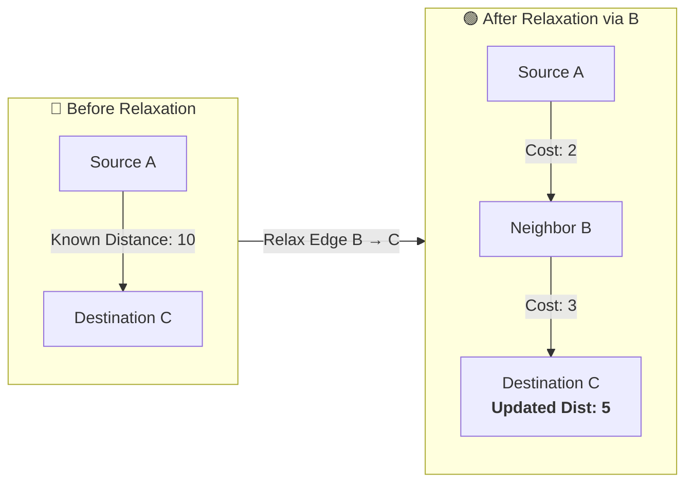

# 🧠 Bellman-Ford Algorithm & Edge Relaxation

> [!important] 🎯 Executive Summary
> - **Bellman-Ford** is a dynamic programming **single-source shortest path algorithm** that computes minimum-cost routes from a source node to all other vertices in a weighted graph.
> - **Networking Role:** It forms the mathematical foundation of **Distance Vector Routing** (and by extension, **RIP**).
> - **Core Operation (Relaxation):** Testing whether traversing through an intermediate neighbor node yields a lower cost than the currently recorded distance.
> - **Pass Guarantee:** Operates in **$V - 1$ relaxation passes** (where $V$ is the vertex count).
> - **Superpower over Dijkstra:** Handles **negative edge weights** and detects **negative-weight cycles** via a final $V^{\text{th}}$ pass.

---

## 🧭 1. Why Do We Need Bellman-Ford?

Consider finding the lowest cost path from **$A$ to $C$**:

```text
       (2)           (3)
[ A ] ─────> [ B ] ─────> [ C ]
  │                         ▲
  └─────────── (10) ────────┘
```

1. **Direct Path ($A \to C$):** $\text{Cost} = 10$
2. **Indirect Path through $B$ ($A \to B \to C$):** $\text{Cost} = 2 + 3 = 5$

Bellman-Ford methodically evaluates candidate paths, discovers that $5 < 10$, and updates the optimal path to **$A \to B \to C$** with a distance of **$5$**.

---

## 🔑 2. The Core Operation: Relaxation

The central mechanism of the Bellman-Ford algorithm is **Relaxation**.

> [!definition] ⚡ Relaxation
> **Relaxation** is the process of checking whether routing through an intermediate neighbor node produces a strictly shorter/cheaper path to a destination than the currently recorded distance.



### The Relaxation Condition:
$$\text{If } \Big(\text{dist}[u] + \text{weight}(u, v) < \text{dist}[v]\Big) \implies \text{dist}[v] = \text{dist}[u] + \text{weight}(u, v)$$

> [!tip] 🗣️ Plain English / Layman Explanation
> Think of searching for the cheapest flight ticket or road shortcut:
> 
> ```text
> "If (Cost to reach intermediate city U + Cost of flight from U to destination V)
>       IS CHEAPER THAN
>  Our currently recorded ticket price to destination V...
>  
>  THEN:
>  Update our recorded ticket price to V with this new cheaper detour price!"
> ```
> 
> | Math Variable | Layman Meaning | Real Example |
> | :--- | :--- | :--- |
> | $\text{dist}[u]$ | *"How much it currently costs to get from Home to friend $u$."* | Uber fare to friend's house = **₹100** |
> | $\text{weight}(u, v)$ | *"How much it costs to go from friend $u$ to destination $v$."* | Bus ticket from friend to Mall = **₹50** |
> | $\text{dist}[v]$ | *"The best price we currently had written down for destination $v$."* | Direct Cab to Mall previously = **₹250** |
> | **The Decision** | $100 + 50 = 150 < 250$ $\implies$ **New Best Price to Mall = ₹150 (via friend)** | Saves ₹100 by taking the detour! |

---

## 🧮 3. The Bellman-Ford Iteration Formula

In a distributed network environment, each node executes relaxation as:

$$\text{New Distance} = \text{Distance to Neighbor} + \text{Neighbor's Advertised Distance to Destination}$$

$$D(X, Y) = \min_v \Big\{ c(X, v) + D(v, Y) \Big\}$$

> [!note] 🗣️ In Layman Terms (Router Perspective)
> *"I (Router X) want to reach Destination Y. I ask all my direct neighbors: 'How far is Y for you?' I add the cable cost to each neighbor to their reported distance, and pick whichever neighbor gives me the lowest total sum."*

Where:
* $c(X, v)$ = Direct physical link cost between me ($X$) and my neighbor ($v$).
* $D(v, Y)$ = Neighbor $v$'s advertised distance to destination $Y$.


---

## 🔄 4. Why Does Bellman-Ford Run $V - 1$ Passes?

Bellman-Ford relaxes **all $E$ edges** in the graph repeatedly for **$V - 1$ passes**.

### ❓ Why Exactly $V - 1$?

```text
[Node 1] ───> [Node 2] ───> [Node 3] ───> [Node 4] ───> [Node 5]
   |             |             |             |
 Edge 1        Edge 2        Edge 3        Edge 4
```

1. In a graph with **$V$ vertices**, any **simple path** (a path with no repeating vertices or cycles) contains at most **$V - 1$ edges**.
2. In the worst-case scenario (e.g., edges are processed in the reverse order of the optimal path), each relaxation pass only correctly locks in **one additional edge** of the shortest path.
3. Therefore, after **$V - 1$ passes**, all shortest path estimates across the entire graph are guaranteed to have stabilized (converged).

---

## 🚨 5. Handling Negative Edge Weights: Why Dijkstra Fails

### ➖ What is a Negative Weight?
In network graph theory, a standard link represents a positive expense (latency, hop, monetary cost):
* Traversing $A \to B$ with cost $+5$ adds 5 units to the total path penalty.
* An edge with **negative weight** $A \xrightarrow{-3} B$ mathematically **subtracts** 3 units from the total cost:
  $$A \xrightarrow{4} B \xrightarrow{-3} C \implies \text{Cost}(A \to C) = 4 + (-3) = \mathbf{1}$$

---

### ❌ The Dijkstra Failure Mode (The "Greedy Finalization" Flaw)
Dijkstra's algorithm relies on a fundamental **greedy invariant**:
> *"Once a vertex $u$ is selected from the priority queue and marked 'visited/settled', its shortest distance from the source is permanently locked in and will never decrease."*

When negative edges exist, this assumption completely breaks down:

```text
         (2)
   [ A ] ───────> [ B ]
     │             │
  (5)│             │ (-10)
     ▼             ▼
       [  C  ]
```

1. **Dijkstra's Process:**
   * Step 1: Evaluates unvisited neighbors from $A$: $B$ (cost $2$) and $C$ (cost $5$).
   * Step 2: Picks the minimum neighbor $B$ ($\text{cost } 2$), finalizes $B$.
   * Step 3: Next smallest is $C$ ($\text{cost } 5$). Dijkstra marks $C$ as **settled with final distance = 5**.
2. **The Flaw:**
   * Later, exploring edge $B \to C$ yields:
     $$\text{Path } A \to B \to C = 2 + (-10) = \mathbf{-8}$$
   * Because Dijkstra already marked $C$ as settled, it fails to update $C$ to $-8$, returning an incorrect result!

---

### 🟢 How Bellman-Ford Solves This
Bellman-Ford **never makes greedy assumptions**. It does not mark nodes as permanently settled.
* It iteratively checks every edge $(u, v)$ across the entire graph for $V - 1$ rounds.
* In round 1, it discovers $A \to B = 2$ and $A \to C = 5$.
* In round 2, it evaluates edge $(B, C)$ and updates $\text{dist}[C] = 2 + (-10) = \mathbf{-8}$.

---

## 💀 6. Negative-Weight Cycles vs Negative Edges

> [!important] ⭐ Critical Distinction: Negative Edge $\neq$ Negative Cycle
> - **Negative Edge:** A single link with weight $< 0$. Shortest paths **still exist** as long as no negative cycle is reachable. Bellman-Ford solves this perfectly.
> - **Negative Cycle:** A directed closed loop whose cumulative weight sum is negative ($< 0$).

```text
       (+2)
[ A ] ─────> [ B ]
  ▲           │
  │           │ (-5)
(+1)          ▼
  └───────── [ C ]

Cycle Sum: (+2) + (-5) + (+1) = -2
```

### The Infinite Decrease Dilemma:
Every time a packet or traversal loops around this cycle:
$$\text{Loop 1: } -2 \implies \text{Loop 2: } -4 \implies \text{Loop 3: } -6 \implies \dots \implies -\infty$$
Because the cost can be reduced infinitely, **no finite shortest path exists**.

### 🛡️ $V^{\text{th}}$ Pass Detection Rule:
1. Complete all **$V - 1$ passes**.
2. Execute a **$V^{\text{th}}$ pass** over every edge $(u, v)$:
   $$\text{If } \Big(\text{dist}[u] + \text{weight}(u, v) < \text{dist}[v]\Big) \implies \text{\textbf{Negative Cycle Detected!}}$$

---

## ⚖️ Algorithm Decision Matrix

| Graph Scenario | Dijkstra's Algorithm | Bellman-Ford Algorithm |
| :--- | :---: | :---: |
| **All Non-Negative Weights ($\ge 0$)** | ✅ **Optimal** ($O((V+E)\log V)$) | ✅ Correct ($O(V \cdot E)$, but slower) |
| **Graph Contains Negative Edges ($< 0$)** | ❌ **Fails / Incorrect Results** | ✅ **Optimal & Correct** |
| **Graph Contains Negative Cycle** | ❌ **Infinite Loop / Incorrect** | 🚨 **Detects & Flags Cycle on $V^{\text{th}}$ Pass** |


---

## 📊 7. Complexity Analysis

| Metric | Complexity | Notes |
| :--- | :---: | :--- |
| **Time Complexity (Worst/Avg)** | $O(V \cdot E)$ | Relaxes $E$ edges across $V-1$ iterations. |
| **Time Complexity (Best Case)** | $O(E)$ | If no updates occur in the first pass (early termination). |
| **Space Complexity** | $O(V)$ | Stores the distance array and predecessor array. |

---

## 🧠 Bellman-Ford vs Distance Vector & RIP Cheat Sheet

| Concept | Definition / Role |
| :--- | :--- |
| **Bellman-Ford** | Mathematical single-source shortest path algorithm. |
| **Relaxation** | Iterative comparison: testing if an indirect route is shorter. |
| **$V$** | Number of vertices (Routers). |
| **$E$** | Number of edges (Network links). |
| **$V - 1$ Passes** | Maximum iterations needed for simple path convergence. |
| **Negative Cycle** | Infinite cost-reducing loop (detected on $V^{\text{th}}$ pass). |
| **Distance Vector** | Distributed routing framework powered by Bellman-Ford calculations. |
| **RIP** | Production protocol implementing Distance Vector with Hop Count metric. |

```text
Bellman-Ford (Mathematical Algorithm)
       ↓
Distance Vector (Distributed Routing Architecture)
       ↓
RIP (Concrete Network Protocol)
       ↓
Hop Count (Protocol Metric: Max 15 Hops)
```

---

## 🎯 Quick Checkpoint & Practice

```text
       (2)
[ A ] ─────> [ B ]
  │           │
(5)│           │ (3)
  ▼           ▼
    [  C  ]
```

* Direct: $A \to C = 5$
* Indirect via $B$: $A \to B \to C = 2 + 3 = 5$

> [!abstract] Checkpoint Solution
> * **Shortest Distance ($A \to C$):** **$5$**
> * **Optimal Path(s):** **$A \to C$** or **$A \to B \to C$** (Both provide an identical minimal cost of $5$).

---

## 🔗 Cross-Domain & Vault Connections

- **Prerequisites:**
  - [[01. Routing Fundamentals - Routing vs Forwarding and Graph Models|01. Routing Fundamentals (Graph Models & Metrics)]]
  - [[02. Distance Vector Routing and RIP|02. Distance Vector Routing & RIP]]
- **Algorithm Comparisons:**
  - `[[Dijkstra's Algorithm]]` — Greedy $O((V+E)\log V)$ shortest path for non-negative weights (powers OSPF).
  - `[[Breadth-First Search (BFS)]]` — Unweighted shortest paths.
- **Next Routing Protocol Notes:**
  - `[[04. Link-State Routing and OSPF]]` — Dijkstra Link-State routing, topological databases, LSAs.
  - `[[05. Border Gateway Protocol (BGP)]]` — Inter-domain Path Vector routing.
