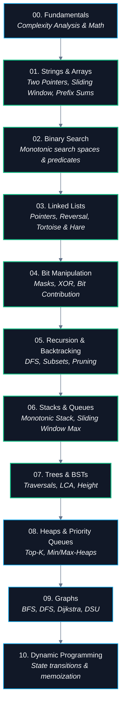

# 🌳 Data Structures & Algorithms (DSA) Knowledge Base

> [!abstract] Master DSA Hub
> Welcome to the **Data Structures & Algorithms Knowledge Base**. This repository is structured for deep conceptual understanding, algorithmic pattern recognition, space-time complexity analysis, and coding interview preparation.

---

## 🗺️ DSA Master Roadmap

---

## 📚 Active Modules

### 🔤 [[CS/DSA/01. Strings/00. Strings Core|01. Strings]]
String operations, character manipulation, two-pointer simulation, and memory optimization:
- **01.** [[CS/DSA/01. Strings/StringBuilder|🏗️ StringBuilder]] — Mutable character buffers, memory growth model, and DSA patterns.
- **02.** [[CS/DSA/01. Strings/Add Binary & String Arithmetic|➕ Add Binary & String Arithmetic]] — Column-by-column math simulation, `StringBuilder` vs `String`, and carry propagation.
- **03.** [[CS/DSA/DSA Problems/67. Add Binary|💡 67. Add Binary]] — Problem walkthrough, baseline vs. 100% `char[]` backward-fill optimization.

### 🔍 [[Binary Search|02. Binary Search]]
Searching monotonic patterns and halving search spaces:
- **01.** [[Binary Search]] — Monotonic property, $O(\log N)$ reduction, standard boundary template, example trace, and virtual reduction mental models.

### 🔗 [[CS/DSA/03. Linked Lists/00. Linked Lists Core|03. Linked Lists]]
Singly linked lists, non-contiguous node architecture, traversal, and core interview patterns:
- **01.** [[01. Linked List Fundamentals]] — Node class, pointer references, $O(1)$ vs $O(N)$ memory model, insertion/deletion mechanics, and 3-pointer mental model.
- **02.** [[02. Linked List Patterns]] — Fast & Slow pointers (Tortoise & Hare), in-place list reversal, and dummy head sentinel nodes.

### ⚡ [[Bit Manipulation|04. Bit Manipulation]]
Bit-level integer representation, operators, low-level tricks, and algorithmic XOR patterns:
- **01.** [[01. Bitwise Operators]] — AND (`&`), OR (`|`), XOR (`^`), NOT (`~`), truth tables, and algebraic identities
- **02.** [[02. Bit Tricks]] — Parity check (`N & 1`), Shift formulas (`<<`, `>>`), and bit masks (Check, Set, Flip, Unset)
- **03.** [[03. XOR Patterns]] — Identities ($A \oplus 0 = A$, $A \oplus A = 0$), duplicate cancellation, and bit-count observations
- **04.** [[04. Bit Manipulation Problems]] — Single Number, Two Missing Numbers (Partitioning), Minimum XOR Pair, and Sum of XOR of All Pairs (Bit Contribution)

### 🔁 [[CS/DSA/05. Recursion & Backtracking/00. Recursion Core|05. Recursion & Backtracking]]
Recursive problem solving, call stack winding/unwinding, and state decomposition:
- **01.** [[CS/DSA/05. Recursion & Backtracking/01. Recursion Fundamentals|🔄 01. Recursion Fundamentals]] — Base case vs recursive case, call stack phases (going down vs coming up), factorial tracing, the 3-question formula, and recursive tree decomposition.

### 🥞 [[CS/DSA/06. Stacks & Queues/00. Stacks & Queues Core|06. Stacks & Queues]]
Restricted access LIFO and FIFO linear structures, monotonic stacks, and parsing:
- **01.** [[01. Stack Fundamentals|🥞 01. Stack Fundamentals]] — LIFO mechanics, `push`/`pop`/`peek`/`isEmpty`, Java `ArrayDeque`, custom array stack, and interview use cases.

### 🌳 [[CS/DSA/07. Trees & BSTs/00. Trees & BSTs Core|07. Trees & BSTs]]
Hierarchical structures, binary trees, binary search trees, and traversals:
- **01.** [[CS/DSA/07. Trees & BSTs/01. Binary Tree Fundamentals|🌳 01. Binary Tree Fundamentals]] — Tree hierarchy vs arrays, Node anatomy, Java implementation, Binary tree rule, Terminology (Root, Parent, Child, Siblings, Leaf), and Height conventions (Edge vs Node).
- **02.** [[CS/DSA/07. Trees & BSTs/02. Binary Tree Traversals|🚶‍♂️ 02. Binary Tree Traversals]] — DFS traversals (Preorder, Inorder, Postorder), BFS Level-Order, step-by-step traces, Java recursion, and use-case matrix.

---

## 🔗 Quick Links & Reference
- [[home|🧭 Main Command Center]]
- [[Quick Look|⚡ Quick Look & Cheatsheet (Frequently Forgotten Syntax)]]
- [[CS/DSA/01. Strings/00. Strings Core|🔤 01. Strings Master Note]]
- [[Binary Search|🔍 Binary Search]]
- [[CS/DSA/03. Linked Lists/00. Linked Lists Core|🔗 03. Linked Lists Master Note]]
- [[01. Linked List Fundamentals|🧱 Linked List Fundamentals]]
- [[02. Linked List Patterns|🧠 Linked List Patterns]]
- [[Bit Manipulation|📁 Bit Manipulation Master Note]]
- [[04. Bit Manipulation Problems|💡 Bit Manipulation Problems]]
- [[CS/DSA/05. Recursion & Backtracking/00. Recursion Core|🔁 05. Recursion & Backtracking Master Note]]
- [[CS/DSA/05. Recursion & Backtracking/01. Recursion Fundamentals|🔄 01. Recursion Fundamentals]]
- [[CS/DSA/03. Linked Lists/00. Linked Lists Core|🔗 03. Linked Lists Master Note]]
- [[01. Linked List Fundamentals|🧱 Linked List Fundamentals]]
- [[02. Linked List Patterns|🧠 Linked List Patterns]]
- [[Bit Manipulation|📁 Bit Manipulation Master Note]]
- [[04. Bit Manipulation Problems|💡 Bit Manipulation Problems]]
- [[CS/DSA/07. Trees & BSTs/00. Trees & BSTs Core|🌳 07. Trees & BSTs Master Note]]
- [[CS/DSA/07. Trees & BSTs/01. Binary Tree Fundamentals|🌳 01. Binary Tree Fundamentals]]
- [[CS/DSA/07. Trees & BSTs/02. Binary Tree Traversals|🚶‍♂️ 02. Binary Tree Traversals]]

