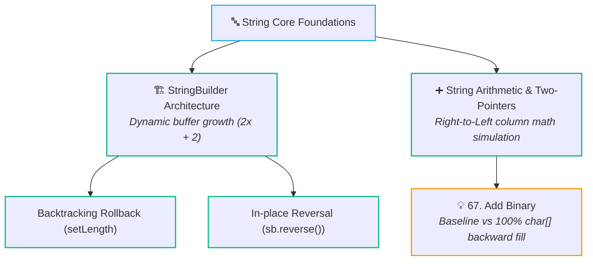

# 🔤 Strings & String Manipulation

> [!abstract] Module Overview
> Welcome to the **Strings** module. Strings are one of the most foundational data structures in technical interviews, testing character arithmetic, two-pointer techniques, sliding windows, mutable buffer memory models, and pattern matching.

---

## 🗺️ Module Learning Path



---

## 📚 Module Notes

1. **[[CS/DSA/01. Strings/StringBuilder|🏗️ StringBuilder (Architecture, Methods & DSA Patterns)]]**
   - In-depth look at mutable strings, memory buffer allocation, capacity growth ($2 \times \text{cap} + 2$), and performance.
   - Core API operations: `append()`, `insert()`, `deleteCharAt()`, `reverse()`, `setLength(0)`.
   - DSA patterns: Backtracking path rollback, right-to-left reversal, buffer reuse, and reference equality traps.

2. **[[CS/DSA/01. Strings/Add Binary & String Arithmetic|➕ String Arithmetic & Add Binary]]**
   - Simulating column-by-column math from right to left (`i = A.length - 1`, `j = B.length - 1`).
   - Why `StringBuilder.append()` + `reverse()` beats `String` concatenation ($O(N)$ vs $O(N^2)$).
   - Base conversion and carry propagation (Binary Base 2 and Decimal Base 10).

---

## 💡 Practice Problems

- **[[CS/DSA/DSA Problems/67. Add Binary|67. Add Binary]]** *(Easy)* — Simulation with `StringBuilder` vs top 100% direct `char[]` backward fill optimization.

---

## ⚡ Essential String Idioms (Java)
*(Full quick look: [[Quick Look]])*

```java
// Char to digit / digit to char
int digit = c - '0';
char c = (char) ('0' + digit);

// In-place reversal & mutation
StringBuilder sb = new StringBuilder();
sb.append(val);
sb.reverse().toString();

// Character tests
Character.isLetterOrDigit(c);
Character.toLowerCase(c);
```

---

## 🔗 Related Notes
- [[CS/DSA/00. DSA Nexus|🌳 DSA Master Roadmap]]
- [[Quick Look|⚡ Quick Look & Cheatsheet]]
- [[Bit Manipulation|⚡ Bit Manipulation Master Note]]
- [[Home|🧭 Main Command Center]]
