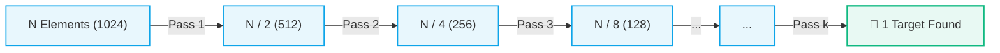
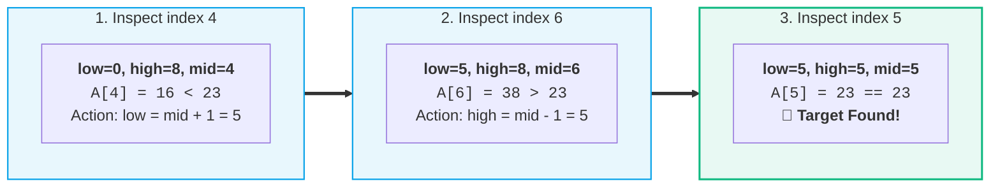

# 🔍 Binary Search

> [!abstract] Module Overview
> **Master Roadmap:** [[CS/DSA/README|DSA Master Roadmap]] | **Quick Reference:** [[Quick Look|⚡ Quick Look Cheatsheet]]

---

## 💡 1. Core Idea & Intuition

> [!tip] The Monotonic Invariant
> Binary search operates on search spaces that exhibit **monotonicity** (sorted arrays, monotonic mathematical functions, or boolean predicates $\text{false} \dots \text{false} \to \text{true} \dots \text{true}$).

Instead of scanning every element sequentially ($O(N)$):
```text
Sequential Scan (O(N)):
[ 1 ] ──→ [ 2 ] ──→ [ 3 ] ──→ [ 4 ] ──→ [ 5 ] ──→ [ 6 ] ──→ [ 7 ] ──→ [ 8 ] ──→ [ 9 ]
```

We inspect the middle element:
```text
Binary Divide & Conquer (O(log N)):
[ 1 , 2 , 3 , 4 ]       [ 5 ]       [ 6 , 7 , 8 , 9 ]
   Left Half            Middle          Right Half
```

Then discard half of the remaining search space based on a single comparison:
- **If $\text{target} < \text{mid}$:** The target *cannot* exist on the right $\implies$ search space shrinks to `[ 1, 2, 3, 4 ]`.
- **If $\text{target} > \text{mid}$:** The target *cannot* exist on the left $\implies$ search space shrinks to `[ 6, 7, 8, 9 ]`.
- **If $\text{target} == \text{mid}$:** Element found immediately!

### 📉 Search Space Halving ($O(\log N)$)



> [!info] Complexity Metric
> - **Time Complexity:** $O(\log_2 N)$ — in a dataset of $1,000,000$ elements, binary search finds the target in at most $\approx 20$ comparisons!
> - **Space Complexity:** $O(1)$ auxiliary memory (iterative template).

---

## 📋 2. Standard Iterative Template (Java)

For a sorted array `A`:

```java
int low = 0;
int high = A.length - 1;

while (low <= high) {
    // Prevent integer overflow: low + (high - low) / 2 instead of (low + high) / 2
    int mid = low + (high - low) / 2;

    if (A[mid] == target) {
        return mid; // 🎯 Found at index mid
    }
    else if (A[mid] < target) {
        low = mid + 1; // Discard left half, search right
    }
    else {
        high = mid - 1; // Discard right half, search left
    }
}

return -1; // ❌ Target not present in array
```

### 🧠 The Three Core Decision Branches

| Condition | Meaning | Boundary Action | Next Search Space |
| :--- | :--- | :--- | :--- |
| `A[mid] == target` | Target located | Return `mid` | `Terminated` |
| `A[mid] < target` | Target lies in the **RIGHT** half | `low = mid + 1` | `[mid + 1, high]` |
| `A[mid] > target` | Target lies in the **LEFT** half | `high = mid - 1` | `[low, mid - 1]` |

---

## 🎯 3. Step-by-Step State Walkthrough

> [!example] Trace Problem
> - **Array:** `A = [2, 5, 8, 12, 16, 23, 38, 45, 56]` ($N = 9$)
> - **Target:** `23`



### 🔍 Detailed Iteration Log

#### 1️⃣ Iteration 1:
- **Bounds:** `low = 0`, `high = 8`
- **Midpoint:** $\text{mid} = 0 + \frac{8 - 0}{2} = 4$
- **Value at Mid:** `A[4] = 16`
- **Comparison:** $16 < 23 \implies \text{A[mid]} < \text{target}$ (Target is in right half)
- **Boundary update:** `low = mid + 1 = 5`

```text
Active Window:
[ 2 , 5 , 8 , 12 , 16 | 23 , 38 , 45 , 56 ]
                        ^               ^
                      low=5           high=8
```

#### 2️⃣ Iteration 2:
- **Bounds:** `low = 5`, `high = 8`
- **Midpoint:** $\text{mid} = 5 + \frac{8 - 5}{2} = 6$
- **Value at Mid:** `A[6] = 38`
- **Comparison:** $38 > 23 \implies \text{A[mid]} > \text{target}$ (Target is in left half)
- **Boundary update:** `high = mid - 1 = 5`

```text
Active Window:
[ 23 , 38 , 45 , 56 ]
  ^    ^
 low  mid
(low = 5, high = 5)
```

#### 3️⃣ Iteration 3:
- **Bounds:** `low = 5`, `high = 5`
- **Midpoint:** $\text{mid} = 5 + \frac{5 - 5}{2} = 5$
- **Value at Mid:** `A[5] = 23`
- **Comparison:** $23 == 23 \implies \text{A[mid]} == \text{target}$
- 🎯 **Target located at index 5!**

---

## ❓ 4. Key Questions & Nuances

### 1. Why do we change `low` or `high` instead of changing `mid`?
`low` and `high` define our **current active search window**. We do not manually adjust `mid`; rather, `mid` is dynamically calculated from the boundaries `low` and `high`.

### 2. Why not simply do `mid++`?
Binary search is designed to throw away **half of the search space** in each step, not step forward by one index.

> [!caution] What Happens if you do `mid++`?
> If `low = 0`, `high = 1000`, `mid = 500`, and $\text{target} > A[500]$:
> - ❌ **Doing `mid++` $\to 501$:** You check elements sequentially one-by-one $\implies$ degrades to **$O(N)$**.
> - ✅ **Doing `low = mid + 1`:** Recalculates $\text{mid} = \frac{501 + 1000}{2} = 750$, leaping straight to the middle of the remaining half $\implies$ achieves true **$O(\log N)$**.

### 3. Why `low + (high - low) / 2` instead of `(low + high) / 2`?
In languages with 32-bit signed integers (like Java and C++):
If `low` and `high` are large (e.g. $1.5 \times 10^9$), their sum `low + high` ($3.0 \times 10^9$) exceeds `Integer.MAX_VALUE` ($2.14 \times 10^9$), causing **integer overflow** into negative numbers.
`low + (high - low) / 2` is mathematically identical but guarantees the intermediate value never exceeds `high`.

---

## 🧠 5. Mental Model: Virtual Window Shrinking

```mermaid
flowchart TD
    A["1. Calculate Midpoint: mid = low + (high - low) / 2"] --> B["2. Compare A[mid] against target"]
    B -->|Found| C["🎯 Return mid"]
    B -->|A[mid] < target| D["Shrink Window: low = mid + 1"]
    B -->|A[mid] > target| E["Shrink Window: high = mid - 1"]
    D --> F{"low <= high?"}
    E --> F
    F -->|Yes| A
    F -->|No| G["❌ Exhausted: Return -1"]

    classDef proc fill:#0ea5e918,stroke:#0ea5e9,stroke-width:1.5px;
    classDef win fill:#10b98118,stroke:#10b981,stroke-width:2px;
    classDef fail fill:#f43f5e18,stroke:#f43f5e,stroke-width:1.5px;
    class A,B,D,E,F proc;
    class C win;
    class G fail;
```

> [!summary] Zero Physical Memory Allocation
> We do not physically slice, copy, or allocate a new array. Instead, `low` and `high` define a virtual pointer window over the existing array in $O(1)$ auxiliary space.

---

## 🔗 Related Notes
- [[CS/DSA/README|🌳 DSA Master Roadmap]]
- [[Quick Look|⚡ Quick Look & Cheatsheet]]
- [[Home|🧭 Main Command Center]]
